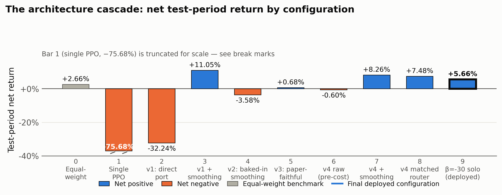
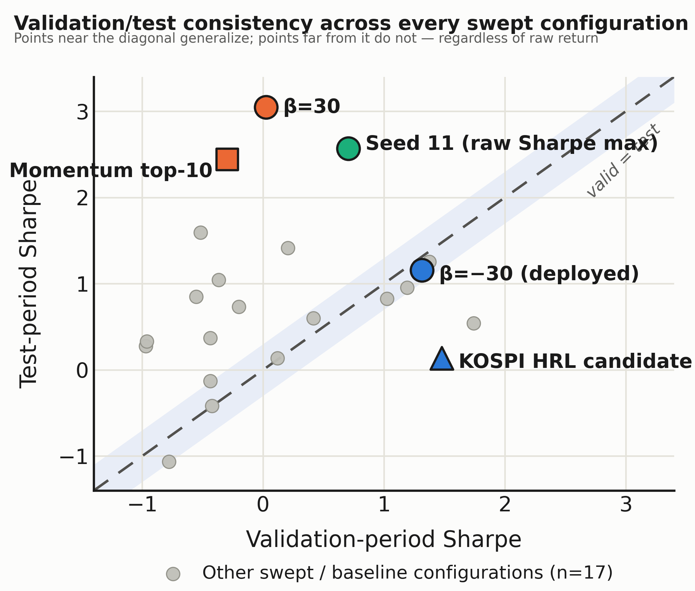

# 포트폴리오 배분을 위한 계층적 강화학습에서의 과적합 진단: 세 시장에 걸친 실패 모드 캐스케이드와 일관성 우선 강건성 방법론

*투고 목표: KDD 응용 데이터 사이언스(ADS) 트랙 / ACM ICAIF (2027 사이클). 이 문서는 `DRAFT.md`(영문본)를 그대로 옮긴 한글판이며, 졸업논문 국문 원고 및 국내 발표용으로 사용한다. 내용·수치·구조는 영문본과 완전히 동일하고, 표현만 자연스러운 한국어 학술 문체로 옮겼다.*

---

## 초록 (Abstract)

EarnHFT와 같은 계층적 강화학습(HRL) 기법은 단일 자산·이산 포지션의 고빈도 트레이딩에서 강력한 성능을 보였지만, 이를 연속적인 다자산 포트폴리오 배분 문제로 이식했을 때 어떤 일이 벌어지는지는 거의 문서화된 바가 없다. 본 논문은 새로운 알고리즘이 아니라 실증적 사례 연구와 진단 방법론이다: EarnHFT류 계층적 RL을 포트폴리오 배분으로 이식할 때 나타나는 실패 모드를 카탈로그화하고, 헤드라인 테스트구간 지표만으로는 보이지 않는 과적합을 잡아내는 검증/테스트 일관성 진단을 정식화한다. 본 논문은 한국 주식시장(KOSPI, 781종목)과 암호화폐 시장(바이낸스 USDT 44종목)에 걸친 확장된 사례 연구를 보고한다. 두 시장 모두에서 단순한 단일 정책 PPO 에이전트는 등가중 벤치마크를 이기지 못했으며(KOSPI: +0.28% vs +34.33%, 크립토: −75.68% vs +2.66%), 이 공통된 실패가 계층적 재설계의 동기가 되었다. EarnHFT의 3단계 구조를 Q-teacher 사전학습 단계 없이 직접 이식하면, 실제로는 양(+)인 비용 차감 전 신호(+12.6%)가 30분 주기 리밸런싱 비용에 의해 완전히 지워지는 정책 풀이 만들어진다(순수익 −32.24%). 추론 시점 관성 필터는 재학습 없이 이 신호를 회복시키지만(비용 차감 후 +11.05%), 더 원리적으로 보이는 대안 — 동일한 관성을 학습 자체에 내장하는 것 — 은 오히려 신용 할당 신호의 붕괴를 통해 근본 알파를 파괴한다(비용 차감 전 알파가 +12.6%에서 +0.92%로 붕괴). Q-teacher 없이 EarnHFT의 선별 절차를 더 충실하게 재구현하면, 두 번째의 독립적인 실패가 드러난다: 전문가 풀이 거의 균등가중으로 붕괴한다(다양성 엔진 부재). 행동공간을 구조적으로 희소화(top-K 선택 + 리스크게이트, FreQuant와 DeepClair를 응용)해 다양성을 복원하면 다양한 정책 풀을 되찾을 수 있지만, 그 위에 얹은 라우터는 이후 결정적인 ablation을 통해 단일 전문가 에이전트와 동일한 상수함수로 붕괴했음이 밝혀진다 — 즉 라우팅 단계 전체가 이 세팅에서 아무런 실질적 기여를 하지 못했다는 뜻이다. 홀드아웃 검증 구간과 테스트 구간 전체에 걸쳐 네 전문가 에이전트를 체계적으로 비교한 결과, 라우터가 선호했던 그 전문가의 겉보기 테스트셋 우위는 라우터의 판단력이 아니라 과적합에서 비롯된 것으로 드러난다. 우리는 이를 밝혀낸 진단 지표 — 검증구간과 테스트구간 샤프비율의 격차 — 를 정식화하고 블록 순열검정으로도 추가 확인한 뒤, 최종 배포 정책(라우터 없이 단일 전문가 에이전트 + 추론 시점 지수 스무딩)을 16개의 독립적인 무작위 시드, Deflated Sharpe Ratio 보정, 데이터 유출 없는 클린 검증 재실행, 앙상블 베이스라인, top-$K$ 선택 폭과 거래비용에 대한 감도 스윕, 그리고 고전적(매수후보유, 횡단면 모멘텀, 평균-분산 최적화, 리스크 패리티) 및 딥러닝(EIIE, LSRE-CAAN) 포트폴리오 베이스라인에 대해 검증한다. 최고 테스트 수익률이 아니라 검증·테스트 두 구간 모두에서의 양의 안정적 성과를 기준으로 삼는 "일관성 우선" 성공 기준 하에서, 배포된 정책은 시험한 10개 구성 중 유일하게 성공한다: 고전적 모멘텀 전략은 원시 테스트 수익률에서 20배 높은 수치를 기록하지만, 동시에 시험한 모든 전략 중 가장 신뢰할 수 없는 검증/테스트 샤프 격차(2.742, 배포된 정책의 0.158과 대비됨)를 보여, 검증 가능한 우위가 아니라 테스트 구간에 특정된 아티팩트에 부합한다. 우리는 이렇게 도출된 실패 모드 카탈로그와 그에 수반된 강건성 진단 방법론이, 단일자산 HRL 트레이딩 기법을 포트폴리오 세팅으로 이식하려는 실무자들에게 독립적인 가치가 있다고 주장한다.

---

## 1. 서론 (Introduction)

### 1.1 동기: 임베딩 기반 단일 정책 RL은 포트폴리오 배분에서 반복적으로 실패한다

강화학습은 수익률·리스크 모델을 수작업으로 설계할 필요 없이 데이터로부터 직접 포트폴리오 배분 정책을 학습하는 방법으로 반복적으로 제안되어 왔다. 그러나 실제로는, 포트폴리오의 전체 자산 유니버스에 대해 종단간(end-to-end) 학습된 단순한 단일 정책 에이전트는 취약한 베이스라인에 불과하다. 우리는 구조적으로 무관한 두 시장에서 이 실패를 독립적으로 관찰했다. 781종목으로 구성된 한국 주식 유니버스에서, 325차원 상태(5개 클러스터 임베딩 + 현재 비중)와 5차원 클러스터-비중 행동공간을 사용하는 PPO 에이전트는 2024–2025 테스트 구간에서 +0.28%를 기록했다 — 같은 구간 등가중 벤치마크는 +34.33%(샤프 1.043)였던 것에 비해 크게 뒤처진 결과다(에이전트 샤프 0.100). 바이낸스의 44개 USDT 현물 종목으로 구성된 암호화폐 유니버스에서는, 동일한 아키텍처 패턴 — 자산별 임베딩과 softmax 포트폴리오 비중에 대한 단일 PPO 정책 — 이 2026년 상반기 테스트 구간에서 −75.68%(샤프 −4.209)를 기록했다 — 같은 구간 등가중 벤치마크는 +2.66%였다. 두 실험은 자산군, 상태 설계, 행동 차원, 학습 기간이 모두 다르지만, 실패의 방향은 동일하고 그 격차 또한 크다. 이 시장 간 일관성이야말로 단일 정책 베이스라인을 계속 튜닝하는 대신 계층적 재설계를 시도하게 만든 동기다 — 이 실패는 특정 데이터셋의 우연이 아니라 단일 정책 정식화 자체에 내재된 구조적 문제로 보인다.

이 두 관찰은 공통적으로 사전학습된 임베딩 기반 상태 표현과 자산 전체에 걸친 밀집(dense) softmax 행동공간을 사용한다. 7장에서 보고하는 세 번째 독립 확인 — 미국 대형주 44종목, 처음에는 원시 가격 윈도우 기반 상태 표현(임베딩 없음)으로 — 에서는 이 실패가 재현되지 않았다: 단일 정책 PPO가 2024–2025 테스트 구간에서 등가중 벤치마크와 사실상 동률을 기록했다(+46.20%/샤프 1.498 대 등가중 +45.74%/샤프 1.473). 이 확인은 시장뿐 아니라 상태 표현도 함께 바꿨으므로 market 하나만의 효과로 해석할 수 없었다 — 그래서 우리는 동일한 미국 대형주·동일한 테스트 구간에 이번에는 Chronos 제로샷 임베딩(크립토·한국 주식과 동일 계열의 상태 표현)을 입힌 후속 확인을 수행해, market을 고정한 채 architecture만 통제했다(7장). 결과: 단일 정책 PPO의 성과가 등가중 대비 "동률"에서 "명확히 저조"로 이동했다(테스트 샤프 1.498→1.252, 등가중 1.477) — 평균 턴오버가 스텝당 0.38%에서 9.2–9.4%로 24배 급증하는 것을 동반하며, 이는 아래에서 서술하는 v1의 "턴오버가 알파를 태운다"는 발견과 동일한 메커니즘이다. 즉 **아키텍처(임베딩 기반 밀집 행동공간)는 실패를 유발하는 실제 인과 요인**이지만, 크립토(샤프 −4.209)나 한국 주식(0.100 대 1.043)에서 본 것만큼 파국적이지는 않다 — market 혹은 레짐이 그 실패의 심각도를 조절하는 것으로 보인다. 본 논문은 임베딩 기반 아키텍처를 사용한 세 시장(한국 주식·크립토·미국 대형주, 7장)에서 방향은 일관되고 정도만 다르게 관찰된 이 실패를 계층적 재설계의 동기로 삼는다.

### 1.2 EarnHFT를 연속 포트폴리오로 이식할 때 나타나는 실패 모드의 연쇄

단일 정책 실패의 원인을 근거 없는 가설로 남겨두는 대신, EarnHFT 원 논문 자신의 결과에서 직접적인 선례를 찾을 수 있다. EarnHFT는 자신의 (단일자산·고빈도) 세팅에서 정확히 같은 종류의 단일 정책 베이스라인(PPO, DQN)과 비교하는데, 이 베이스라인들은 4개 크립토 데이터셋(BTCUSDT, BTCTUSDT, ETHUSDT, GALAUSDT) 전부에서 EarnHFT의 계층적 구조에 뒤처진다 — 총수익률 기준 4개 전부, 샤프비율 기준 4개 중 3개에서 EarnHFT가 앞서며, PPO·DQN은 종종 음(−)의 수익률을 낸다(예: ETHUSDT에서 PPO −22.61%, DQN −11.02% 대 EarnHFT +4.52%; 원 논문 표 2). EarnHFT 저자들은 이 실패를 단일 정책 기반 에이전트가 "더미(dummy) 정책으로 수렴"하고 단일 가치 기반 에이전트가 "시장 추세 변화에 걸쳐 강건성이 부족"하기 때문이라고 설명한다(Qin et al., 2024) — 이는 본 논문이 1.1절에서 독립적으로 관찰한 실패(단일 PPO 정책이 KOSPI·크립토 두 시장 모두에서 등가중에 크게 뒤처짐)와 정확히 같은 종류의 현상이다. 이 선례 — 추상적인 계층적 RL 이론에 대한 기대가 아니라, EarnHFT가 자신의 세팅에서 이미 이 정확한 실패 패턴을 계층적 분해로 해결했다는 실증 결과 — 가 본 논문이 EarnHFT의 3단계 구조를 이식 대상으로 택한 근거다.

EarnHFT(Qin et al., 2024)는 관련되어 있지만 더 좁은 문제 — 고빈도·단일자산·이산 포지션 트레이딩 — 를 3단계 계층 구조로 다룬다: 서로 다른 리스크 선호도로 편향된 대규모 에이전트 풀을 사전학습하는 동적계획법 기반 "Q-teacher"(Stage I), 소수의 다양한 부분집합만 남기는 증류 단계(Stage II), 그리고 시장 레짐에 따라 이들 사이를 전환하는 라우터(Stage III)다. 본 논문은 이 아키텍처를 EarnHFT가 원래 설계되지 않은 세팅 — 44개 자산을 동시에 보유하는 연속 포트폴리오 비중 — 으로 이식했을 때 무슨 일이 일어나는지 보고한다. 특히 결정적으로, 이산·단일자산 행동공간을 전제로 하여 일반화가 쉽지 않은 Stage I은 이식하지 않았다.

이 조사 과정에서 각각 고유한 진단과 시도된 해법을 동반한 실패의 연쇄가 드러났으며, 이것이 본 논문의 실증적 핵심을 이룬다.

- **직접 이식(v1).** Q-teacher 없이 Stage II–III만 재현하면(Stage I 대신 우선순위 기반 샘플링만 사용) 거래비용을 차감한 정책 풀과 라우터는 −32.24%의 손실을 낸다. 결과를 분해해보면 기저 신호 자체는 강하게 양(+)이지만(비용 차감 *전* +12.6%로 이미 벤치마크를 이김), 30분 주기 리밸런싱에서 발생하는 스텝당 평균 5.4%의 턴오버로 인한 거래비용에 의해 완전히 지워진다.
- **추론 시점의 해법은 통하지만, 학습 시점의 해법은 신호 자체를 파괴한다.** 추론 시점에만 지수 관성 필터를 적용하면(`w_new = (1-α)w_old + α·softmax(a)`, α=0.01), 재학습 없이도 비용 차감 후 +11.05%(샤프 0.638)를 회복한다. 더 원리적으로 보이는 대안 — 동일한 관성을 학습 환경 자체에 내장해 정책이 저회전 행동을 직접 학습하도록 하는 것 — 을 시도하면 오히려 비용 차감 전 알파가 +12.6%에서 +0.92%로 붕괴하고 순수익은 −3.58%가 된다. 우리는 이를 신용 할당(credit assignment) 신호의 붕괴로 해석한다: 환경 자체가 실행된 행동을 완충시켜버리면, 정책이 취하는 행동과 그것이 받는 보상 사이의 연결이 느슨해진다.
- **더 충실한 재구현조차 다양성 엔진이 없다(v3).** EarnHFT를 더 가깝게 재구현해도 — 원 논문처럼 현금 행동을 추가하고 에이전트 선별에 엄격한 train/validation 분할을 적용해도 — 여전히 실패한다(순수익 +0.68%, 등가중 벤치마크 미만). 전문가 에이전트 풀이 거의 동일하고 거의 균등가중인 정책들로 수렴해버리기 때문이다. 우리는 이를 Stage I의 부재로 귀결시킨다: Q-teacher가 서로 다른 행동 목표를 손실함수에 직접 주입하지 않으면, 리스크 선호도 파라미터를 데이터 샘플링에만 반영하는 것으로는 45차원 연속 softmax 행동공간에서 다양성을 만들어내기에 충분하지 않다.
- **구조적 행동공간 변경을 통한 다양성 복원(v4).** 밀집(dense) softmax 행동을 구조적으로 희소한 행동으로 대체하면 — top-K 종목 선택(FreQuant, Jeon et al., KDD'24 응용)과 전용 리스크 노출 게이트(DeepClair, Choi et al., CIKM'24 응용)를 결합 — 전문가 풀 전반에 걸쳐 측정 가능한 다양성이 복원된다(턴오버는 테스트 구간 내내 건강하게 유지되며, top-10 보유종목은 44개 중 33개를 순환한다). 추론 시점 스무딩과 결합하면 **라우터가 아직 남아있는 상태에서** 이 연구 전체에서 가장 우수한 위험조정 성과를 달성한다: 비용 차감 후 +8.26%, 샤프 2.168, MDD −5.22% — 이 수치는 뒤이은 두 항목에서 라우터 자체가 아무 일도 안 하고 있었음이 밝혀지며 하향 조정된다.
- **라우터가 상수함수로 붕괴한다.** 라우터 입력의 학습/서빙 불일치를 겨냥한 후속 수정은 처음에는 결과를 더 개선하는 것처럼 보인다(샤프 2.168 → 3.046). 그러나 결정적인 후속 ablation은 이 개선이 착시였음을 보여준다: 라우터가 가장 자주 선택한 단일 전문가 에이전트를 라우터 없이 단독 실행하면, "개선된" 결과가 소수점 넷째 자리까지 정확히 재현된다. 라우터는 라우팅하는 법을 배운 것이 아니라, 항상 하나의 고정된 에이전트만 선택하는 형태로 퇴화한 것이었다.
- **그 하나의 에이전트가 우수해 보였던 것 자체가 과적합이다.** 네 후보 전문가 에이전트 전부를 홀드아웃 검증 구간과 테스트 구간 양쪽에서 체계적으로 재평가한 결과, 붕괴한 라우터가 선호했던 바로 그 에이전트만이 두 구간 사이에서 성과가 극단적으로 요동친다는 것(검증 샤프 0.025 → 테스트 샤프 3.046)이 드러난다. 반면 최종 배포에 선택된 것을 포함한 나머지 세 에이전트는 두 구간 모두에서 안정적이다. 테스트 구간 성과 하나만이 아니라 이 검증/테스트 샤프 격차야말로 과적합을 드러낸 진단 지표이며, 우리는 RL 트레이딩 논문에서 이것이 헤드라인 테스트 구간 수치를 대체하는 것이 아니라 그와 함께 보고되어야 한다고 주장한다.

### 1.3 생존자의 검증

최종 배포된 정책 — 라우터 없이 추론 시점 지수 스무딩만 적용한 단일 전문가 에이전트 — 은 이 연쇄에서 살아남은 것 중 의도적으로 가장 단순한 구성이다. 우리는 이 단순함을 종착점으로 취급하는 대신, 위에서 드러난 종류의 실패를 정확히 겨냥해 설계한 일련의 강건성 검증에 이 정책을 회부한다: 16개의 독립적인 학습 시드에 대한 재현성(우위의 *방향*은 16개 전부에서 재현되지만, *크기*는 재현되지 않는다 — 시드별 분산이 평균으로 뭉개져서는 안 되고 그대로 보고되어야 함을 시사한다); 다중 시드 선택 과정에 대한 Deflated Sharpe Ratio 보정(직관과 반대로, 이 보정이 원시 샤프비율이 가장 높은 시드를 더 강하게 벌하지 *않음*을 보인다 — 두 진단이 서로 다른 편향을 교정하기 때문에 검증/테스트 일관성 검사와는 별개의 발견이다); 원래의 모델 선택 과정에서 전혀 보지 않은 홀드아웃 검증 구간을 사용한 완전히 유출 없는 재학습(배포된 모델의 성과를 재현하고 심지어 소폭 상회한다 — 검증셋 유출이 결과를 부풀렸다는 설명에 반하는 증거); 16개 시드의 등가중 앙상블(예상과 달리 분산을 *줄이는* 대신 오히려 *늘린다* — 그 자체로 부정적 결과); top-$K$ 선택 폭 인접값(5, 7, 15)에 대한 사후 감도 스윕(배포된 $K=10$이 스윕한 값 중 검증/테스트 일관성 기준을 유일하게 통과함을 확인하는 한편, top-$K$ 선택에 쓰이는 확신도 신호와 실현 수익률의 순위상관이 사실상 0이라는 부수적 negative result도 드러낸다); 배포 비용의 0.5배부터 2배까지의 거래비용 민감도 스윕(전 구간에서 배포 정책의 테스트 샤프가 등가중 벤치마크의 최소 2.6배를 유지함, 6.9절); 검증/테스트 격차 진단 자체를 가설검정으로 정식화한 블록 순열검정(정성적으로 본 것과 같은 방향을 확인하지만 관습적 유의수준에는 못 미침, 6.10절); 그리고 네 가지 고전적 베이스라인(매수후보유, 횡단면 모멘텀, Ledoit-Wolf 최소분산 최적화, 리스크 패리티)과 문헌에서 응용한 딥러닝 베이스라인 두 개(EIIE, Jiang et al., 2017; LSRE-CAAN, Li, Zhang, Yang, & Chen, 2023)와의 비교. 원시 수익률 기준으로는 모멘텀이 큰 차이로 승리한다(테스트 수익률 +106.04% vs +5.66%). 그러나 §1.2와 동일한 검증/테스트 샤프 격차라는 일관성 기준으로 보면, 모멘텀의 결과는 시험한 모든 것 중 가장 신뢰할 수 없는 것이다(격차 2.742, 연구 전체에서 관측된 최댓값) — 반면 배포된 정책의 격차(0.158)는 양(+)의 성과를 낸 전략 중 가장 작다. 리스크 패리티의 격차는 그보다도 더 작지만(0.003) 두 구간 모두 마이너스로, 격차가 작다는 것만으로는 정책의 우수성을 보장하지 않음을 보여준다(6.5절). EIIE·LSRE-CAAN 두 베이스라인 모두 완전히 다른 두 신경망 아키텍처에서도 v3에서 처음 관찰된 것과 동일한 균등가중 수렴을 재현하며, 이는 다양성 실패가 특정 아키텍처의 속성이 아니라 이 문제 세팅 자체의 속성임을 뒷받침한다.

### 1.4 기여

본 논문은 다음과 같이 기여한다:

1. **단일 정책 RL 실패의 원인을 인과적으로 격리한다.** 임베딩 기반 단일 정책 RL이 구조적으로 무관한 두 시장(한국 주식, 암호화폐)에서 등가중 벤치마크에 반복적으로 뒤처짐을 관찰한 뒤, 세 번째 시장(미국 대형주)에서 market은 고정하고 상태 표현만(원시 가격 윈도우 대 사전학습 임베딩) 바꾸는 confound 통제 실험을 수행해, 이 실패가 특정 시장의 우연이 아니라 임베딩 기반 밀집 행동공간 자체(architecture)에 기인함을 직접 확인한다(턴오버 24배 급증 동반) — market·레짐은 그 붕괴의 심각도만 독립적으로 조절하는 것으로 보인다(7장).
2. **문서화된 실패 모드 연쇄** — 단일자산·이산 포지션 계층적 RL(EarnHFT)을 연속·다자산 포트폴리오로 이식할 때: 비용에 의한 신호 소거, 학습 시점 관성의 함정, Q-teacher 부재로 인한 다양성 격차, 희소 행동공간을 통한 구조적 해법, 그리고 소리 없이 상수함수로 퇴화하는 라우터.
3. **강건성 진단 방법론** — 검증/테스트 샤프 격차 분석을 제시하고, 이것이 Deflated Sharpe Ratio를 대체하는 것이 아니라 상호보완적임을 보인다. 16개 시드, 앙상블, 유출 없는 홀드아웃, 고전적·딥러닝 베이스라인에 걸쳐 시험했으며, 두 가지 보조적인 정식 유의성 검정(DSR, 블록 순열검정)도 방향은 뒷받침하지만 관습적 유의수준에는 미치지 못한다.
4. **단순하고, 시험한 44종목·18개월 실험 내에서는 실증적으로 강건한 배포 정책**(단일 전문가 에이전트, 라우터 없음, 추론 시점 스무딩) — 일관성 우선 성공 기준 하에서 시험한 10개 전략 중 검증·테스트 두 구간 모두에서 성공한 유일한 전략이며, 이 실험에서는 최대낙폭도 등가중 벤치마크의 −40.09%에서 −7.43%로(82% 감소) 낮춘다. 다만 7장에서 보고하는 point-in-time 다년 walk-forward는 같은 방법론이 시간축을 넓히면 이 일관성 자체가 무너짐을 직접 보인다(5개의 독립적 (검증,테스트) 관측치 전부 실패, 8장 한계#5) — 따라서 이 하방 방어 프로필을 자본 보전(capital preservation)이 장기간에 걸쳐 검증됐다는 근거로 읽어서는 안 된다. 이 정책은 현재 실계좌에서 실거래 시스템으로 가동 중이나(실거래 기록의 현재 길이에 관한 유보사항은 8장 한계#10 참고), 이는 지속 운영 상태의 보고이지 강건성의 추가 증거가 아니다.

### 1.5 논문 구성

2장은 트레이딩용 계층적 RL, 희소·게이트형 포트폴리오 행동공간, 백테스트 과적합 진단에 관한 관련 연구를 검토한다. 3장은 두 시장 데이터셋과 공통 임베딩 백본을 서술한다. 4장은 v1–v4 아키텍처 연쇄와 그에 수반된 진단을 차례로 다룬다. 5장은 통합된 ablation 표를 제시한다. 6장은 강건성 검증 결과(다중시드, DSR, 클린 검증, 앙상블, 고전적·딥러닝 베이스라인, top-$K$ 감도 스윕, 거래비용 감도 스윕, 검증/테스트 격차의 정식 가설검정)를 보고한다. 7장은 이 발견들이 연구한 두 시장에 걸쳐 어느 정도로 일반화되는지 논의한다. 8장은 한계를 논의하며, 9장은 결론을 맺는다.

---

## 2. 관련 연구 (Related Work)

### 2.1 트레이딩을 위한 계층적 강화학습

EarnHFT(Qin et al., 2024, AAAI'24; arXiv:2309.12891)는 본 논문이 기반으로 삼고 또한 이탈하는 아키텍처 원형이다. 초 단위·단일자산·이산 포지션 고빈도 트레이딩을 대상으로 3단계 파이프라인을 제시한다: **Stage I**은 오프라인 동적계획법을 풀어 다수의 리스크 선호도 설정 $\beta$에 대한 근사 최적 행동가치함수 $Q^*$를 얻고, 이 교사 신호에 대한 KL 발산 항 $\mathrm{KL}(Q_\theta \| Q^*)$과 최적 액터 모방(원 논문 식 2–3)을 결합해 DDQN으로 에이전트 풀을 학습하며, $\beta$ 조건부 우선순위 샘플링(원 논문 식 4)을 사용한다; **Stage II**는 각 에이전트를 레짐별 홀드아웃 검증 분할에서 평가해 이 대규모 풀을 소수의 대표 에이전트로 증류한다; **Stage III**는 레짐이 바뀔 때 생존한 전문가들 사이를 전환하는 라우터(원 논문에서는 시장/에이전트 특징에 대한 DDQN)를 학습한다. Stage I의 동적계획법 교사가 있기에 풀은 구성상 다양성을 가진다 — 각 에이전트는 스스로 다양성을 발견하는 것이 아니라, 외부에서 주어진 서로 다른 최적 정책을 향해 학습된다.

다자산 포트폴리오 배분에 계층적 RL을 적용하는 시도 자체가 선행연구에 전혀 없는 것은 아니며, 본 논문도 그렇게 주장하지 않는다. HRPM(Wang, Wei, An, Feng, & Yao, 2021, AAAI'21)은 포트폴리오 관리를 저빈도로 다자산 비중을 정하는 상위 정책과, 슬리피지를 최소화하며 각 리밸런싱을 매수·매도 주문 시퀀스로 실행하는 하위 정책으로 분리한다 — 이 논문에서 쓰는 리스크 선호도 조건부 전문가 풀이 아니라 전략적 배분/실행 분리형 계층이다. Zha, Dai, Xu, & Wu(2022, IJCNN'22; DOI 10.1109/IJCNN55064.2022.9892378)는 문제를 반대 방향으로 쪼갠다: 상위 정책이 대규모 유니버스에서 수익 가능성이 높은 종목 부분집합을 선별하고, 하위 정책은 그 선별된 부분집합에 대해서만 연속 비중을 정한다 — 선별-다음-배분이라는 2단계 구조이며, 여기에도 리스크 선호도 조건부 전문가 풀이나 레짐 라우터는 없다. MetaTrader(Niu, Li, & Li, 2022, CIKM'22; arXiv:2210.01774)는 RL과 모방학습을 결합한 목적함수로 여러 다양한 트레이딩 정책을 먼저 사전학습한 뒤, 그 사이를 라우팅하는 메타 정책을 학습한다 — 구조적으로는 EarnHFT의 Stage II–III와 가장 가깝지만, 풀의 다양성이 DP 교사가 아니라 모방학습 항에서 나오고 처음부터 다자산 세팅이다. Millea & Edalat(2023, *International Journal of Financial Studies*, 11(1), 10; DOI 10.3390/ijfs11010010)는 DRL 에이전트를 상태적(stateful) 멀티암드밴딧으로 프레이밍해, 여러 비학습 계층적 리스크 패리티(HRP)/계층적 균등 리스크 기여(HERC) 배분기 중 어느 것을 쓸지만 선택하게 함으로써 연속 비중을 직접 학습하는 어려움 자체를 회피한다. MacroHFT(Zong, Wang, Qin, Feng, Wang, & An, 2024, KDD'24; arXiv:2406.14537)는 EarnHFT와 저자진이 일부 겹치는 후속 연구로, 시장을 추세·변동성으로 분해한 하위 에이전트들과 이를 혼합하는 메모리 증강 하이퍼 에이전트를 제시하지만 여전히 단일자산·고빈도 세팅에 머문다. 가장 최근에는 HARLF(Coriat & Benhamou, 2025; arXiv:2507.18560, 집필 시점 기준 동료심사 미완료 프리프린트)가 기초·메타·슈퍼 에이전트 3단계 계층으로 다자산 배분을 수행하며 LLM 기반 센티먼트를 결합하는 구조를 제안했다. 그러나 이 여섯 편 중 어느 것도 EarnHFT의 구체적인 3단계 파이프라인 — DP 교사로 학습한 전문가 풀 + 검증 기반 증류 + 레짐 라우터 — 을 연속 다자산 심플렉스로 이식하려 시도하지 않으며, 따라서 본 논문이 기록하는 구체적 실패 연쇄 — 비용에 의한 신호 소거, DP 교사 제거 시 전문가 풀의 다양성 붕괴, 레짐 라우터의 상수함수 퇴화 — 를 보고한 사례도 없다. 이것이 4장이 채우는 공백이며, "다자산 포트폴리오용 계층적 RL 자체가 새롭다"가 아니라 §1.4의 좁혀진 기여 주장이 실제로 성립하는 근거다.

이 구성은 정확하거나 근사적인 DP 해가 다루기 쉬운, 이산화된 행동공간(전형적으로는 매수/무포지션/매도)을 가진 단일 유동자산에 특화되어 있다. 이는 $N$개 자산에 대한 $(N{-}1)$-단체(simplex) 행동공간을 갖고 동등한 폐형(closed-form) 최적해가 존재하지 않는 연속-비중 다자산 포트폴리오로 직접 일반화되지 않는다. 이 한계는 연산 자원의 부족이 아니라 차원의 저주(curse of dimensionality)라는 구조적 문제다: 종목 하나·3개 행동(매수/무포지션/매도)에서는 벨만 백업의 $\max$ 연산이 세 값을 비교하는 것으로 끝나 정확한 DP가 항상 다루기 쉽다. 반면 $N$개 자산에 대한 연속 $(N{-}1)$-단체 행동공간에서는, 같은 $\max$ 연산이 거래비용(L1, 비매끄러움)을 포함한 비볼록 목적함수 위에서 고차원 연속 최적화를 매 방문 상태마다 풀어야 하는 문제가 된다. 이를 정확히 푸는 효율적인 방법은 알려져 있지 않으며(자산당 단 5단계로만 성기게 이산화한 격자 탐색조차 $N=44$에서 $5^{44} \approx 5.7\times10^{30}$개의 조합을 요구한다), 함수 근사로 이를 대체하는 순간 — 신경망이 상태로부터 직접 좋은 행동을 내놓도록 학습시키는 것 — 은 Q-teacher가 애초에 제공하려던 "사전에 계산된 확실한 정답"이라는 지위를 잃고, 본 논문이 4장에서 이미 시도하고 있는 것과 동일한 표준 강화학습 정책 학습으로 되돌아가 버린다. 즉 이 한계는 이산·저차원 행동공간에서만 성립하는 DP의 정확성 보장이 연속·고차원 행동공간으로 이전되지 않는다는 구조적 문제이지, 계산 자원을 늘리면 풀리는 문제가 아니다. 4장은 Stage I을 더 저렴한 대체물(리스크 선호도 조건부 데이터 샘플링만 사용하고 교사 신호는 없음)로 바꾼 채 Stage II–III를 이 세팅으로 이식했을 때 정확히 무슨 일이 일어나는지 상세히 기록한다 — 우리가 아는 한 이 특정한 실패 모드(교사 없는 다양성 붕괴와, 그에 이은 라우터의 상수함수 붕괴)는 포트폴리오 규모의 HRL에서 이전에 문서화된 바 없다.

더 일반적으로, EarnHFT의 3단계 구조는 옵션(options) 프레임워크(Sutton, Precup, & Singh, 1999) — 고정된 하위정책 집합과 그 사이를 전환하는 상위 정책 — 의 한 구체적 사례로 볼 수 있으며, 봉건적(feudal) RL(Dayan & Hinton, 1993; 딥러닝으로 확장한 Vezhnevets et al., 2017의 FeUdal Networks)과도 같은 "장기 관리자·단기 실행자" 계열에 속한다. 이 일반 이론들은 대개 하위 정책의 다양성이 서로 다른 서브골이나 종료 조건에서 자연스럽게 발생한다고 전제하는 경향이 있다 — 본 논문의 실패 카탈로그(4.3, 4.5절)는 정확히 그 전제(EarnHFT에서는 Q-teacher가 담당)가 없을 때 이 일반형이 무너지는 구체적인 사례를 제공한다.

### 2.2 포트폴리오 선택을 위한 구조화된 행동공간과 정책 정규화

직접적인 EarnHFT 이식이 실패한 뒤 전문가 다양성을 복원하는 데 사용한 구조적 재료는 최근 두 논문에서 가져왔다. **FreQuant**(Jeon, Park, Park, & Kang, 2024, KDD'24; DOI 10.1145/3637528.3671668)는 급격한 시장 이벤트와 상시적인 다중주파수 패턴을 융합하는 Frequency State Encoder를 중심으로 한 주파수 도메인 RL 포트폴리오 최적화 프레임워크를 제안한다. 우리가 채택한 구성요소는 신뢰도 점수 기반 top-$K$ 종목 선택 메커니즘(원 논문 식 13–14)뿐이며, 이는 주파수 정보를 인코딩하기 위해서가 아니라 행동공간을 희소화하기 위해 사용한다 — 주파수 도메인 인코더 자체는 본 논문의 기여에 포함되지 않으며 재구현하지 않았다. **DeepClair**(Choi, Kim, Gim, Lee, & Kang, 2024, CIKM'24; arXiv:2407.13427)는 Transformer 기반 시장 예측기를 사전학습하고 이를 LoRA로 파인튜닝해 RL 기반 포트폴리오 선택 파이프라인에 통합한다. 우리가 채택한 구성요소는 "어떤 자산을 보유할지"와 "총 얼마의 리스크를 감수할지"를 분리하는 전용 리스크 노출 게이트이며, 이를 top-$K$ 선택 위에 적용되는 단일 스칼라 시그모이드 게이트 $\rho \in (0,1)$로 구현했다. FreQuant와 마찬가지로, DeepClair의 예측 사전학습 단계는 재구현하지 않았다 — 우리 파이프라인에서는 이 역할을 이미 3.2절의 Chronos+MTGNN 임베딩 백본이 수행하고 있다. 두 채택 모두 부분적이다: 우리는 각 논문에서 단일 구조적 메커니즘 하나만을 가져와 EarnHFT 골격에 접목했을 뿐, 어느 쪽도 전체를 재현하지 않았다. 4.4절은 그 결과 환경(`SparseGatedCryptoPortfolioEnv`)을 정확히 서술한다. 같은 이유로 FreQuant·DeepClair 전체를 6장의 베이스라인으로 재구현하지는 않았다 — 공정한 비교를 하려면 각 논문 고유의 주파수 분해·예측 사전학습 예산을 우리 것으로 대체하지 않고 맞춰야 하는데, 이는 우리가 포함한 토폴로지만 이식한 EIIE·LSRE-CAAN 베이스라인(6.6절, 한계#8)보다 훨씬 큰 작업이라 향후 과제로 남긴다.

4.2절의 관성 필터는 별개의 문헌 계열 — 행동정책 스무딩(action policy smoothing) — 과 관련되지만, 채택이 아니라 대조 관계에 있다. **CAPS**(Mysore, Mabsout, Mancuso, & Saenko, 2021, ICRA'21; arXiv:2012.06644)는 로봇 제어(쿼드로터 등)에서 RL 정책의 행동을 매끄럽게 만들기 위해 시간적 평활도(연속된 행동이 서로 비슷해야 함)와 공간적 평활도(비슷한 상태가 비슷한 행동으로 매핑돼야 함) 두 정규화 항을 **정책 손실함수에 직접 추가**하며, 실제 쿼드로터에서 전력소비를 약 80% 줄이면서도 비행 가능한 컨트롤러를 유지했다고 보고한다. 4.2절의 두 번째 실험(`SmoothStepMixin`, 지수 블렌딩을 학습 환경 자체에 내장)은 사실 CAPS의 시간적 평활도 항과 같은 발상 — 매끄러움을 훈련 시점에 직접 유도한다 — 을 이 논문의 세팅에서 독립적으로 재발견한 것이었는데, CAPS가 로봇 제어에서 보고하는 결과와 정반대로 이 세팅에서는 신용 할당 붕괴를 통해 비용 전 알파를 파괴했다(12.6%→0.92%). 최종적으로 채택한 해법(스무딩은 추론 시점에만 적용, 학습은 $\alpha=1$ 전권)은 따라서 CAPS와 정확히 반대 지점에 있다: 매끄러움을 훈련 목적함수에 주입하는 대신, 훈련은 그대로 두고 매끄러움을 배포 시점 후처리로만 적용한다. 두 세팅의 핵심 차이는 로봇 제어의 보상이 매 스텝 조밀하고 지속적인 반면, 이 세팅의 보상은 거래비용이라는 희소하고 지연된 페널티에 지배된다는 점일 수 있다는 가설을 제시하지만, 이는 검증하지 않은 채로 남긴다.

### 2.3 고전적 포트폴리오 최적화 베이스라인

6장의 강건성 검증 일부로, 등가중 벤치마크와 별도로 네 가지 고전적·비학습 전략과 비교한다: 매수후보유, 횡단면 모멘텀, Ledoit & Wolf(2004)의 축소추정 공분산을 사용한 평균-분산 최적화(자산 유니버스가 관측 구간에 비해 작고 상호 상관이 높아 표본 공분산이 잘 작동하지 않는 세팅이므로 표본 공분산 대신 채택), 그리고 리스크 패리티(역변동성 배분). Markowitz(1952)와 Black & Litterman(1992)은 각각 평균-분산 및 베이지안 사전분포 기반 포트폴리오 구성의 정전(canonical) 참고문헌이다. 우리의 MVO 베이스라인은 전체 평균-분산 프론티어가 아니라 무제약 전역 최소분산 정식화를 따른다 — 이 세팅에서 미래 수익률 추정치가 충분히 노이즈가 많아 최소분산 코너가 더 방어 가능한 선택이기 때문이다. 별도로, 4.4절의 top-$K$ 희소선택은 조합최적화 문헌의 카디널리티 제약 포트폴리오 최적화(cardinality-constrained portfolio optimization) — 평균-분산 모델에 보유 종목 수 상한을 추가하는 것(Chang, Meade, Beasley, & Sharaiha, 2000; 정확해 알고리즘은 Bertsimas & Shioda, 2009) — 를 학습된 확신도 점수로 근사하는 미분 가능한 완화(relaxation)로 볼 수 있다. 다만 6.8절의 스피어만 IC 진단은 이 학습된 근사가 실제로는 종목의 미래 수익률 순위를 거의 예측하지 못함을 보여, 고전적 정식화가 전제하는 "참 신호 기반 선택"이라는 가정이 이 신경망 근사에서는 충족되지 않을 수 있음을 시사한다.

### 2.4 강화학습 알고리즘

본 논문의 모든 전문가·라우터 정책은 새로운 RL 알고리즘이 아니라 기성의 액터-크리틱 및 가치 기반 방법으로 학습된다: 연속-비중 전문가 풀에는 Proximal Policy Optimization(Schulman et al., 2017)을, 이산 레짐 라우터에는 표준 Deep Q-Network(Mnih et al., 2015)를 사용한다. EarnHFT 원 논문은 Stage I 풀 학습과 Stage III 라우터 양쪽 모두에 DDQN(van Hasselt, Guez, & Silver, 2016)을 사용하는데, 본 논문은 구현을 단순화하기 위해 두 단계 모두 표준 DQN으로 대체했다 — 이는 EarnHFT의 선택을 따른 것이 아니라 그로부터 벗어난 것이며, 8장 한계에서 이 단순화가 4.5절의 라우터 붕괴 진단에 미칠 수 있는 영향을 별도로 논의한다. 본 논문의 기여는 RL 알고리즘 자체가 아니라 그 위에 구축된 아키텍처와 그것을 평가하기 위해 사용한 진단 방법론에 있다.

### 2.5 백테스트 과적합 진단

4.5–4.6절 및 6장과 가장 밀접한 선행 연구는 Gort, Liu, Sun, Gao, Chen, & Wang(2022; arXiv:2209.05559)으로, 이들은 정확히 우리가 마주친 실패 모드 — 백테스트 성과가 진정하고 재현 가능한 우위를 반영하지 않는 딥 RL 암호화폐 트레이딩 에이전트 — 를 연구하며, 과적합 탐지를 반복적인 학습/평가 사이클에 대한 가설검정으로 정식화할 것을 제안한다. 우리의 검증/테스트 샤프 격차 진단(4.6절)은 이 아이디어의 더 단순한 정성적 버전으로 시작했으나, 6.10절에서 블록 순열검정으로 직접 formalize해 정량적 $p$-value로도 재확인한다 — 방향은 일치하지만 관습적 유의수준에는 못 미치는 결과로, 6장은 이런 방향의 향후 연구에서 이를 임시방편적 비교가 아니라 통계적 검정으로 보고해야 한다고 주장한다.

계량 금융 문헌에서 가져온 두 가지 도구는 "하나의 좋은 백테스트를 얼마나 신뢰해야 하는가"를 정식화할 방법을 제공한다: **Probability of Backtest Overfitting**(Bailey, Borwein, López de Prado, & Zhu, 2016, *Journal of Computational Finance*; SSRN 2326253)은 조합적 대칭 교차검증(CSCV)으로 과적합 확률을 추정하며, **Deflated Sharpe Ratio**(Bailey & López de Prado, 2014, *Journal of Portfolio Management*)는 샤프비율을 그것이 선택된 독립 시행의 수와 수익률의 비정규성에 대해 보정한다. 우리는 6.2절에서 16개 시드 스윕에 PBO가 아니라 후자를 적용한다: PBO의 조합적 대칭 교차검증(CSCV)은 하나의 연속된 트랙레코드를 다수의 인샘플/아웃샘플 하위구간 조합으로 나눠서 검증하도록 설계된 반면, 이 논문의 선택 문제는 독립적으로 학습된 $N$개 후보(시드) 중 최선을 고르는 것이라 — 하위구간 분할 없이도 DSR의 다중비교 보정이 이 구조에 직접 들어맞는다. PBO의 조합적 로직을 한 시계열의 하위구간이 아니라 독립적으로 학습된 후보 집합에 적용하도록 응용하는 것은 향후 과제로 남긴다. 이론적으로만이 아니라 실증적으로도 Deflated Sharpe Ratio가 4.6절에서 사용한 검증/테스트 일관성 검사와는 *다른* 형태의 선택 편향을 교정한다는 점을 확인한다 — 두 진단은 서로를 대체하는 것이 아니라 상호보완적이며, 하나의 관점에서는 동일해 보이는 정책이 다른 관점에서는 크게 달라 보일 수 있다.

### 2.6 관련 프레임워크 대비 포지셔닝

아래 표는 본 논문의 방법이 위에서 논의한 프레임워크들과 비교해 어느 위치에 있는지 요약한다 — 추측이 아니라 각 논문의 실제 발표된 본문을 직접 대조해서 검증했다(참고: 이 포지셔닝 표는 결과표가 아니라 관련연구 요약표이므로, 본 논문의 표 번호는 5장의 표1부터 다시 시작한다). 특히 짚어둘 비교가 둘 있다. 첫째, DeepClair는 스스로의 결론에서 거래비용 반영을 향후 과제로 명시한다("더 현실적이고 견고한 실험 설정을 탐구할 계획이며, 여기에는 거래비용 반영이 포함된다" — Choi et al., 2024, 7절) — 반면 본 논문의 핵심 진단 발견(4.1절)은 바로 이 문제군에서 거래비용이 지배적인 실패 요인이라는 것이고, 배포 정책이 0.5~2배 비용 범위에서 강건한 것(6.9절)은 처음부터 비용을 진지하게 다룬 직접적인 결과다. 둘째, 위 네 프레임워크 중 어느 것도 본 논문에서 쓰는 의미의 검증/테스트 일관성 검사를 보고하지 않는다 — EarnHFT의 Stage II가 홀드아웃 검증 분할에서 에이전트를 선별한다는 점이 가장 가까운 선례이지만, 검증/테스트 성과 격차를 명시적 강건성 지표로 보고하지는 않는다. FreQuant와 DeepClair는 각각 시장당 하나의 홀드아웃 테스트 구간에서만 평가하며, 여러 시장 데이터셋을 추가하는 것으로 기간 간 강건성 검증을 대신한다.

| 프레임워크 | 다자산·연속 비중? | 계층적 라우터? | 희소/구조화된 행동공간? | 거래비용 모델링? | 다중시드 강건성 보고? | 검증/테스트 일관성 진단? |
|---|---|---|---|---|---|---|
| EarnHFT (Qin et al., 2024, AAAI'24) | 아니오(단일자산, 이산 매수/무포지션/매도) | 예 | N/A(이산·단일자산) | 예(HFT 세팅의 핵심 요소) | 미보고 | 부분적(Stage II 검증기반 에이전트 증류는 있으나, 명시적 격차 보고는 없음) |
| FreQuant (Jeon et al., 2024, KDD'24) | 예 | 아니오 | 예(확신도 점수 기반 top-$K$) | 예(명시적 수수료 정식화가 스스로 밝힌 기여점) | 미보고 | 아니오(시장당 단일 train/test 분할, ablation·해석 연구만) |
| DeepClair (Choi et al., 2024, CIKM'24) | 예 | 아니오 | 예(top 롱/숏 포지션 선택) | **아니오**(스스로의 결론에서 향후 과제로 명시) | 예(10개 시드, 평균 보고) | 아니오(dev 분할은 아키텍처·하이퍼파라미터 선택용, 과적합 진단이 아님) |
| EIIE / LSRE-CAAN(본 논문에서 재구현, 6.6절) | 예 | 아니오 | 아니오(밀집 softmax) | 예(재구현 시 $\tau=0.001$, 배포 정책과 동일하게 맞춤) | 아니오(각각 시드 1개) | 본 논문의 진단(6.6절)으로 평가됨 — 원 논문 자체의 진단은 아님 |
| **본 논문(배포)** | 예 | **ablation으로 제거됨 — 기여 0으로 확인(4.5–4.6절)** | 예(top-$K$ + 리스크게이트) | 예($\tau=0.001$, 0.5~2배 스윕, 6.9절) | 예(16개 시드, 6.1절) | 예(검증/테스트 격차 + DSR + 블록 순열검정) |

---

## 3. 문제 설정과 데이터 (Problem Setup and Data)

### 3.1 두 시장, 하나의 반복되는 문제

본 논문은 공통된 설계 패턴(상태공간을 채우는 임베딩 백본, softmax 계열의 포트폴리오 비중 행동공간, PPO로 학습된 정책)을 공유하지만 실증적 세부사항은 모든 면에서 다른, 독립적으로 구축된 두 포트폴리오 배분 문제를 다룬다:

| | KOSPI 주식 | 암호화폐 (바이낸스) |
|---|---|---|
| 유니버스 | KOSPI 상장 781종목 | USDT 현물 44종목(원래 더 큰 집합에서 히스토리 6개월 미만 6종목 제외) |
| 봉 주기 | 일봉 | 5분봉 |
| 원시 피처 | OHLCV + 기술지표 20개(SMA/EMA/MACD/RSI/볼린저/ATR 계열) | 5분 그리드에서 계산한 동일한 20개 지표 세트 |
| 시퀀스 인코딩 | RevIN 정규화 60스텝 패치 | 5분봉마다 적용한 동일한 패칭 스킴 |
| 예측 타겟 | 1일/5일 순방향 수익률 | 실거래 리밸런싱 주기와 일치하는 6봉(30분) 순방향 수익률 |
| 상태 집계 | DTW k-means 클러스터 5개(클러스터링된 757종목 중); 상태 = 클러스터별 평균 임베딩 | 종목별(클러스터링 없음); 상태 = 종목별 임베딩 |
| 행동공간 | 5차원(클러스터 비중) | 최대 45차원(종목 비중 [+ 현금], 3.3절 참고) |
| 학습/테스트 구간 | 2021–2023 / 2024–2025 | 2025년(실험에 따라 전체 또는 1–9월 부분집합) / 2026년 상반기 |

두 유니버스는 어느 트랙의 RL 구성요소가 설계되기도 전에 서로 독립적으로(다른 데이터 벤더, 다른 피처 파이프라인, 클러스터링 여부에 관한 다른 설계 결정으로) 구축되었다. 이 독립성이야말로 4.1절에서 확인한 공통된 단일 정책 실패 모드를 의미 있게 만드는 요인이다 — 한쪽 실험 설계를 다른 쪽에 그대로 복사해서 나온 결과가 아니다. 이러한 설계 차이가 공유된 실패의 해석에 어떤 영향을 미치는지, 그리고 본 논문의 일반화 주장이 정확히 어디에서 멈추는지는 7장에서 직접 다룬다.

표에 나온 봉 주기 행이 시사하는 것보다 더 근본적인 비대칭이 하나 더 있다: EarnHFT 원 논문(2.1절)은 초 단위 의사결정 빈도에서 동작하는데, 본 논문의 두 트랙은 그보다 몇 자릿수 느린 시간축에서 동작한다 — 크립토의 30분 리밸런싱 주기는 이미 원 논문이 "고빈도"라 부르는 범위를 한참 벗어나 있고, KOSPI의 일봉 주기는 그보다도 더 느리다. 이는 KOSPI에서 특히 중요한 문제다: 하루에 한 번 리밸런싱하는 주기에서는, EarnHFT의 계층 구조를 애초에 동기부여한 거래비용 드래그(4.1절)가 30분이나 초 단위 간격에서처럼 복리로 누적될 여지가 사실상 없다. 이것이 7장의 KOSPI 결과를 어떻게 읽어야/읽지 말아야 하는지에 대해서는 7장과 8장 한계#1에서 직접 다룬다.

### 3.2 공통 임베딩 백본

두 트랙 모두 동일 계열의 종목별(또는 클러스터별) 임베딩 백본을 사용하며, 이는 8개 후보 시계열 백본(StockMixer, PatchTST, iTransformer, Chronos 제로샷, Chronos-LoRA, MTGNN, Mamba/BiGRU, Chronos+MTGNN 하이브리드)을 방향성 정확도와 수익률 예측의 스피어만 순위상관 기준으로 체계적으로 비교한 뒤 선정되었다. 제로샷 Chronos 인코더(Ansari et al., 2024)는 방향성 정확도 기준 단일 백본 중 가장 우수했고, MTGNN(Wu et al., 2020) — 원래 다변량 예측을 위해 설계된 적응형 그래프 학습기 + 게이트형 시간적 합성곱 — 은 확장 비교에서 가장 우수했다. 배포된 백본은 Chronos T5 인코더(종목별 시간적 표현)와 MTGNN 스타일의 교차피처 어텐션 레이어(변량/교차자산 표현)를 결합했으며, 교차변량 구성요소는 iTransformer(Liu et al., 2023)의 설계 패턴을 따른다. 이 백본은 리밸런싱 스텝마다 종목별(또는 KOSPI의 경우 클러스터별) 64차원 임베딩을 산출한다. 이 임베딩을 현재 포트폴리오 비중 벡터와 이어붙인 것이 아래에서 서술하는 모든 변형에서 RL 정책이 관측하는 전체 상태다. 전체 백본 비교 수치와 RevIN 정규화(Kim et al., 2022) 세부사항은 프로젝트의 별도 기술 보고서(본 논문 범위 밖)에 보고되어 있으며, 이 임베딩 백본 자체는 본 논문의 모든 RL 실험에 걸쳐 고정되어 있으므로 — 즉 4장의 어떤 실패 모드도 백본에 기인하지 않으므로 — 여기서 반복하지 않는다.

### 3.3 공통 환경 정식화

별도로 명시하지 않는 한, 4장의 모든 환경 변형은 다음 구조를 공유한다. 각 스텝 $t$에서 에이전트는 상태 $s_t = [\,e_{1,t}, \dots, e_{N,t},\, w_{t-1}\,] \in \mathbb{R}^{N \cdot d + N}$을 관측한다. 여기서 $N$은 자산(또는 클러스터) 수, $d = 64$는 임베딩 차원, $e_{i,t}$는 자산 $i$의 임베딩, $w_{t-1}$은 이전 스텝에서 이월된 포트폴리오 비중 벡터다(44종목 크립토의 경우 $N{\cdot}d + N = 2{,}860$; 현금 레그를 명시적으로 포함하는 변형은 이전 현금 비중을 위한 차원 하나를 추가한다). 임베딩 $e_{i,t}$는 오직 스텝 $t$까지의(포함) 데이터만으로 인코딩되며, 아래 보상에 사용되는 순방향 타겟 수익률과는 입력 단계에서 엄격히 분리되어 있다. 정책은 행동 $a_t$를 출력하고, 이는 목표 비중 벡터 $w_t$로 변환된다(4.1–4.3절의 밀집 변형에서는 softmax 정규화; 4.4절의 희소 변형에서는 top-$K$-플러스-게이트 변환). 환경은 이후 실현된 턴오버에 비례하는 거래비용을 부과한다:

$$\text{cost}_t = \tau \cdot \lVert w_t - w_{t-1} \rVert_1,$$

여기서 $\tau = 0.001$(10bp)은 바이낸스의 표준 테이커 수수료와 일치한다. 이는 선형 수수료만 반영한 비용 모델로, 오더북 슬리피지나 비선형 시장충격은 포함하지 않으며, 44개 자산을 30분마다 리밸런싱하는 상황에서는 이 두 요소가 때때로 10bp를 넘을 수 있다. 6.9절에서는 가정한 수수료율이 최대 2배까지 틀렸을 때의 강건성을 검증하지만, 이것이 완전한 시장충격 모델을 대체하지는 않는다. 스텝 보상은 이 비용을 차감한 실현 포트폴리오 수익률로 계산한다:

$$r_t = w_t^\top \rho_t - \text{cost}_t,$$

여기서 $\rho_t$는 스텝 $t$의 실현된 순방향 자산 수익률 벡터다(3.1절에서 설명한 미리 계산된 6봉 타겟 수익률이므로 미래참조는 발생하지 않는다). 모든 정책은 PPO(`stable-baselines3`, `MlpPolicy`)로 학습되며, 전문가 에이전트당 10만 환경 스텝에 걸쳐 학습률 $3\times10^{-4}$, $n_\text{steps}=1024$, 배치 크기 64, 업데이트당 10 에폭, $\gamma=0.99$, GAE $\lambda=0.95$, 클립 범위 0.2, 엔트로피 계수 0.01, 가치함수 계수 0.5라는 공통 하이퍼파라미터 예산을 사용한다. DQN 라우터(4.1, 4.5절)는 학습률 $10^{-3}$, 리플레이 버퍼 크기 20,000, 배치 크기 64, $\gamma=0.95$, $[128,64]$ MLP, 0.3에서 0.05로 어닐링되는 $\epsilon$-greedy 탐색을 2만 스텝 예산으로 사용한다. 이 예산들은 v1–v4 전체에 걸쳐 고정되어 있으며, 이는 4장과 5장의 아키텍처 비교가 불균등한 연산량으로 오염되지 않도록 하기 위함이다.

---

## 4. 방법론: 아키텍처 연쇄 (Method: An Architecture Cascade)

아래 각 절은 1.2절에서 요약한 연쇄의 한 반복에 대응한다. 환경 또는 학습 방식의 변경을 먼저 서술하고, 그 결과와 진단을 뒤이어 설명한다. 정량적 결과는 5장의 ablation 표에 통합했으며 여기서는 전부 반복하지 않는다.

### 4.1 v1 — Q-teacher 없는 EarnHFT 직접 이식

Stage A는 저역통과 필터링된 가격 시계열의 극값을 취하고 이를 DTW 기반 유사도로 병합해, 2025–2026년 시장 히스토리를 다섯 개 레짐(`bear`, `pullback`, `sideways`, `rally`, `bull`) 중 하나로 라벨링된 연속 청크로 분할한다 — 평균 약 3일 길이의 187개 청크가 만들어지며 라벨 간 분포는 비교적 균형 잡혀 있다. Stage B는 3.3절의 밀집 44차원 softmax 행동공간에 대해 리스크 선호도 설정 $\beta \in \{-90, -30, 30, 90\}$마다 하나씩, 네 개의 전문가 PPO 에이전트를 학습한다. DP 교사가 없는 상태에서 $\beta$는 학습 청크의 *샘플링 우선순위*를 그 부호의 선호도가 역사적으로 유리했을 레짐 쪽으로 편향시키는 데만 사용되며(`chunk_sampling_priority`, 고정 리스크 임계값 0.2), PPO의 목적함수 자체는 바뀌지 않는다. Stage C는 매크로 관측값에 대해 DQN 라우터(3.3절 하이퍼파라미터)를 학습해, 각 새 청크 경계마다 네 전문가 중 하나를 선택하게 한다.

그 결과 시스템은 테스트 구간에서 거래비용을 차감하고 자본의 32.24%를 잃는다. 동일한 행동 궤적을 10bp 거래비용 없이 재계산하면 +12.6%를 회복하는데 — 이는 이미 +2.66%의 등가중 벤치마크를 앞서는 수치다 — 원본 시스템의 스텝당 턴오버는 평균 포트폴리오 가치의 5.4%이며, 이것이 복리로 누적되어 구간 전체에 걸쳐 −39.81%의 비용 손실로 이어진다. 따라서 이 척도로 보면 Stage B+C가 만들어내는 신호는 실재하지만, 30분 주기 리밸런싱 비용에 의해 순수익에 도달하기도 전에 완전히 파괴된다.

### 4.2 추론 시점 관성 vs 학습 시점 관성

비용에 압도된 정책에 대한 가장 직접적인 해법은 턴오버를 줄이는 것이다. 우리는 이를 위한 두 가지 방법을 시험한다. 첫 번째는 재학습 없이 추론 시점에만 적용하며, 각 스텝의 목표 비중을 고정 비율 지수 필터로 이전 비중과 블렌딩한다:

$$w_t = (1-\alpha)\, w_{t-1} + \alpha \cdot \text{softmax}(a_t),$$

여기서 $\alpha$는 $[0.01, 0.5]$ 범위로 스윕했으며, 최적값 $\alpha=0.01$은 동일하게 학습된 정책을 −32.24%에서 비용 차감 후 +11.05%(샤프 0.638, MDD −36.47%)로 끌어올리는 한편, 비용 무관 알파는 스윕 범위 전체에서 사실상 변하지 않는다(12.5–12.6%) — 이는 기저 신호가 30분이 아니라 수일 단위 빈도에서 작동하며, 관성은 정책이 과도하게 거래하지 않고 그 신호를 표현할 수 있게 해줄 뿐임을 시사한다.

두 번째 접근법은 동일한 지수 블렌딩을 학습 환경 자체에 내장한다(`SmoothStepMixin`, $\alpha=0.03$) — 자기 행동이 완충될 것을 학습 과정에서부터 예상하는 정책이 이를 보상하거나, 애초부터 본질적으로 저회전인 정책을 학습할 수 있으리라는 발상이다(2.2절에서 논의하듯, 이는 CAPS(Mysore, Mabsout, Mancuso, & Saenko, 2021)가 로봇 제어에서 사용하는 훈련시점 평활 정규화와 구조적으로 같은 발상을 이 세팅에서 독립적으로 재발견한 것이다). 이는 아무것도 하지 않는 것보다 더 나쁜 결과를 낳는다: 순수익은 −3.58%로 떨어지고, 더 시사적으로는 비용 무관 알파가 12.6%에서 0.92%로 붕괴한다 — CAPS가 로봇 제어에서 보고하는 성공과 정반대되는 결과다. 우리는 이를 신용 할당의 붕괴로 인한 것이라는 **가설**을 제시한다 — 환경 자체가 실행된 비중 변화를 정책이 내놓은 원시 행동으로부터 분리해버리면, PPO의 이점(advantage) 추정치가 더 이상 실제로 도움이 된 행동을 가리키지 못해 정책의 유인 기울기가 저하될 수 있다는 것인데, 다만 이는 결과(비용 무관 알파가 12.6%에서 0.92%로 붕괴)에 대한 해석일 뿐, advantage 분산이나 policy loss 같은 직접적인 진단 지표로 확인한 것은 아니며 이 실행에서는 그런 지표를 수집하지 않았다. 이로부터 확립되어 본 논문 나머지 전체에 걸쳐 유지되는 실천 규칙은 다음과 같다: **학습은 전권(학습 중 $\alpha=1$)으로 하고, 관성은 실행 시점에만 적용한다.**

### 4.3 v3 — 더 충실한 재구현조차 다양성 엔진이 없다

v1의 단순화(현금 행동 없음, 교사 대신 우선순위 샘플링, 테스트셋으로 튜닝된 에이전트 선택)가 그 자체로 부족한 성과의 원인이었을 가능성을 배제하기 위해, EarnHFT의 Stage II/III 선별 절차를 더 가깝게 재구현한다. 45번째 행동 차원을 현금으로 추가하고(수익률 0, 현금만의 리밸런싱에는 거래비용 없음), 이를 통해 음의 $\beta$를 가진 에이전트가 위험자산 재배분만이 아니라 직접적으로 리스크 축소를 표현할 수 있게 한다. 2025 역년을 9개월 학습 구간과 3개월(4분기) 검증 구간(30분 리밸런싱 기준 4,416스텝)으로 엄격히 분할한다. 20개의 후보 에이전트(4개 $\beta$ 값 × 5개 학습 체크포인트) 각각을 원 논문의 Stage II 절차를 따라 검증 분할에서 레짐별로 평가하고, 레짐마다 최고 후보를 남긴다. 라우터와 최종 $\alpha$ 스무딩 비율 역시 테스트 구간이 아니라 이 검증 분할에서 선택함으로써, v1과 그 관성 해법에 존재했던 테스트셋 선택 편향을 제거한다.

이 버전 역시 실패한다: 비용 차감 후 +0.68%로, +2.65%의 등가중 벤치마크에 못 미친다. 배포된 정책을 살펴보면 현금 비중이 테스트 구간 사실상 전체에 걸쳐 2.2% — 정확히 균등 초기화 값인 $1/45$ — 에 고정되어 있으며, 20개 후보 에이전트의 레짐 조건부 검증 점수는 서로 1퍼센트포인트 미만 차이로, 즉 네 개의 서로 다른 $\beta$ 값으로 학습되었음에도 사실상 동일한 클론처럼 행동한다. 우리는 이를 EarnHFT Stage I의 역할을 직접적으로 확인해주는 결과로 해석한다: 리스크 선호도가 오직 학습 데이터의 *샘플링 분포*를 통해서만 표현되고 PPO 목적함수 자체는 바뀌지 않는다면, 45차원 연속 행동공간에서 구별 가능한 행동을 만들어내기에 충분하지 않다 — $\beta$에 의존하는 목표를 손실함수에 직접 주입하는 교사 신호가 없다면, 경사하강법이 어느 방향으로든 균등가중 국소최적점에서 벗어날 이유가 없다.

이 인과적 주장을 사후 해석으로 남겨두지 않기 위해, 최소 개입으로 직접 검증했다. `CashPortfolioEnv`는 그대로 두고, $\beta$ 부호에 따라 현금 비중을 다르게 유도하는 스칼라 보조보상 하나만 목적함수(reward)에 직접 추가했다($\text{aux} = -\lambda \cdot (\beta/90) \cdot (\text{cash} - 0.5)$) — 완전한 DP 기반 $Q^*_\beta$ 교사를 재현한 것이 아니라 "채점 기준 자체를 $\beta$마다 다르게 준다"는 핵심 아이디어만 이식한 것이다. 보조보상 강도 $\lambda$를 15배(0.01→0.15) 늘리며 재학습한 결과, $\beta$ 순서와 평균 현금비중 순서의 스피어만 순위상관이 $+0.400$(원본 v3, 의도한 방향과 반대) → $-0.400$($\lambda=0.01$) → $-0.800$($\lambda=0.15$)로 단조롭게 개선됐다. 단일 변수(신호 강도)만 조작해 예측된 방향으로 반응을 얻어낸 이 용량-반응(dose-response) 관계는, 이 붕괴가 특정 실행의 우연이나 구현상의 하이퍼파라미터 튜닝 실패가 아니라 진단된 메커니즘(목적함수 대 샘플링 분포)에 따라 통제 가능한 현상임을 확인해준다 — 그리고 2.2절에서 논의한 FeUdal Networks·DIAYN(Eysenbach et al., 2019)의 목적함수 수준 다양성 주입 원리와도 정합적이다. 다만 다양성 회복이 성과 개선을 보장하지는 않는다 — $\lambda=0.15$ 풀을 4.2절과 동일한 추론 시점 스무딩으로 평가하면, 검증 구간에서는 네 전문가 전부 등가중과 비슷하게 저조하고, 테스트 구간에서 가장 화려한 원시 수익률을 낸 후보($\beta=-30$, +8.64%)가 검증/테스트 샤프 격차 기준으로는 네 후보 중 가장 나쁘다(0.850) — 4.6절에서 확인한 것과 정확히 같은 과적합 패턴이 이 축소 실험에서도 재현된다.

### 4.4 v4 — 구조적 행동공간 변경을 통한 다양성 복원

DP 스타일 교사를 재도입하는 대신(2.1절에서 논증한 차원의 저주로 원리상 다루기 어렵다 — 정확히 풀 효율적 방법이 없고, 근사하면 표준 강화학습 정책 학습으로 되돌아간다), 2.2절에서 서술한 두 메커니즘을 응용해 행동공간의 형태 자체를 바꾼다. `SparseGatedCryptoPortfolioEnv`는 $(N{+}1)$차원 행동을 받는다: 처음 $N$개 성분은 종목별 신뢰도 로짓이고, 마지막 하나는 단일 리스크게이트 로짓이다. 변환은 먼저 신뢰도 로짓 기준 top-$K$($K=10$; 4장 전체에 걸쳐 고정, 6.8절에서 사후적으로 감도 스윕) 종목을 선택해 그 부분집합 안에서만 softmax를 적용하고(FreQuant 식 13–14 응용), 그 결과 만들어진 하위 포트폴리오를 $\sigma(\text{게이트 로짓}) \in (0,1)$로 스케일링한다(DeepClair의 노출 게이트 $\rho$ 응용). 나머지는 암묵적으로 현금으로 보유한다. Stage A의 레짐 청크와 $\beta$ 조건부 샘플링 우선순위는 v1에서 변경 없이 재사용하며, 전문가·라우터 학습 예산도 v1과 동일하게 유지해(3.3절), v1 대비 유일하게 변경된 변수가 행동공간의 형태뿐이도록 했다.

3가지 다양성 진단 — 리스크게이트 $\rho$의 시계열 표준편차, $\beta$ 조건부 평균 $\rho$, 테스트 구간 동안 어느 스텝의 top-10 보유종목에라도 등장한 서로 다른 종목 수 — 을 성과 평가 전에 실행해, v3의 붕괴가 재발하는지 구체적으로 확인한다. 재발하지 않는다: $\rho$의 표준편차는 0.068(v3에서는 사실상 0), 평균 $\rho$는 $\beta=-30$의 0.109부터 $\beta=90$의 0.545까지 분포하며 — 완전히 단조롭지는 않지만 리스크 선호도에 따른 명확한 분리를 보이고 — top-10 보유종목은 테스트 구간 동안 가용한 44종목 중 33종목을 순환한다. 다양성은 구조적으로 복원되었다. 그러나 성과는 엇갈린다: *원시*(스무딩 없는) 정책 풀은 비용 차감 전 알파가 사실상 0(−0.60%)이며, 이는 스무딩을 적용하기 전 저수준의 희소-게이트 정책 자체가 v1의 밀집 정책보다 약하다는 뜻이다. 4.2절과 동일한 $\alpha=0.01$ 추론 시점 스무딩을 적용하면 비용 차감 후 +8.26%, 샤프 2.168, MDD −5.22%를 얻는다 — v1+스무딩(+11.05%, 샤프 0.638, MDD −36.47%)보다 총수익은 낮지만 위험조정 프로필은 확연히 우수하다. v1(4.2절)에서는 비용 전 알파가 α와 무관하게 12.5~12.6%로 고정돼 있어(즉 스무딩은 이미 있는 신호를 비용으로부터 지켜주는 역할만 했다) — v4는 다르다: 비용 전 알파 자체가 α에 따라 함께 움직인다. 스무딩을 적용한 정책 자신의 비용 전 수익률은 +8.91%로, 위에서 인용한 원시 정책의 −0.60%와 다르다. 즉 추론 시점 스무딩이 v1에서처럼 고정된 기존 신호를 그저 보존하는 게 아니라, 어떤 거래가 실제로 실현되는지 자체를 바꿔서 원시 정책에는 사실상 없던 양의 비용 전 수익률을 만들어낸다. 이 특정 스무딩 필터가 원시 정책의 거의 노이즈에 가까운 신호로부터 왜 비용 전 우위를 회복시키는지에 대한 메커니즘적 설명은 우리에게 없으며, 이를 증명된 인과 서사가 아니라 열린 질문으로 보고한다(6.8절에서 top-$K$ 확신도 신호와 실현 수익률 간 순위상관이 사실상 0이라는 독립적으로 발견된 사실도 같은 퍼즐의 관련된 조각이다). 별도의 진단은 이 저턴오버 결과가 정적 포지션 아티팩트가 아님을 배제한다(턴오버는 테스트 구간 종료 시점까지 0으로 수렴하지 않으며, 구간의 전반부와 후반부 모두 각각 +5.47%와 +2.64%로 양의 기여를 한다 — 다만 이 전반부 편중은 8장에서 미해결 우려로 남겨둔다).

### 4.5 "매칭" 라우터와 그 붕괴

4.4절의 라우터는 여러 매크로 특징 중 하나로 현재 레짐 청크가 경과한 비율(`episode_progress`)을 관측한다 — 이는 각 청크가 유한한 에피소드인 학습 시점에는 잘 정의되지만, 에피소드 경계가 없는 실거래 추론 시점에는 자연스러운 정의가 없다. 배포된 시스템은 이를 상수 0.5로 근사한다. 이 학습/서빙 불일치를 제거하기 위해, 4.4절에서 변경하지 않은 Stage B 전문가 풀을 재사용하면서 `episode_progress`를 학습 시에도 0.5로 고정한 채 Stage C(라우터)만 재학습한다 — "매칭" 라우터다. 이 매칭 시스템을 한 번 실행한 결과는 4.4절의 이미 강력한 결과를 더 개선하는 것처럼 보인다: 순수익은 +8.26%에서 +7.48%로(소폭 하락) 이동하지만, 샤프는 2.168에서 3.046으로 상승하고 MDD는 −5.22%에서 −3.33%로 개선된다. 이 시점의 조사에서는 이것이 진짜 학습/서빙 불일치에 대한 성공적인 수정으로 보였다.

*왜* 이 수정이 도움이 되었는지 단순히 받아들이지 않고 확인하도록 설계된 후속 ablation은, 오히려 전혀 도움이 되지 않았음을 보여준다. 매칭 라우터의 선택 로그를 조사하면 검증 구간과 테스트 구간 청크의 100%에서 $\beta=30$ 전문가를 선택한다(테스트 195/195 청크, 검증 92/92 청크 — 4.6절 참고). 라우터 없이 $\beta=30$ 전문가만 단독으로 두 구간에서 실행하면 매칭 라우터의 수치를 소수점 넷째 자리까지 재현한다(테스트: 양쪽 모두 +7.4776%; 검증: 양쪽 모두 −0.1938%). 라우터는 시장 상황에 조건부로 라우팅하는 법을 학습한 것이 아니었다 — `episode_progress`의 학습·서빙 분포를 일치시킨 것이, 이 사례에서는 Stage C의 학습 과정을 모든 매크로 입력을 버린 채 단일 상수 행동으로 붕괴시킨 것이었다. 위에서 보고한 겉보기 샤프/MDD 개선은 라우터의 의사결정이 만들어낸 속성이 아니라, $\beta=30$ 전문가 하나만의 속성이었다 — 이전의(매칭되지 않은) 라우터도 테스트 구간 청크의 전체는 아니지만 다수를 이미 이 전문가에게 배정하고 있었다.

### 4.6 어느 전문가인가, 그리고 그 테스트 성과는 진짜인가?

이 발견은 남은 질문을 재구성한다: 붕괴한 라우터로부터 결과적으로 변화 없이 물려받은 $\beta=30$ 전문가의 단독 성과는 정말 우수한가, 아니면 이 특정 테스트 구간에서 우수해 보일 뿐인가? 우리는 네 개의 Stage-B 전문가 전부를 라우터 없이 단독으로, 검증 구간(2025년 4분기)과 테스트 구간(2026년 상반기) 양쪽에서 실행해 답한다:

| $\beta$ | 검증 샤프 | 테스트 샤프 | 검증 수익률 | 테스트 수익률 |
|---|---|---|---|---|
| −90 | 0.416 | 0.600 | +2.23% | +4.74% |
| **−30** | **1.314** | **1.156** | **+4.54%** | **+5.66%** |
| 30 | 0.025 | 3.046 | −0.19% | +7.48% |
| 90 | −0.779 | −1.063 | −16.68% | −23.00% |
| 등가중 | −0.444 | 0.367 | −29.57% | +2.66% |

네 전문가 중 세 개는 두 구간에 걸쳐 일관되게 행동한다 — $\beta=90$은 양쪽에서 모두 실패하고(실현된 레짐 조합과 잘 맞지 않는 정책), $\beta=-90$과 $\beta=-30$은 양쪽에서 각각 완만하게, 그리고 강하게 성공한다. 오직 $\beta=30$만이 사실상 0과 구별되지 않는 검증 샤프(0.025)에서 모든 전문가 중 최고 테스트 샤프(3.046)로 크게 요동친다 — 다른 어떤 전문가도 동일한 평가 절차 하에서 보이지 않는, 거의 두 자릿수에 가까운 도약이다. 이 요동이 네 전문가 전체가 아니라 하나에만 특정된다는 점에서, 전체 시장에 영향을 미치는 검증/테스트 레짐 변화로는(그런 변화라면 네 전문가의 샤프비율이 상관되어 함께 움직일 것으로 예상되므로) 설명할 수 없다. 더 간명한 설명은 $\beta=30$의 테스트 구간 결과가 검증으로 확인 가능한 우위가 아니라 과적합 혹은 우연을 반영한다는 것이다.

우리는 **검증-대-테스트 샤프 격차** — $\beta=-90$의 0.184, **$\beta=-30$의 0.158**, $\beta=30$의 3.021, $\beta=90$의 0.284 — 를 테스트 구간 성과의 원시 크기와는 직교하는 그 자체로서의 진단으로 취급하며, 이를 근거로 $\beta=-30$을 배포 대상으로 선정한다: 이는 테스트 구간 수익률이나 샤프가 가장 높은 전문가가 아니라, 선택에 사용되지 않은 구간에 걸쳐 성과가 가장 일관된 전문가다. 이 선택은 격차만으로 결정된 근소한 판단이 아니라 이중으로 뒷받침된다: $\beta=-30$의 검증 샤프(1.314) 역시 네 전문가 중 가장 높으며 그 격차도 크다(차점 0.416) — 즉 이 선택은 격차 최소값이면서 동시에 단독 검증 성과 최고값이라는 두 기준을 함께 충족한다. 따라서 최종 배포 정책은 라우터 없이 $\beta=-30$ 전문가 단독에 4.2절의 $\alpha=0.01$ 추론 시점 스무딩 필터를 결합한 것이다 — 이는 전체 연쇄에서 가장 단순한 구성이며, 이보다 복잡한 세 구성(v1의 라우터, v3의 현금 증강 선별, v4의 매칭 라우터)이 각각 표면적 지표가 시사하는 만큼의 일을 하고 있지 않음이 목표를 겨냥한 ablation을 통해 밝혀진 뒤에야 도달한 결과다. 6장은 이 최종 구성을 1.3절에서 요약한 강건성 검증에 회부한다.

---

## 5. 결과 (Results)

표 1은 4장에서 서술한 모든 아키텍처 구성을 동일한 테스트 구간(2026년 상반기, 9,319스텝)에서, 고정된 등가중 벤치마크(+2.66%, 샤프 0.367, MDD −40.09%) 대비로 통합한다.

| # | 구성 | 다양성 메커니즘 | 라우터 | 스무딩 | 순수익 | 샤프 | MDD |
|---|---|---|---|---|---|---|---|
| 0 | 등가중 벤치마크 | — | — | — | +2.66% | 0.367 | −40.09% |
| 1 | 단일 PPO(계층 없음) | — | — | — | **−75.68%** | −4.209 | −79.04% |
| 2 | v1: EarnHFT 직접 이식 | 우선순위 샘플링만 | DQN | — | −32.24% | −1.107 | −50.04% |
| 3 | v1 + 추론 시점 스무딩 | 우선순위 샘플링만 | DQN | $\alpha=0.01$ | +11.05% | 0.638 | −36.47% |
| 4 | v2: 학습에 스무딩 내장 | 우선순위 샘플링만 | 시장피처 DQN | 내장 | −3.58%* | — | — |
| 5 | v3: 현금 행동 + 검증기반 선별 | 우선순위 샘플링만(다양성 붕괴 확인됨) | DQN(검증기반 선별) | — | +0.68% | 0.301 | −40.2% |
| 6 | v4 원본: top-$K$ + 리스크게이트(스무딩 없음) | **top-$K$ + 게이트(다양성 복원)** | DQN | — | −0.60%(비용 전)† | −7.107† | −23.61%† |
| 7 | v4 + 스무딩(원본 라우터) | top-$K$ + 게이트 | DQN | $\alpha=0.01$ | +8.26% | 2.168 | −5.22% |
| 8 | v4 매칭 라우터 | top-$K$ + 게이트 | DQN(**상수함수로 붕괴**) | $\alpha=0.01$ | +7.48% | 3.046 | −3.33% |
| 9 | **$\beta=-30$ 단독(배포)** | top-$K$ + 게이트 | **없음** | $\alpha=0.01$ | **+5.66%** | **1.156** | −7.43% |

\* 이 초기 negative-result 실행에서는 Sharpe·MDD를 계산하지 않았다 — 당시 기록된 것은 순수익과 비용 전 알파(4.2절)뿐이다. 없는 값을 이후의 다른 재현 실행 수치로 대체하지 않고, 있는 값만 그대로 보고한다.
† 행6의 "순수익" 칸은 이 표의 다른 모든 행과 달리 비용 전 수치다 — 4.2절의 진단 요지가 정확히 어떤 스무딩도 적용하기 전 원시 정책의 비용 전 신호가 사실상 0이라는 점이기 때문이다. Sharpe·MDD는 표 나머지 행과 비교 가능하도록 비용 후(net) 궤적 기준으로 계산했으므로, 같은 행의 비용 전 순수익 수치와 나란히 놓고 해석해서는 안 된다.

이 표를 관통하는 두 패턴이 있다. 첫째, 연쇄에서의 모든 큰 개선(0→3, 5→7)은 추론 시점 스무딩 추가나 전문가 다양성 복원 중 하나에 의해 견인되며, 라우터 자체에 의한 것은 결코 없다 — 행 8→9에서 분리해보면 라우터의 순수 기여는 정확히 0이다. 둘째, 총수익과 위험조정 품질 사이의 상관관계는 약하다: 행 8은 표 전체에서 가장 높은 샤프(3.046)와 가장 낮은 MDD(−3.33%)를 모두 가지고 있지만, 4.5–4.6절은 이 행이 바로 붕괴한 라우터의 아티팩트일 뿐 진짜 결과가 아닌 그 행임을 보여준다. 4.6절에서 도입한 검증/테스트 일관성 검사 없이 샤프나 MDD만 신뢰하는 독자라면 배포할 구성을 잘못 선택했을 것이다.

**그림 1.** 표 1의 시각화. 파란 막대는 순양(+), 주황 막대는 순음(−)을 나타내며, 배포된 구성(9)은 검은 테두리로 강조했다. 막대 1(단일 PPO, −75.68%)은 척도를 위해 절단했다 — 절단 표시(빗금) 참고. 라우터 개입(2, 8)이 스무딩 도입(0→3, 5→7) 없이는 큰 폭의 개선을 만들어내지 못한다는 것과, 행 8(가장 높아 보이는 막대 중 하나)이 실제로는 붕괴한 라우터의 아티팩트라는 4.5–4.6절의 논지가 한눈에 들어온다.

표 2는 배포된 구성(행 9)을 고전적·딥러닝 베이스라인 및 6장에서 개발한 강건성 변형들과 나란히 놓으며, 4.6절의 검증구간(2025 4분기)/테스트구간(2026 상반기) 샤프 격차를 부수적으로가 아니라 명시적인 열로 사용한다:

| 전략 | 테스트 수익률 | 테스트 샤프 | 검증 수익률 | 검증 샤프 | \|검증−테스트\| 샤프 격차 |
|---|---|---|---|---|---|
| 등가중 벤치마크 | +2.75% | 0.370 | −29.38% | −0.436 | 0.806 |
| 매수후보유 | +19.00% | 0.848 | −27.64% | −0.554 | 1.402 |
| 횡단면 모멘텀(top-10) | **+106.04%** | 2.443 | −15.75% | −0.298 | **2.742(최대)** |
| 평균-분산 최적화(Ledoit-Wolf) | −9.10% | −0.129 | −29.40% | −0.437 | 0.308 |
| 리스크 패리티(역변동성) | −13.60% | −0.419 | −29.06% | −0.423 | **0.003(전체 최소, 다만 두 구간 다 마이너스)** |
| **$\beta=-30$ RL, 배포 시드** | +5.66% | 1.156 | +4.54% | 1.314 | **0.158(양(+)의 성과를 낸 전략 중 최소)** |
| $\beta=-30$, 추가 시드 5개(평균) | +11.48%(평균) | 1.197(평균, $\sigma=0.896$) | +1.97%(평균) | 0.337(평균, $\sigma=0.541$) | — |
| $\beta=-30$, 6시드 비중평균 앙상블 | +10.27% | 1.599 | +2.96% | 0.501 | 1.098 |
| $\beta=-30$, 클린 검증 재학습(유출 없음) | +7.83% | 1.393 | +3.10% | 0.560 | — |
| EIIE(Jiang et al., 2017 토폴로지 + 본 논문의 PPO 파이프라인) | +0.18% | 0.275 | −31.59%$^\dagger$ | −0.969$^\dagger$ | 1.244$^\dagger$ |
| LSRE-CAAN(Li, Zhang, Yang, & Chen, 2023 토폴로지 + 본 논문의 PPO 파이프라인) | +1.78% | 0.332 | −31.03%$^\dagger$ | −0.962$^\dagger$ | 1.294$^\dagger$ |

$^\dagger$ EIIE·LSRE-CAAN 두 노트북은 공유 임베딩 파이프라인(3.2절)과 독립적으로 평가 버킷을 구성한다 — 이는 공유 로더가 아니라 별도의 원시 가격윈도우 데이터로더를 쓰는 구현상의 세부사항이지, 방법론적 불일치가 아니다 — 그래서 재계산된 등가중 참조값이 이 표의 다른 곳에서 사용한 등가중 수치와 소폭 다르다. 이는 이 행들의 절대 수치를 1~2퍼센트포인트 정도 바꾸지만 정성적 결론(두 아키텍처 모두 등가중을 추종하며, $\beta=-30$에 크게 못 미치고, 검증/테스트 샤프 격차도 배포 정책의 0.158보다 7배 넘게 큰 1을 훌쩍 넘음)에는 영향을 주지 않는다.

원시 수익률 기준으로는 모멘텀이 큰 격차로 승리한다. 4.6절에서 동기부여한 일관성 기준으로는, 모멘텀이 시험한 전략 중 가장 신뢰할 수 없다 — 2.742의 검증/테스트 샤프 격차는 본 연구 전체에서 관측된 최댓값으로, 표 1 행 8의 붕괴한-라우터 아티팩트보다도 크다. 배포된 $\beta=-30$ 정책은 표 2의 10개 전략 중 *양쪽* 구간 모두에서 양의 샤프비율과 0.2 미만의 격차를 가진 유일한 전략이다. 6장은 이 표의 나머지 행들(시드 스윕, 앙상블, 클린 검증 재학습, 고전적/딥러닝 베이스라인)을 전부 상세히 전개한다.

---

## 6. 강건성 분석 (Robustness Analysis)

단일 검증/테스트 비교(4.6절)에 근거해 $\beta=-30$을 선정한 뒤, 우리는 이 선정 자체를 독립적인 검증이 필요한 주장으로 취급하고 다섯 가지 추가 검증에 회부한다.

### 6.1 다중 시드 재현성

배포 구성($\beta=-30$, top-$K$+게이트 전문가, $\alpha=0.01$ 스무딩, 라우터 없음)을 다섯 개의 추가 무작위 시드(11, 22, 33, 44, 55)로 재학습하며, 아키텍처와 학습 예산은 고정한다:

| 시드 | 검증 수익률 | 검증 샤프 | 테스트 수익률 | 테스트 샤프 |
|---|---|---|---|---|
| **42(배포)** | +4.54% | **1.314** | +5.66% | 1.156 |
| 11 | +7.01% | 0.706 | +36.67% | 2.567 |
| 22 | +6.27% | 1.024 | +3.76% | 0.827 |
| 33 | −0.53% | 0.118 | +0.48% | 0.134 |
| 44 | −0.45% | 0.204 | +11.68% | 1.414 |
| 55 | −2.44% | −0.368 | +4.80% | 1.045 |
| 등가중 | −29.57% | −0.444 | +2.66% | 0.367 |

**방향은 6/6 시드에서 재현된다**: 모든 시드가 두 구간 모두에서 등가중 벤치마크를 이긴다(시드 55의 검증 샤프는 절댓값 기준 음수지만 등가중의 −0.444보다는 훨씬 낫다). **크기는 재현되지 않는다**: 신규 다섯 시드의 테스트 샤프는 평균 1.197, 표준편차 0.896으로 — 변동계수가 1에 가깝다. 시드 11과 44는 4.6절의 $\beta=30$ 과적합 패턴을 연상시키는(다만 덜 극단적인) 큰 검증-대-테스트 도약을 보인다(각각 0.706→2.567, 0.204→1.414). 이미 실제로 운영 중인 시드 42는 여섯 시드 중 검증/테스트 격차가 가장 작다(0.158) — 즉 이 스윕이 실행되기 전에 내려진 배포 결정이 결과적으로 가장 내적으로 일관된 시드를 선택했었다는 뜻이다.

여섯 개 시드가 이런 종류의 주장을 하기에는 얇은 표본이라는 우려를 해소하기 위해, 열 개의 추가 시드(66, 77, 88, 99, 110, 121, 132, 143, 154, 165)로 스윕을 확장해 총 $N=16$으로 만든다. 신규 열 개 시드 중 여섯 개는 양의 검증 샤프를, 열 개 중 아홉 개는 양의 테스트 샤프를 가진다(시드 66만 −0.397로 음수). 배포되지 않은 15개 시드에서 신규 시드의 테스트 샤프는 평균 0.907, 표준편차 0.766으로 5시드 표본과 유사한 산포를 보여, 여섯 시드 표본이 비대표적으로 좁았던 것은 아니었음을 시사한다. 시드 42는 16개 후보 전체 중 여전히 최고 검증 샤프(1.314; 2위는 시드 22의 1.024)를 유지해, 원래의 시드 선정 결과를 뒤집기보다는 강화한다.

### 6.2 Deflated Sharpe Ratio

Deflated Sharpe Ratio(Bailey & López de Prado, 2014; 2.5절)를 시드 스윕에 적용해 각 시드를 다중비교 보정의 한 시행으로 취급하고, 배포 시드(42)를 원시 테스트 샤프가 가장 높은 시드(11)와 비교한다:

| 후보 | 테스트 샤프 | DSR($N=6$) | DSR($N=16$) |
|---|---|---|---|
| 시드 42(배포) | 1.156 | 0.533 | 0.447 |
| 시드 11(원시 최댓값) | 2.567 | 0.866 | 0.815 |

두 가지 발견이 초기의 직관적 예상과 반대로 나타난다. 첫째, 우리는 "다수 시행 중 최댓값이 가장 신뢰할 수 없다"는 논리로 원시 샤프가 가장 높은 시드(11)가 다중비교 보정에서 *더 크게 벌점*을 받으리라 예상했다 — 그러나 실제로는 두 설정 모두에서 그 DSR이 배포 시드보다 더 높다. Deflated Sharpe Ratio의 보정 문턱 $SR^*$는 *시행 횟수*의 함수이며 그 시행 집합에서 뽑힌 모든 후보에게 공통으로 적용된다. DSR은 각 후보가 이 공통의, 시행 수에 의존하는 문턱을 넘는지를 측정할 뿐, 그 후보가 최댓값이었는지는 측정하지 않는다. 원시 샤프가 더 높은 후보는 이 공통 문턱을 더 쉽게 넘으므로, 다중비교 보정과 "최댓값을 불신하라"는 것은 동일한 연산이 아니다 — 이 결과가 실증적으로 드러낸, 쉽게 혼동하기 쉬운 지점이다. 둘째, $N$을 6에서 16으로 확장하면 시행 수가 늘어남에 따라 $SR^*$가 상승해 예상대로 두 후보의 DSR이 모두 하락하지만(0.533→0.447, 0.866→0.815), 정성적 결론은 바뀌지 않는다: 어느 표본 크기에서도 어느 후보도 관습적인 0.95 유의수준을 넘지 못한다 — 즉 시행 수를 세 배로 늘려도 6시드 표본이 뒷받침하지 못했던 공식적 통계적 유의성 주장을 구제하지 못한다. 우리는 이를 $N=6$ 결과가 유난히 작은 표본의 아티팩트가 아니었다는 증거로 읽으며, 시드 42의 배포 근거는 어느 후보도 달성하지 못한 DSR 유의성이 아니라 6.1절의 검증/테스트 일관성에 근거해야 한다고 본다.

2.5절을 따라, 우리는 Deflated Sharpe Ratio와 검증/테스트 샤프 격차가 서로 다른 질문에 답한다는 점을 강조한다: DSR은 단일 테스트 구간 *안에서* $N$개 시행 중 최선으로 선택된 것이 그 선택을 보정한 뒤에도 살아남는지를 묻고, 검증/테스트 격차는 *평가 구간 자체가* 바뀌어도 정책의 품질이 유지되는지를 묻는다. 어떤 정책은 한쪽 검사는 통과하고 다른 쪽은 실패할 수 있다 — $\beta=30$(4.6절)에 위 계산을 적용했다면 검증구간 DSR에서 큰 불일치(거의 0에 가까운 검증 샤프)를 보였을 가능성이 높지만, 위의 테스트구간 전용 DSR 계산은 이를 포착하지 못한다. 두 진단 모두 어느 한쪽이 다른 쪽을 포섭하지 않기 때문에 함께 보고한다.

### 6.3 유출 없는 클린 검증 재학습

지금까지 보고된 모든 하이퍼파라미터 선택 — $\alpha$뿐 아니라 암묵적으로는 네 $\beta$ 전문가 중의 선택까지 — 은 원래의 아키텍처 선택 실험 당시 이미 사용 가능했던 데이터와 겹치는 구간(2025년 4분기)에서 평가되어 이루어졌으며, 이는 "검증"이 전통적 의미에서 완전히 홀드아웃되지 않았을 수 있다는 우려를 낳는다. 이를 직접 검증하기 위해, $\beta=-30$(시드 42)을 **오직** 2025년 1–9월 데이터로만 재학습하고(4.3절 v3 실험과 동일한 경계), 진정으로 보지 않은 2025년 10–12월 구간에서 $\alpha$를 스윕한 뒤, 그 결과 구성을 2026년 상반기 테스트 구간에 정확히 한 번 실행한다:

| | 테스트 수익률 | 테스트 샤프 | MDD |
|---|---|---|---|
| 등가중 벤치마크 | +2.66% | 0.367 | −40.09% |
| 배포(2025년 전체로 학습, 아키텍처 선택에 쓰인 동일 구간에서 $\alpha$ 선택) | +5.66% | 1.156 | −7.43% |
| **클린 재학습(9개월로 학습, 진정한 미노출 3개월에서 $\alpha$ 선택)** | **+7.83%** | **1.393** | −8.73% |

더 적은 학습 데이터와 선택-평가 간 더 엄격한 분리를 가진 클린 재학습 구성이, 오히려 원래 배포된 구성보다 성능이 낮기는커녕 더 우수하다. 이는 검증구간 노출이 배포 모델의 보고된 성과를 부풀렸다는 가설에 반한다 — 만약 그랬다면 유출 없는 변형은 더 *낮은* 점수를 받았을 것으로 예상되기 때문이다. 우리는 배포 정책을 이 클린 재학습 변형으로 바꾸지 않는다 — 단일 테스트구간 비교의 결과만으로 바꾼다면, 본 연구가 그토록 경계해온 테스트셋 정보 기반 선택 편향을 정확히 재도입하는 셈이기 때문이다. 클린 재학습은 오로지 이미 배포된 결과의 신뢰도를 확인하는 용도로만 보고하며, 그 확인은 통과했다.

### 6.4 앙상블 평균화(부정적 결과)

6.1절에서 문서화한 시드 간 분산을 줄이는 자연스러운 방법은 단일 시드를 배포하는 대신 여러 시드의 포트폴리오 비중을 매 스텝 평균하는 것이다. 원래의 여섯 시드(42와 6.1절의 다섯 시드)로, 추가 학습 없이 이를 시험한다:

| 구성 | 검증 샤프 | 테스트 샤프 | \|검증−테스트\| 격차 |
|---|---|---|---|
| 시드 33 | 0.118 | 0.134 | 0.016(최소이나 절대 성과는 약함) |
| **시드 42(배포)** | **1.314** | **1.156** | **0.158** |
| 시드 22 | 1.024 | 0.827 | 0.198 |
| 앙상블(시드 11 제외 5개) | 0.386 | 1.013 | 0.627 |
| 앙상블(6개 전부) | 0.501 | 1.599 | 1.098 |
| 시드 44 | 0.204 | 1.414 | 1.210 |
| 시드 55 | −0.368 | 1.045 | 1.413 |
| 시드 11 | 0.706 | 2.567 | 1.861 |

두 앙상블 모두 단일 배포 시드보다 *더 큰* 검증/테스트 격차를 가진다 — 6시드 전체 앙상블의 격차(1.098)는 시드 42의 격차(0.158)의 거의 일곱 배이며, 가장 변동성이 큰 시드(11)를 제외해도 5시드 앙상블의 격차는 여전히 시드 42보다 크다. 우리는 독립적으로 초기화되어 학습된 시드들을 평균하는 것이 독립 노이즈를 평균하는 것처럼 작동해 분산을 줄여주리라 예상했으나, 이 세팅에서는 그렇지 않다. 더 조사하지는 않았지만 그럴듯한 설명 하나는, 전문가들의 top-$K$ 종목 선택이 시드마다 충분히 달라서, 비중 공간에서의 평균이 각 시드의 희소하고 집중된 포지션을 어느 시드의 원래(그리고 검증된) 리스크 프로필과도 닮지 않은 더 흐릿한 것으로 희석시킨다는 것이다 — 다만 이는 확인된 메커니즘이 아니라 열린, 미검증 가설로서 보고한다. 메커니즘과 무관하게 실용적 결론은 명확하다: **비중 평균화를 통한 시드 앙상블은 이 세팅에서 강건성을 개선하지 못하며**, 시험한 대안들 중 단일 시드 배포가 여전히 가장 근거 있는 선택이다.

### 6.5 고전적 베이스라인

배포된 정책을 학습이 전혀 없는 네 가지 베이스라인과 비교한다: 매수후보유(초기 배분 이후 리밸런싱 없음), 횡단면 모멘텀(trailing 7일 수익률 기준 상위 10종목으로 매일 리밸런싱), Ledoit-Wolf 축소추정 공분산을 사용한 평균-분산 최적화(주 단위 리밸런싱, 무제약 전역 최소분산, 공매도 없음), 그리고 리스크 패리티(자산별 20스텝 실현 변동성의 역수로 매일 리밸런싱). 결과는 표 2(5장)에 보고되어 있으며 논의를 위해 여기서 반복한다: 모멘텀은 연구 전체에서 가장 높은 원시 테스트 수익률(+106.04%)을 달성하지만 동시에 가장 큰 검증/테스트 샤프 격차(2.742)를 보인다. MVO는 완전히 실패해 두 구간 모두 등가중 벤치마크와 비슷하거나 더 나쁜 성적을 낸다(테스트 −9.10%, 검증 −29.40%) — 우리는 이 부정적 결과를 암호화폐 자산에서 전형적인 높은 쌍별 상관관계로 귀결시킨다. 이런 상관관계 하에서는 공분산 기반 최적화가 활용할 수 있는 구조가 거의 없다. 리스크 패리티도 MVO와 같은 방향, 비슷한 폭으로 실패한다(테스트 −13.60%, 검증 −29.06%) — 역변동성 배분 역시 공분산 기반 최적화보다 더 활용할 구조를 찾지 못한다 — 그런데 동시에 본 논문에서 시험한 모든 전략 중 검증/테스트 샤프 격차가 가장 작다(0.003, 배포된 정책의 0.158보다도 작음). 우리는 이 결과를 의도적으로 강조한다: 리스크 패리티는 "검증/테스트 격차가 작다는 것 자체가 좋은 정책의 증거"라는 생각에 대한 이 연구에서 가장 명확한 반례다 — 격차는 양(+)의 원시 성과와 결합될 때만 의미가 있으며, 이것이 정확히 4.6절과 7장이 세우는 두 조건 결합 기준이다. 비교한 여섯 전략(등가중, 매수후보유, 모멘텀, MVO, 리스크 패리티, 배포된 RL 정책) 중 배포된 정책만이 검증 구간과 테스트 구간 양쪽에서 양의 샤프비율을 가진다.

### 6.6 딥러닝 베이스라인: EIIE

RL 정책이 고전적 베이스라인 대비 갖는 우위가 단순히 *어떤* 포트폴리오 관리 신경망이든 갖는 가치를 반영하는 것은 아닌지 배제하기 위해, EIIE(Jiang, Xu, & Liang, 2017) — 자산별 공유 CNN 평가기, 포트폴리오-벡터 메모리, 현금 편향으로 구성되어 softmax 포트폴리오 비중을 산출하는 네트워크 토폴로지 — 를 구현한다. 원 논문의 온라인 확률적 배치 학습(OSBL) 절차 대신 본 논문의 PPO 파이프라인으로 학습시키고, 임베딩 백본 없이 원시 OHLC 가격 윈도우를 사용하며, $\beta=-30$과 동일한 버킷 구조·거래비용·10만 스텝 학습 예산을 적용한다. EIIE는 테스트 샤프 0.275를 기록하는데, 이는 이 노트북에서 재계산한 등가중 벤치마크(0.330)와 통계적으로 구별되지 않으며 검증에서도 등가중과 비슷하게 가깝다(−0.969 vs −0.982$^\ddagger$) — 즉 **EIIE는 등가중과 유사한 정책으로 수렴한다**. 이는 완전히 다른 신경망 아키텍처와 행동 파라미터화에서 4.3절 v3 실험에서 처음 관찰된 것과 동일한 거의-균등 붕괴를 재현한다. 이는 4.3절의 진단을 강화한다: 이 세팅에서의 어려움은 본 논문 다른 곳에서 사용한 희소 선택이나 밀집 softmax 행동공간에 특정된 것이 아니라, 이 자산 유니버스와 이 데이터 예산에서 외부의 다양성 유발 신호 없이 포트폴리오 비중 정책을 처음부터 학습시키는 것 자체의 더 일반적인 속성으로 보인다. 배포된 $\beta=-30$ 정책은 샤프비율 기준 EIIE를 약 4배(1.156 vs 0.275) 앞서며, 우리는 이를 사전학습된 임베딩 백본(3.2절), 구조적 행동공간 희소화(4.4절), 추론 시점 스무딩(4.2절)의 조합이 더 강한 PPO 구현으로부터 단순히 이득을 보는 것이 아니라 표준 딥 RL 포트폴리오 베이스라인 대비 실질적인 일을 하고 있다는 증거로 해석한다.

EIIE(2017)는 딥러닝 포트폴리오 관리 문헌에서 이제 상대적으로 오래된 지점이므로, 같은 방식으로 더 최근의 어텐션 기반 아키텍처인 **LSRE-CAAN**(Li, Zhang, Yang, & Chen, 2023) — 소수의 학습된 latent가 가격 시퀀스에 cross-attention으로 접근하는 attention-bottleneck 인코더(LSRE)와 그 결과 자산별 표현에 대해 cross-asset attention을 적용해 최종 점수를 산출하는 모듈(CAAN)로 구성 — 도 동일한 PPO 파이프라인과 동일한 원시 가격 윈도우 입력으로 구현한다. LSRE-CAAN은 테스트 샤프 0.332를 기록하는데, 이 역시 등가중 벤치마크(0.330)와 통계적으로 구별되지 않는다 — **세 번째로 다른 아키텍처(45차원 dense softmax의 v3, CNN 기반 EIIE, attention 기반 LSRE-CAAN)에서 재현된 동일한 거의-균등 붕괴**다. 이는 4.3절·6.6절의 진단을 한층 더 강화한다: 이 문제 설정에서의 다양성 실패는 특정 네트워크 토폴로지의 산물이 아니라, 외부의 다양성 유발 신호(EarnHFT의 Q-teacher 같은) 없이 포트폴리오 비중 정책을 처음부터 학습시키는 것 자체의 일반적인 속성으로 보인다. 배포된 $\beta=-30$ 정책은 LSRE-CAAN을 샤프비율 기준 약 3.5배(1.156 vs 0.332) 앞선다.

$^\ddagger$ 이 노트북의 독자적으로 구성된 평가 버킷에 관해서는 표 2 각주(5장)를 참고.

### 6.7 보조 증거: 단일 자산에서 Q-teacher를 복원하면 다양성도 복원된다

4.3절은 v3의 다양성 붕괴를 EarnHFT Stage I 동적계획법 교사의 부재로 귀결시켰는데, 이는 본 논문이 연구한 44자산 연속 비중 규모에서는 직접 재도입하기 어렵다(2.1절에서 논증한 차원의 저주 — 정확히 풀 효율적 방법이 없고, 근사하면 표준 강화학습 정책 학습으로 되돌아간다). 이 인과 주장에 대한 간접적 확인으로서, 본 프로젝트의 병행 단일자산 브랜치 — 비트코인만 대상으로 이산 롱/무포지션/숏 포지션을 사용하며 Stage I을 포함해 EarnHFT를 원래 범위에 더 가깝게 재구현한 것 — 의 결과를 언급한다. DP 최적 교사가 다루기 *쉬운* 이 세팅에서, 결과 전문가 풀은 네 $\beta$ 값에 걸쳐 명확히 분리된 평균 포지션을 보인다(0.39에서 0.79까지) — 즉 4.3절의 44자산·교사 없음 실험에서 붕괴했던 것과 동일한 척도로 측정한 다양성이다. 이 단일자산 브랜치의 전체 수익률은 무관한 이유(초기 NAV 회계 버그, 잘못된 결정 경계로 잘못 보정된 규칙 기반 라우터)로 저조하며, 그 결과는 본 논문의 44자산 결과와 다른 방식으로도 비교 가능하지 않다 — 우리는 다양성 결과만을, 성과 결과로서가 아니라 4.3절에서 확인한 Stage I의 인과적 역할을 뒷받침하는 증거로서 보고한다.

### 6.8 top-$K$ 하이퍼파라미터 감도 스윕

4.4절의 top-$K$는 $K=10$으로 고정한 채 v1–v4 전체 비교를 진행했다(3.3절에서 서술한, 예산을 균등하게 유지하기 위한 일반적 방침의 일부다). 이 선택이 스윕 없이 이루어졌다는 점은 이후 8장에서 원래 한계로 지적했던 사항이다. 이를 사후적으로 검증하기 위해, 배포 구성($\beta=-30$, $\alpha=0.01$ 스무딩, 라우터 없음)을 고정한 채 $K \in \{5, 7, 15\}$로 재학습하고($K=10$은 4.4절 모델을 재사용), 4.6절과 동일한 검증(2025년 4분기)/테스트(2026년 상반기) 일관성 진단을 적용한다:

| $K$ | 검증 샤프 | 테스트 샤프 | \|검증−테스트\| 격차 | 검증 수익률 | 테스트 수익률 |
|---|---|---|---|---|---|
| 5 | 1.741 | 0.541 | 1.200 | +4.45% | +1.72% |
| 7 | −0.516 | 1.593 | 2.109 | −7.85% | +18.51% |
| **10(배포)** | **1.314** | 1.156 | **0.158** | +4.54% | +5.66% |
| 15 | −0.200 | 0.734 | 0.934 | −3.76% | +8.07% |

스윕한 네 값 중 배포된 $K=10$만이 검증/테스트 격차 0.2 미만을 달성한다 — 나머지 세 값은 모두 0.9를 넘는다. 특히 $K=7$은 4.6절 $\beta=30$과 정확히 같은 형태의 패턴을 보인다: 검증에서는 사실상 실패(샤프 $-0.516$, 수익률 $-7.85\%$)하지만 테스트에서는 연구 전체를 통틀어 두 번째로 높은 원시 수익률(+18.51%, $K{=}10$의 세 배 이상)을 낸다. 4.6절의 논리를 그대로 적용하면 이 도약은 검증 가능한 우위가 아니라 테스트 구간 특정적인 과적합으로 읽어야 하며, $K=7$을 원시 테스트 수익률만 보고 채택했다면 $\beta=30$ 전문가를 채택했을 때와 동일한 실수를 반복했을 것이다. **$K=10$은 따라서 튜닝되지 않은 임의의 선택이 아니라, 스윕한 인접 값들 중 유일하게 이 논문의 일관성 기준을 통과하는 값이다** — 다만 스윕 범위($\{5,7,10,15\}$)는 8장에서 원래 예고했던 범위($\{5,10,15,20\}$)와 정확히 일치하지는 않는다.

이 스윕은 부수적으로 하나의 negative result를 함께 드러낸다. top-$K$ 선택에 쓰이는 종목별 확신도 로짓과 그 종목의 실현 수익률 사이의 스피어만 순위상관(IC)을 네 $\beta$ 전문가 전부에 대해 테스트 구간에서 측정하면, 평균 IC는 $0.0006$–$0.0057$(사실상 0)이고 IC가 양인 스텝의 비율은 $50.3$–$51.5\%$(동전 던지기와 구별되지 않음)이며, $\beta=-90$($t=3.33$)을 제외하면 어떤 $\beta$도 통계적으로 유의한 IC를 갖지 않는다. 즉 **확신도 로짓이 다음 구간 수익률의 종목 간 순위를 실제로 예측한다는 증거는 거의 없다** — $K$를 바꿀 때 성과가 달라지는 것은 정교한 종목 선별 때문이라기보다, 노출되는 종목 수 자체가 리스크게이트 $\rho$(4.4절)의 유효 분산·집중도에 영향을 주기 때문일 가능성이 더 크다. 우리는 이를 top-$K$ 메커니즘의 가치에 대한 재평가로서, 성과 결과와는 별개로 보고한다. 이는 4.4절에서 이미 짚은 열린 질문과 연결된다: 스무딩을 적용한 배포 정책 자신의 비용 전 수익률은 이 사실상 0에 가까운 종목선택 신호에도 불구하고 양(+)의 값을 가지며, 그 이유에 대한 메커니즘적 설명은 우리에게 없다.

### 6.9 거래비용 민감도 스윕

3.3절의 $\tau=0.001$(10bp)은 배포 계좌 규모에서 바이낸스의 표준 테이커 수수료와 일치하지만, VIP 등급이나 BNB 수수료 할인을 적용하면 실효 비용은 더 낮아질 수 있다(8장 한계 #7). 배포 구성($\beta=-30$, $\alpha=0.01$)을 고정한 채 재학습 없이 $\tau \in \{5, 10\text{(배포)}, 15, 20\}$bp로 재백테스트한다:

| $\tau$ | 검증 샤프 | 검증 수익률 | 테스트 샤프 | 테스트 수익률 |
|---|---|---|---|---|
| 5bp | 1.375 | +4.77% | 1.256 | +6.19% |
| 10bp(배포) | 1.314 | +4.54% | 1.156 | +5.66% |
| 15bp | 1.253 | +4.31% | 1.055 | +5.14% |
| 20bp | 1.191 | +4.08% | 0.955 | +4.61% |

비용을 0.5배에서 2배까지 흔들어도 검증·테스트 양쪽에서 등가중 벤치마크(테스트 샤프 0.367)를 여유 있게 이긴다 — 2배 비용(20bp)에서도 테스트 샤프 0.955로 등가중의 2.6배다. 비용이 증가함에 따라 수익이 단조 감소하는 것은 4.2절의 "관성 스무딩이 거래비용을 흡수한다"는 서사와 일치하지만, 이 감소가 핵심 결론을 뒤집을 정도는 아니다. $\tau=0.001$이라는 가정이 다소 어긋나더라도 배포 근거는 유지된다.

### 6.10 valid/test 격차 진단의 정식 가설검정

2.5절에서 언급했듯, 지금까지의 검증/테스트 샤프 격차 진단(4.6절)은 정성적 임계값 비교였다. 이를 Gort et al.(2022)이 제안한 가설검정 정식화의 정신을 따라 **블록 순열검정**으로 formalize한다: 1일(48스텝) 블록으로 수익률의 단기 자기상관을 보존한 채, 검증·테스트 구간 레이블이 교환 가능하다는 귀무가설 하에서 관측된 $|$검증 샤프 $-$ 테스트 샤프$|$가 우연히 나올 확률을 계산한다. 네 $\beta$ 전문가 전부에 적용한다:

| $\beta$ | 격차(테스트$-$검증) | 순열검정 $p$-value |
|---|---|---|
| $-90$ | $+0.183$ | $0.923$ |
| $-30$(배포) | $-0.158$ | $0.948$ |
| $30$ | $+3.021$ | $\mathbf{0.282}$ |
| $90$ | $-0.284$ | $0.882$ |

$\beta=30$이 네 값 중 $p$-value가 뚜렷이 가장 작다(0.282, 나머지는 0.88–0.95) — 4.6절의 정성적 판단과 방향은 일치한다. 그러나 관습적 유의수준($p<0.05$)에는 크게 못 미친다 — 6.2절의 Deflated Sharpe Ratio에서 관찰한 것과 정확히 같은 패턴이다: 방향은 맞지만 공식적 통계적 유의성에는 도달하지 못한다. 이 낮은 검정력은 근본 효과가 약해서라기보다 검정 자체의 보수성 때문으로 본다: 일별 자기상관을 보존하려면 원시 9,319스텝이 아니라 약 194개의 1일 블록 단위로만 순열이 가능하고, 크립토의 일별 샤프비율 자체가 변동성이 크기 때문에, 4개 β 후보만 비교하는 양측검정으로는 실제 격차가 존재하더라도 단일 테스트 구간에서 $p<0.05$에 도달할 능력이 제한적이다 — 5번 한계에서 짧은 표본 구간 때문에 지적한 것과 같은 종류의 제약이다. 이는 8장 한계 #6에서 이미 명시한 입장 — 배포 논거는 검증/테스트 일관성에 근거하며, 이 진단은 이미 β=30·KOSPI·모멘텀의 과적합 사례를 실전에서 잡아냄으로써 그 가치를 입증했다(4.6절, 7장, 6.5절) — 을 하나의 정식 가설검정으로도 재확인하는 결과다. 배포 논거는 이 순열검정의 공식적 통계적 유의성 달성에 근거하지 않는다.

**그림 2.** 6장에서 검증구간·테스트구간 샤프비율이 둘 다 계산된 모든 구성을 $y=x$ 대각선(음영 대역: $|$격차$|<0.3$) 위에 표시했다. 배포된 $\beta=-30$ 정책은 대각선에 거의 정확히 위치하는 반면, $\beta=30$·모멘텀·raw 샤프 최댓값 시드 11은 강한 테스트구간 수치에도 불구하고 대각선에서 한참 떨어져 있고, 7장의 KOSPI 일반화 후보는 반대 방향으로 한참 떨어져 있다. 리스크 패리티 베이스라인도 대각선에 거의 정확히 위치하지만(격차 0.003, 이 논문 전체 최소) 두 샤프비율 다 마이너스다 — 대각선 근접성만으로는 충분한 성공 기준이 아니라는 것을 일깨워주는 사례(6.5절). 이 논문의 배포 논거는 어느 한 점의 높이가 아니라 대각선과의 근접성에 근거한다.

---

## 7. 다중 마켓 분석 (Multi-Market Analysis)

1.1절은 시장 간 관찰로 시작했다: 서로 다른 데이터·피처 파이프라인·상태·행동 설계를 가진 두 실험(한국 주식·암호화폐)에서 단일 정책 PPO 에이전트가 각자의 등가중 벤치마크를 이기지 못했다. 여기서는 이 관찰을 다시 살펴보고, 뒤이어 본 논문 작업 후반부에 수행한 **세 번째 독립 시장(미국 대형주)** 확인을 보고한 뒤, 세 관찰을 종합해 이것이 본 논문 발견의 일반성에 대해 정확히 무엇을 입증하고 무엇을 입증하지 않는지 명시한다.

**두 시장이 뒷받침하는 것.** KOSPI와 크립토의 단일 정책 실험은 서로 다른 시점에, 상태 표현에 관한 서로 다른 추론(5개의 DTW 기반 클러스터 vs 44개의 개별 종목)으로, 겹치지 않는 역년 구간(2021–2023 학습/2024–2025 테스트 vs 2025 학습/2026 상반기 테스트)에 걸쳐 독립적으로 설계되었다. 그럼에도 두 실험 모두 각자의 벤치마크 대비 동일한 방향으로, 비슷한 규모로 실패한다(3.1절). 두 설계가 서로 닮도록 만들어진 것이 아니라는 점에서, 이 일치는 본 논문 전체 아키텍처 조사의 동기가 된 주장 — **사전학습된 임베딩 기반 상태 표현과 밀집 행동공간을 쓰는 단일 정책 RL은 연속 포트폴리오 배분의 신뢰할 만한 출발점이 아니다** — 에 대해 합리적으로 강한 증거가 된다(아래에서 서술하듯, "특정 자산군과 무관하게"라는 원래의 더 강한 주장은 세 번째 시장에서 뒷받침되지 않는다).

**세 번째 시장은 이 주장을 정교하게 만든다.** 미국 대형주 44종목(11개 GICS 섹터, 2015–2025, `us_equity_hrl_generalization_colab.ipynb`)에서 동일한 질문(단일 정책 PPO가 등가중을 이기는가?)을 확인했다. 다만 이 확인은 임베딩 백본을 새로 구축하는 대신(그 자체로 몇 달 규모의 별도 작업) 6.6절의 EIIE 베이스라인이 이미 쓰는 원시 가격 윈도우 상태 표현(임베딩 없음)을 재사용한다 — 즉 시장뿐 아니라 상태 표현도 함께 바뀐 확인이다. 결과: 단일 정책 PPO가 2024–2025 테스트 구간에서 등가중 벤치마크와 **사실상 동률**을 기록했다(+46.20%/샤프 1.498 대 등가중 +45.74%/샤프 1.473) — 한국 주식·크립토에서 본 극적 실패가 재현되지 않는다. 1.1절에서 이미 지적했듯, 이는 이 프로젝트 데이터 안에서 두 번째로 확인되는 패턴이다: "실패 재현"(한국 주식, 크립토 원본)은 둘 다 임베딩 기반이고 "실패 미재현"(크립토 EIIE, 미국 대형주)은 둘 다 원시 가격 윈도우 기반이다.

**confound를 직접 통제한 후속 확인.** market과 architecture가 위 관찰에서 완전히 얽혀 있었으므로(confounded), 같은 미국 대형주·같은 44종목·같은 2024–2025 테스트 구간에 이번에는 Chronos 제로샷 임베딩(`us_equity_embedding_confound_colab.ipynb`, MTGNN 학습 단계는 생략하고 사전학습된 Chronos 인코더만 추론에 사용 — 3.2절 원 하이브리드 백본의 두 구성요소 중 하나) — 즉 한국 주식·크립토와 동일 계열의 상태 표현 — 만 입혀 단일 정책 PPO를 재학습했다. market을 고정하고 architecture만 바꾼 것이다. 결과, 성과는 "동률"에서 "명확히 저조"로 이동했다(테스트 샤프 1.498→1.252, 등가중 1.477) — 평균 턴오버가 스텝당 0.38%에서 9.2–9.4%로 24배 급증하는 것을 동반하며, 이는 4.1절에서 서술하는 v1의 "턴오버가 알파를 태운다"는 발견과 정확히 같은 메커니즘이다. **architecture는 실패를 유발하는 실제 인과 요인이다** — 다만 크립토(샤프 −4.209)나 한국 주식(0.100 대 1.043)만큼 파국적이지는 않다. 우리는 이를 architecture가 실패의 *방향*(왜 발생하는가 — 임베딩 기반 밀집 행동공간이 유발하는 턴오버 불안정성)을 설명하고, market 혹은 레짐이 그 실패의 *정도*(얼마나 심각한가)를 조절하는 것으로 해석한다 — 어느 한쪽만으로 완결되는 설명이 아니라 두 요인이 함께 작동하는 것으로 보인다. 이 인과 주장의 근거에 한 가지 유보를 명시한다: 배포 정책(16개 시드로 검증됨, 6.1절)과 달리, 이 confound 통제 비교는 각 조건당 학습을 단 한 번만 실행했으며 자체적인 시드 강건성 검증은 거치지 않았다. 두 증거는 이 유보에 노출되는 정도가 서로 다르다 — 턴오버 24배 급증은 크고 질적인 변화이며, 4.1절에서 서술한 v1의 비용 침식 패턴과 메커니즘적으로 일치해, 이 정도 규모가 실행 간 노이즈의 산물일 가능성은 낮다. 반면 더 작은 샤프 변화(1.498→1.252)는 그 자체만으로 노이즈를 배제하기 어렵다 — 이 논문의 다른 곳(6.1절: 크립토 $\beta=-30$ 전문가의 추가 시드 5개에서 $\sigma=0.896$)에서 비슷한 규모의 시드 간 테스트 샤프 변동이 이미 관측됐기 때문이다(다만 이는 다른 아키텍처·다른 시장에서 나온 값이라 여기서의 노이즈를 직접 한정하지는 못한다). market·유니버스·테스트 구간·환경·보상함수를 고정하고 상태 표현만 바꾼 통제된 설계 자체는 원칙적으로 인과적 해석을 뒷받침하지만, 관측된 샤프 격차 중 일부가 architecture 효과가 아니라 실행 간 노이즈일 가능성은 아직 배제하지 못했다 — 양쪽 조건을 여러 시드로 반복하는 것이 이 주장을 굳히는 자연스러운 다음 단계다(8장 한계#1).

**한 시장만이 뒷받침하는 것.** 본 논문 나머지를 차지하는 상세한 실패 모드 연쇄 중 핵심 구조적 개입 — 희소 행동공간을 통한 구조적 해법(4.4절)과 라우터의 상수함수 붕괴(4.5절) — 은 여전히 암호화폐 트랙에서만 조사되었다(이 개입들의 동기 자체가 44자산 밀집 softmax에 특정되어 있어, 아래에서 서술하듯 5차원 행동공간에는 애초에 이식하지 않았다). Q-teacher 형태의 다양성 격차(4.3절)와 검증/테스트 일관성 진단(4.6절)은 아래에서 서술하는 축소된 KOSPI 실험을 통해 부분적으로 시험되었다. KOSPI 트랙은 원래 단일 정책 실패 이후 동등한 계층적 재설계를 거치지 않고 더 단순한 일봉 리밸런싱 PPO 베이스라인(프로젝트의 별도 기술 보고서에 기록됨, 본 논문 범위 밖)으로 마무리되었었다.

이 축소 시험을 보고하기 전에 먼저 짚어야 할 프레이밍 문제가 하나 있다: EarnHFT의 핵심 동기(2.1절)는 초 단위 리밸런싱에서 복리로 누적되는 거래비용 드래그이며, 4.1–4.2절의 크립토 v1 실험이 정확히 이 문제를 재현하고 해결한다. 그런데 KOSPI는 일봉으로 리밸런싱한다 — 이 주기에서는 EarnHFT가 풀려는 문제 자체가 발생할 여지가 사실상 없다. 하루 한 번 거래하는 정책은 4.1절에서 기록한 것과 같은 복리성 비용 드래그를 쌓을 수가 없기 때문이다. 따라서 아래 KOSPI 시험을 "EarnHFT의 핵심 고빈도 메커니즘이 느린 시장에서도 통하는가"로 읽어서는 안 된다 — 그렇게 읽으면 애초에 시간축이 맞지 않는 비교가 된다. 이 시험이 정당하게 검증할 수 있는 것은 더 좁지만 이 논문 자신의 증거가 이미 뒷받침하는 별개의 가설이다: 위의 confound 통제 실험(그리고 8장 한계#1)은 거래비용이 아니라 사전학습된 임베딩 기반 상태표현 자체가 유발하는 턴오버 불안정성이라는, 원리상 리밸런싱 주기와 무관하게 발생할 수 있는 별개의 인과 경로를 확인했다. KOSPI 자체의 단일 정책 PPO 실패(1.1절, 샤프 0.100 대 1.043)는, 시간축만 놓고 보면, 크립토의 비용 누적 경로보다 이 architecture-driven 경로와 더 일관된다. 이렇게 읽으면 아래 시험이 실제로 묻는 것은 "크립토에서 architecture-driven 불안정성을 고친 처방(전문가 다양성 + 추론 시점 스무딩)이 다른 리밸런싱 주기의 같은 불안정성에도 이전되는가"이지, "EarnHFT의 고빈도 특정 메커니즘 자체가 느린 시장에도 일반화되는가"가 아니다.

**KOSPI: 최종 레시피로 간극을 부분적으로 좁혀본 결과.** 4장의 연쇄 전체(top-$K$-플러스-게이트 구조적 해법과 라우터 실험까지 포함)를 KOSPI에 재구현하는 것은 여전히 4장 대부분을 두 번째 데이터셋에서 반복하는 규모의 작업이라 시도하지 않는다. 대신 이미 검증이 끝난 최종 레시피 — Q-teacher 없는 $\beta$-조건부 전문가 풀(Stage A/B, 우선순위 샘플링, 라우터 없음)과 추론 시점 지수 스무딩 — 만을 KOSPI의 5클러스터 포트폴리오 환경에 이식하는 더 작은 시험을 수행한다. top-$K$-플러스-게이트 메커니즘(4.4절)은 44자산 밀집 softmax의 붕괴에 대한 구조적 대응이므로 5차원 행동공간에는 이식하지 않으며, 라우터는 크립토에서 최종적으로 기여도 0으로 확정됐으므로(4.5–4.6절) 마찬가지로 제외한다. 2023년을 학습에서 완전히 제외해 진짜 미노출 검증 구간으로 확보하고, 2024–2025 테스트 구간은 1.1절에서 보고한 원본 단일 정책 베이스라인과 동일하게 유지해 직접 비교 가능하게 한다.

결과는 부분적으로만 재현되며 전체적으로는 부정적이다. 다양성 진단은 4.3절의 크립토 v3에서 본 전면 붕괴와는 다르다 — 네 전문가 중 $\beta=30$은 나머지와 뚜렷이 구별되는 클러스터 비중 배분(비중 궤적 상관 0.22–0.51)을 보이지만, 극단 $\beta$ 쌍($\beta=\pm90$)은 상관 0.955로 사실상 동일한 정책에 수렴한다 — 완전한 붕괴도 완전한 다양성도 아닌 중간 패턴이다. 관성 스무딩의 방향도 다르다 — $\beta=-30$만 크립토와 같이 낮은 $\alpha$(강한 관성)가 검증구간에서 최선이었고, 나머지 세 $\beta$는 오히려 높은 $\alpha$(약한 관성)가 최선이었다 — 이는 크립토의 30분 주기 리밸런싱과 달리 KOSPI가 이미 일봉 주기라, 관성으로 흡수해야 할 고빈도 잡음이 애초에 적기 때문일 가능성이 있다. 결정적으로, 검증구간 샤프비율만으로 선택된 최종 후보($\beta=90$, $\alpha=0.3$)는 검증구간에서는 등가중을 이겼지만(샤프 1.477 대 1.306) 테스트구간에서는 참패한다(샤프 0.137 대 1.043, 원본 단일 정책 PPO의 0.100과 비슷한 수준) — 4.6절과 동일한 검증/테스트 일관성 기준을 KOSPI에 적용하면, 크립토의 $\beta=30$(4.6절)과 형태는 같지만 방향은 반대인(여기서는 검증이 좋고 테스트가 나쁨) 이유로 이 후보는 기각된다.

우리는 이를 이중적 의미를 갖는 결과로 읽는다. 첫째, 검증/테스트 일관성 진단이 새로운 시장에서도 의도대로 작동한다는 것을 보여준다 — 헤드라인 검증구간 수치만 봤다면 배포했을 후보를, 크립토에서 개발된 것과 동일한 절차가 KOSPI에서도 걸러냈다. 둘째, 그럼에도 크립토의 개별 메커니즘(다양성 붕괴의 정확한 형태, 관성 스무딩의 이득)은 KOSPI로 그대로 옮겨오지 않는다 — 등가중과 원본 단일 정책 PPO 둘 다 이 KOSPI HRL 후보를 이겼으며, 이는 크립토 트랙과 달리 KOSPI에서는 우리가 시험한 어떤 RL 계열도 아직 등가중을 이기지 못했다는 뜻이다. 이 시험은 4.4절의 구조적 개입을 이식하지 않은 축소된 버전이므로 4장 전체 연쇄가 KOSPI에서 재현되지 않는다고 결론 내릴 수는 없다 — 다만 (a) Q-teacher 없는 다양성 붕괴의 정도가 자산 수·행동공간 차원에 따라 달라질 수 있다는 것과, (b) 검증/테스트 일관성 진단 자체는 시장에 무관하게 견고한 방법론적 도구라는 것을 시사한다. 4.4절의 전체 구조적 개입을 KOSPI에 이식하는 것은 여전히 향후 과제로 남는다. 위에서 재설정한 좁은 프레이밍 기준으로 읽으면, 이 부정적 결과는 architecture-driven 턴오버 불안정성에 대한 처방이 KOSPI로도 이전되지 않는다는 뜻이지 — EarnHFT의 고빈도 특정 메커니즘이 느린 시장에서 실패했다는 증거로 과잉해석해서는 안 된다. 이 실험은 애초에 그 질문을 검증하도록 설계된 적이 없다.

**미국 대형주: 같은 최종 레시피, 세 번째 결과.** 미국 대형주 확인(위)에서 쓴 것과 동일한 원시 가격 윈도우 환경 위에, KOSPI와 동일한 축소 레시피(Q-teacher 없는 $\beta$-조건부 전문가 풀 + 추론 시점 스무딩, top-$K$-플러스-게이트·라우터 제외)를 이식한다 — 이를 그대로 재사용하는 이유는 KOSPI와 미국 대형주라는 두 보조 시장 확인을 서로 직접 비교 가능하게 유지하기 위해서지, top-$K$-플러스-게이트 메커니즘이 KOSPI의 5차원 행동공간에서처럼 구조적으로 적용 불가능해서가 아니다(미국 대형주는 크립토와 동일한 44자산 행동공간을 가지므로 그 구조적 논거가 여기서는 성립하지 않는다). 미국 대형주에 v4 구조적 해법 전체를 이식하는 것은 여전히 미시험 상태로 남는다(8장 한계#1). 다양성 진단은 네 전문가 간 비중 궤적 평균 상관이 0.86–0.98(top-10 보유종목 Jaccard 중첩도 0.54–0.73)로, KOSPI의 부분적 다양성보다 4.3절 크립토 v3의 전면 붕괴에 훨씬 가깝다. 관성 스무딩은 또 다른 패턴을 보인다 — 네 $\beta$ **전부**에서 검증구간 최선의 $\alpha$가 1.0(스무딩 없음)이다. 이는 크립토("관성이 항상 이긴다")나 KOSPI(혼재)와도 다르며, 일봉 주기에는 크립토의 30분 주기 리밸런싱만큼 관성으로 흡수해야 할 고빈도 비용이 애초에 없기 때문일 가능성이 있다(가설, 미검증). 검증구간 샤프비율로 선택된 최종 후보($\beta=-90$, $\alpha=1.0$)는 검증구간에서 등가중을 근소하게 이겼지만(샤프 1.553 대 1.525) 테스트구간에서는 등가중(1.473)·단일 정책 PPO(1.498)와 **사실상 구분되지 않는다**(1.479, 심지어 단일 정책보다 근소하게 낮다). 결정적으로, 검증/테스트 샤프 격차 자체는 작다(0.074) — 이 진단만 놓고 보면 "일관됨" 판정을 받는다. 그러나 이는 "일관되게 등가중과 무차별하다"는 뜻이지 "일관되게 등가중을 이긴다"는 뜻이 아니다.

이 마지막 지점이 KOSPI 사례와 정확히 대칭을 이룬다: KOSPI HRL 후보는 검증/테스트 일관성 진단에서 큰 격차로 기각됐고, 미국 대형주 HRL 후보는 격차 기준은 통과하지만 애초에 이길 이유가 없는 결과를 "일관되게" 낸다. 두 실패 모두 4.6절의 성공 기준이 두 조건의 결합이라는 것을 보여준다 — **작은 검증/테스트 격차와 양(+)의 성과, 둘 다** 필요하다. 6.5절에서 다룬 리스크 패리티 베이스라인(격차 0.003으로 이 논문에서 가장 작지만, 두 구간 모두 손실)도 같은 지점을 독립적으로 재확인한다: 격차가 작다는 것만으로는 정책의 우수성을 보장하지 않는다.

**세 시장 종합.**

| 시장 | 상태 표현 | 단일 정책 vs 등가중(1.1절) | HRL 최종 레시피 vs 등가중 | 검증/테스트 격차 |
|---|---|---|---|---|
| 크립토(배포) | 임베딩 | 큰 폭 실패(샤프 −4.209 대 0.367) | **압도(+5.66% vs +2.66%, 샤프 3배)** | 작음(0.158) |
| KOSPI | 임베딩 | 큰 폭 실패(샤프 0.100 대 1.043) | 검증에서만 승리, 테스트에서 참패 | **큼(1.340)** |
| 미국 대형주 | 원시 가격윈도우 | 실패 없음(사실상 동률, 1.498 대 1.473) | 검증·테스트 둘 다 등가중과 무차별 | 작음(0.074, 그러나 무의미) |
| 미국 대형주(confound 통제) | **임베딩**(market 고정) | 중간 정도 저조(샤프 1.252 대 1.477) | (미시험) | — |

네 번째 행이 이 표의 핵심이다: market을 미국 대형주로 고정한 채 상태 표현만 원시 가격윈도우에서 임베딩으로 바꾸자 성과가 "동률"에서 "명확히 저조"로 이동했다 — architecture가 실패의 원인이라는 것을 이 프로젝트 데이터로 직접 확인한다. 다만 그 저하 폭(1.498→1.252)은 크립토(−4.209)·KOSPI(0.100 대 1.043)의 낙폭에 훨씬 못 미쳐, market/레짐이 실패의 심각도를 별도로 조절한다는 것도 함께 시사한다. 세 시장은 이렇게 서로 다른 세 가지 실패·성공 유형을 보여준다: 크립토는 이 논문이 시험한 유일한 성공(작은 격차 + 양의 초과성과), KOSPI는 격차 진단이 걸러낸 기각, 미국 대형주는 격차는 작지만 애초에 초과성과가 없는 "일관된 무의미"다. 세 시장 중 둘(KOSPI, 미국 대형주)에서 최종 레시피가 등가중을 이기지 못했다는 것은 이 논문의 핵심 배포 정책이 시장에 무관하게 일반화된다고 주장할 근거가 없다는 뜻이다 — 본 논문은 그런 주장을 하지 않는다. 대신 우리는 크립토에서 확립한 것과 동일한 진단 절차(검증/테스트 일관성)를 서로 다른 두 시장에 그대로 적용했을 때, 그 절차가 두 경우 모두에서 방어 가능한(비록 부정적인) 판정을 냈다는 것과, 1.1절의 동기가 된 단일 정책 실패가 architecture에 의해 유발되고 market/레짐에 의해 심각도가 조절된다는 것을 보고한다 — 이것이 이 논문이 방법론과 실패 메커니즘의 이식 가능성에 대해 주장할 수 있는 전부이며, 최종 배포 정책 자체의 다중시장 우위에 대한 주장은 아니다.

**같은 자산군, 다른 시간축: point-in-time 13종목 다년 walk-forward.** 위 세 시장 비교는 전부 "시장을 바꿨을 때" 최종 레시피가 얼마나 이전되는지를 물었다. 8장 한계#5는 크립토 자체에서도 "시간축을 바꿨을 때" 같은 질문을 던지고 싶었지만, 44종목 유니버스의 상장 연령 문제 때문에 다년 walk-forward가 데이터 구조상 불가능하다고 결론 내렸었다. 이 절은 그 결론을 부분적으로 뒤집은 후속 실험을 보고한다.

*point-in-time 유니버스 구성.* 오늘 기준 거래대금 상위로 유니버스를 다시 뽑는 대신, CoinMarketCap의 2021-01-01 히스토리컬 스냅샷(top-20 시가총액)을 확인해 스테이블코인(USDT·USDC)과 래핑 자산(WBTC)을 제외한 "진짜" 자산 17개를 추렸다. 이 중 13개(BTC·ETH·XRP·LTC·BCH·ADA·BNB·LINK·XLM·TRX·DOT·THETA·XTZ)는 검증 시점 기준 바이낸스에서 여전히 active 상태임을 거래소 API로 직접 확인했고, 4개(BSV·EOS·XMR·XEM)는 확인 결과 비활성/거래중단 상태였다 — 이 4개가 이 실험이 해소하지 못하는 생존편향이다(look-ahead bias는 point-in-time 선정으로 제거했으나, 상폐 코인의 데이터 자체가 무료 소스로는 구해지지 않는다는 구조적 한계는 남는다). 21~50위권은 스크래핑 한계로 확인하지 못해, 이 유니버스는 44종목 원 트랙과 같은 폭을 주장하지 않는 "2021년 1월 시총 top-20 중 지금도 거래 가능한 것"으로 엄격히 한정된다.

*분할과 방법.* 학습 2021–2023(3년) / 검증 2024(1년, 완전 미노출) / 테스트 2025–2026(데이터 끝까지, 약 1.5년) — KOSPI 트랙과 동일한 분할 구조다. Q-teacher 없는 β-조건부 전문가 풀(Stage A/B, 라우터 없음)과 추론 시점 스무딩이라는 이미 검증된 최종 레시피를 그대로 이식하되, top-K-플러스-게이트는 13종목이라는 작은 행동공간에서 구조적 필요성이 약해 생략했다.

*1차 결과 — 극단적 국면 전환.* 검증구간(2024)은 등가중만으로 +98.9%(샤프 1.371)가 나온 극단적 강세장이었다. 여기서 4β×7α 28개 조합을 스윕해 검증 샤프 최고 조합($\beta=-30$, $\alpha=0.01$, 검증 샤프 1.434, 등가중을 근소하게 앞섬)을 선택하고, 테스트구간(2025–2026, 등가중이 -55.7%까지 급락한 구간)에 1회 실행했다. 결과는 순수익 −46.12%(샤프 −0.297) — 등가중(−55.72%, 샤프 −0.393)보다는 낫고 MDD도 여전히 더 낮지만(−62.46% 대 −65.69%, 44종목 실험의 82% 감소에 훨씬 못 미치는 3.2%p 차이), 검증-테스트 샤프 격차는 1.731로 배포 정책의 0.158은 물론 이 논문 전체에서 관측된 최댓값(모멘텀의 2.742)에 근접한다. 4개 β 전부 라우터 없이 단독 실행한 결과도 격차 1.662~1.805로 예외 없이 실패한다.

*2차 검증 — 국면 전환이 우연이 아님을 확인.* 이 실패가 "2024 강세장→2025 급락"이라는 유난히 가혹한 한 조합의 우연인지 확인하기 위해, 재학습 없이(이미 2021–2023으로 고정 학습된 4개 β 정책을 그대로 재사용) 2024–2026 구간을 6개월 블록 5개로 나눠 인접 블록 쌍마다 동일한 절차(검증에서 선택 → 테스트 1회)를 반복했다. 4개 fold 전부 격차가 0.3을 넘었다(0.773 / 2.503 / 0.330 / 2.305, 평균 1.478) — 유일하게 격차가 작았던 fold(2025상반기→하반기, 0.330)조차 양쪽 샤프가 0.03~0.36으로 애초에 성과랄 게 없는 구간이었다. 5개의 독립적인 (검증,테스트) 관측치 중 실질적으로 견조한 것은 하나도 없다.

*3차 검증 — 다양성 붕괴가 원인이 아님을 확인.* v3(4.3절)의 선례를 감안하면 이 실패가 "또 다양성이 안 생겨서"일 가능성을 먼저 배제해야 한다. 테스트구간에서 4β의 비중 궤적 페어와이즈 상관을 계산한 결과 평균 −0.153(범위 −0.357~+0.287)으로, v3의 사실상 전면 붕괴(≈1)는 물론 구조적 개입으로 다양성을 복원한 v4(0.109~0.545)나 KOSPI 축소판(0.22~0.51)보다도 훨씬 더 잘 분리돼 있다 — 심지어 음의 상관까지 나온다. $\beta$별 상위 보유종목도 확연히 다르다($\beta=-90$은 ADA·DOT·ETH 위주, $\beta=-30$은 BCH·BNB·BTC 위주 등). **즉 이번엔 다양성이 정상이었는데도 전부 실패했다** — 더 손쉬운 "다양성을 고치면 될 것"이라는 처방이 통하지 않는, 더 근본적인 실패다.

*해석.* 검증/테스트 일관성 진단 도구 자체는 이번에도(5개의 독립 관측치 전부에서) 정확히 작동했다 — 신뢰할 수 없는 후보를 예외 없이 걸러냈다는 점에서 6장의 방법론적 기여는 오히려 강화된다. 그러나 이 결과는 44종목·18개월 배포 정책이 이 규모로 무너진다는 직접 증거는 아니다(다른 유니버스, 다른 학습 데이터에서 나온 별개의 모델이다) — 다만 "검증-테스트 격차가 작다"는 사실이 진짜 다년 강건성을 보장한다는 확신을 갖기엔, 시간축을 실제로 늘려본 이 데이터가 정반대 방향을 가리킨다. 44종목 실험의 하방 방어 프로필(1.4절 기여#4)을 장기간에 걸쳐 검증된 강건성의 근거로 읽어서는 안 되는 이유가 여기에 있다.

---

## 8. 한계 (Limitations)

3–7장에 걸쳐 등장하는 순서대로, 총괄해서가 아니라 직접적으로 본 연구의 한계를 나열한다:

1. **상세 연쇄(4장)의 핵심 구조적 개입은 여전히 한 시장에서만 검증되었고, 최종 레시피는 세 시장 중 하나에서만 등가중을 이겼다.** 7장에서 논의했듯, 구조적 해법(4.4절)과 라우터 붕괴(4.5절)는 44자산 밀집 행동공간에 특정된 개입이라 KOSPI·미국 대형주 어느 쪽에도 이식하지 않았고 크립토에 국한된 발견으로 남는다. 두 시장에서 이식하지 않은 이유는 서로 다르다 — KOSPI는 5차원 행동공간이라 top-$K$-플러스-게이트 메커니즘 자체가 구조적으로 적용 불가능하지만, 미국 대형주는 크립토와 동일한 44자산 행동공간을 가지므로 그 논거가 성립하지 않는다. 이 경우엔 KOSPI와 직접 비교 가능하도록 축소 레시피를 대신 사용했을 뿐이며, 미국 대형주에 v4 구조적 해법 전체를 이식하는 작업은 단순히 아직 하지 않은 상태로, 향후 과제로 남는다. 3.1절에서 도입하고 7장에서 직접 다룬 관련 프레이밍 유보 사항도 있다: 본 논문의 두 트랙 모두 EarnHFT 원 세팅(초 단위)보다 몇 자릿수 느린 시간축에서 동작하며, 특히 KOSPI의 일봉 주기는 EarnHFT의 계층 구조가 애초에 대응하려 했던 고빈도 거래비용 메커니즘 자체를 갖고 있지 않다 — 따라서 KOSPI 결과는 EarnHFT의 고빈도 메커니즘 자체에 대한 문자 그대로의 일반화 시험이 아니라, 주파수와 무관한 별개의 실패 모드(architecture-driven 턴오버 불안정성)에 대한 처방이 시장 간에 이전되는지를 검증하는 시험으로 읽어야 한다. 이 유보는 크립토 트랙에는 같은 방식으로 적용되지 않는다 — 크립토의 30분 리밸런싱 주기는 EarnHFT 원 세팅보다는 여전히 훨씬 느리지만, 4.1절에서 실증된 실제 거래비용 드래그 메커니즘을 그대로 유지하고 있기 때문이다. 7장에서 보고한 두 건의 축소된 최종-레시피 실험(KOSPI, 미국 대형주)은 검증/테스트 일관성 진단에 대해서는 견고한 증거를 제공했지만(두 경우 모두 그 진단이 방어 가능한 판정을 냄), 배포된 레시피 자체는 두 시장 다 등가중을 이기지 못했다 — KOSPI는 큰 검증/테스트 격차로, 미국 대형주는 격차는 작지만 애초에 초과성과가 없어서. 따라서 크립토에서 확립된 개별 메커니즘(다양성 붕괴의 정확한 형태, 관성 스무딩의 이득, 최종 성과)이 시장에 무관하게 일반화된다는 주장은 이 데이터로 뒷받침되지 않는다 — 오직 진단 절차 자체의 이식 가능성만 뒷받침된다. 최초의 미국 대형주 확인은 시장뿐 아니라 상태 표현도 함께 바꿨었으므로(1.1절, 7절 — 임베딩 대신 원시 가격 윈도우, 추적 가능성을 위한 의도적 선택), 후속 확인에서는 시장을 고정한 채 같은 미국 대형주 데이터에 Chronos 제로샷 임베딩을 대신 입혔다(7절). 성과는 등가중과 동률에서 명확히 저조한 수준으로 떨어져 architecture가 실제 인과 요인이라는 해석과 일치했지만, 그 낙폭은 크립토·KOSPI에서 본 붕괴에 훨씬 못 미쳐 market 혹은 레짐이 실패의 심각도를 별도로 조절한다는 것도 시사한다. 이는 confound를 부분적으로만 해소한다 — architecture가 (단순히 이 데이터셋에서 market과 상관관계가 있는 것이 아니라) 실제로 영향을 준다는 증거는 이제 있지만, 크립토·KOSPI 규모의 붕괴 중 얼마만큼이 architecture 때문이고 얼마만큼이 단일 후속 확인만으로는 분리할 수 없는 레짐 특정적 요인(예: 자산 간 상관구조, 추세 강도) 때문인지는 아직 정량화할 수 없다. 이 confound 통제 비교 자체도 조건당 단 한 번의 학습 실행이라는 점 역시 남는다 — 배포 정책 뒤에 있는 16시드 검증(6.1절)과 달리, 상태 표현만 바꾸고 나머지를 고정한 통제된 설계는 인과적 해석을 뒷받침하지만, 관측된 격차 중 일부가 실행 간 노이즈일 가능성은 아직 배제하지 못했다. 완전히 해소하려면 이 임베딩-대-원시윈도우 비교를 여러 시드에 걸쳐, 그리고 다른 시장·레짐에서도 반복해야 하며, 이는 향후 과제로 남는다. 별개로, 4.3절의 $\lambda$-스윕(목적함수 수준 신호 강도를 단일 변수로 조작해 다양성이 예측된 방향으로 단조롭게 반응함을 확인한 통제 실험)은 v3의 다양성 붕괴가 구현상의 우연한 튜닝 실패가 아니라 진단된 메커니즘에 따라 통제 가능한 현상임을 뒷받침하지만, 이 역시 v3라는 단일 아키텍처 계열 안에서의 확인이다 — EarnHFT 외의 다른 계층적 RL 계열(예: Option-Critic)에 이 논리를 실증적으로 반복하는 것은 여전히 이뤄지지 않았다.
2. **PPO/DQN 하이퍼파라미터는 여전히 스윕 없이 고정되어 있으며, top-$K$의 사후 스윕도 부분적이다.** 3.3절의 PPO/DQN 하이퍼파라미터는 한 번 경험적으로 선택되어 v1–v4 전체에 걸쳐 고정되었다 — 이는 5장의 구성 간 비교가 불균등한 튜닝 노력으로 오염되지 않도록 하기 위한 것이지만, 다른 PPO 설정이 개별 구성의 결과를 실질적으로 바꿀 가능성을 배제할 수는 없다는 뜻이기도 하다. top-$K$ 선택의 $K=10$(4.4절)은 이후 6.8절에서 인접값 $\{5,7,15\}$에 대해 사후적으로 스윕했고, $K=10$이 스윕한 값 중 검증/테스트 일관성 기준을 유일하게 통과하는 값임을 확인했다 — 다만 실제 스윕 범위($\{5,7,10,15\}$)는 이 문단이 원래 예고했던 범위($\{5,10,15,20\}$)와 정확히 일치하지 않으며, 더 넓은 범위(특히 $K=20$)는 여전히 미검증이다. 같은 스윕은 또한 top-$K$ 선택에 쓰이는 확신도 로짓이 실현 수익률과의 순위상관(스피어만 IC)에서 사실상 0에 가깝다는 negative result를 드러냈다(6.8절) — $K$에 따른 성과 차이가 정교한 종목 선별 능력을 반영한다고 과도하게 해석해서는 안 된다.
3. **DQN 라우터 학습은 동일 시드에서도 결정론적이지 않으며, 원 논문의 DDQN 대신 표준 DQN을 썼다.** 동일한 시드와 하이퍼파라미터로 라우터(4.1, 4.5절)를 반복 학습하면 GPU 수준의 비결정성으로 인해 순수익이 약 ±8퍼센트포인트 정도 변동하는 것이 관찰되었다. 이는 새로 학습된 라우터를 포함하는 단일 실행 비교 — 두 라우터 모두 동일한 상수 정책으로 붕괴했음을 보여준 결정적 ablation 이전의, 4.5절의 원본-대-매칭 라우터 비교를 포함해 — 가 측정 대상인 아키텍처 차이 위에 제거 불가능한 노이즈를 함께 갖는다는 뜻이며, 향후 라우터 기반 구성은 단일 결과를 고립적으로 신뢰하기 전에 반복 학습으로 평가되어야 한다. 별도로, EarnHFT 원 논문은 Stage I·Stage III 모두 DDQN을 쓰는데(2.4절) 본 논문은 구현 단순화를 위해 표준 DQN을 썼다 — DDQN은 정확히 표준 DQN의 과대추정 편향(overestimation bias)을 교정하기 위해 고안된 알고리즘이므로, 4.5절에서 관찰한 라우터의 단일 행동 조기 수렴이 다양성 신호 부재라는 우리의 진단과는 별개로, 혹은 그것과 함께, 표준 DQN 특유의 과대추정 편향에서도 부분적으로 기인했을 가능성을 배제할 수 없다. 이를 직접 검증했다: 나머지는 전부 동일하게 두고 DQN을 DDQN으로만 교체해 매칭 라우터를 재학습한 결과, valid·test 양쪽에서 여전히 $\beta=30$ 하나에 100% 수렴했고(valid 92/92 청크, test 195/195 청크), 순수익·샤프비율도 원래 DQN 매칭 라우터와 소수점 둘째 자리까지 정확히 일치했다(valid $-0.19\%$/샤프 $0.025$, test $+7.48\%$/샤프 $3.046$). 과대추정 편향을 교정하도록 설계된 알고리즘으로 바꿔도 동일한 붕괴가 재현됐다는 것은, 표준 DQN의 과대추정 편향이 이 붕괴의 원인이 아니었음을 시사한다 — 관찰된 라우터 붕괴는 알고리즘 선택과 무관하게 4.5절에서 진단한 메커니즘(episode\_progress 학습/서빙 불일치 해소가 라우터의 다양성 신호 자체를 제거한 것)에 기인하는 것으로 보인다.
4. **4.4절의 전반부 편중 수익 문제는 완전히 해결되지 않았다.** v4 정책 풀의 테스트구간 수익은 전반부에 편중되어 있으며(구간 전반부 +5.47% vs 후반부 +2.64%), 턴오버·종목회전 진단이 순수 정적 포지션 아티팩트는 배제하지만, 전/후반부 비대칭에 대한 완전한 설명(예: 레짐 분해 분석)은 수행하지 않았다.
5. **다년간에 걸친 walk-forward 검증을 44종목 원 유니버스로는 할 수 없었지만, point-in-time 축소 유니버스로 실제로 해봤고 — 실패했다.** 44종목 중 2022년 이전 가격 히스토리를 가진 것은 23개뿐이며 2021년 이전은 하나도 없어, 생존편향된 부분집합으로 유니버스를 먼저 축소하지 않는 한 4–6장에서 사용한 단일 연도 검증/테스트 분할과 달리 진정한 다년 walk-forward 평가는 달성 불가능하다. Deflated Sharpe Ratio(6.2절)를 부분적 대체물로 사용했지만, 이는 다년 walk-forward와는 다른 편향을 교정하며(6.2절), 이 간극을 완전히 메우지는 못한다. 7장에서 보고했듯, CoinMarketCap의 2021년 1월 시총 스냅샷과 거래소 API 대조로 point-in-time 원칙에 따라 13종목 축소 유니버스를 구성해 2021–2023 학습/2024 검증/2025–2026 테스트로 진짜 다년 walk-forward를 실행한 결과, 배포 정책과 동일한 방법론(β-조건부 전문가 풀 + 검증 기반 스무딩 선택)이 5개의 독립적인 (검증,테스트) 관측치(1개의 정식 분할 + 4개의 재학습 없는 롤링 재분할 fold) **전부**에서 검증/테스트 샤프 격차 0.2 기준을 크게 실패했다(0.33~2.50, 평균 1.48). 별도 진단으로 이 실패가 다양성 붕괴(4.3절 v3의 원인) 때문이 아님도 확인했다 — 4β의 비중 궤적 상관은 평균 −0.153으로 오히려 v4·KOSPI보다 더 잘 분리돼 있었다. 이는 44종목·18개월 배포 정책이 같은 규모로 무너진다는 직접 증거는 아니지만(유니버스·학습 데이터가 다른 별개의 모델), "검증/테스트 격차가 작으면 강건하다"는 이 논문의 핵심 진단 기준이 진짜 다년 강건성까지 보장한다고 확신할 근거는 이 데이터로 뒷받침되지 않는다.
6. **본 연구의 어떤 구성도 DSR 기준 관습적 통계적 유의성에 도달하지 못한다.** 배포 시드와 원시 최댓값 시드 모두 $N=6$과 $N=16$ 양쪽에서 관습적인 0.95 문턱 미만의 DSR을 가진다(6.2절). 본 논문의 배포 논거는 공식적 통계적 유의성 달성이 아니라 검증/테스트 일관성(4.6, 6.1절)에 근거한다 — 독자는 "우리가 시험한 것 중 가장 강건한 구성"과 "다중비교 보정된 검정으로 유의성이 입증된 결과"를 혼동해서는 안 된다.
7. **거래비용 모델은 슬리피지나 시장충격 항이 없는 고정 비례 수수료다.** $\tau=0.001$은 계좌의 현재 규모에서 바이낸스의 표준 테이커 수수료와 일치하지만, 슬리피지나 대량 주문의 가격 충격은 모델링하지 않는다. 이는 실계좌의 현재 규모(9장)에서는 적절하지만, 의미 있게 더 큰 자본에서 결론을 도출하기 전에는 재검토가 필요하다. $\tau$를 0.05–0.2%(0.5–2배) 범위로 흔든 사후 민감도 스윕은 이 가정이 결론을 좌우하지 않음을 보였다 — 2배 비용에서도 배포 정책의 테스트 샤프(0.955)는 여전히 등가중(0.367)의 2.6배였다. 다만 이 스윕도 고정 비례 수수료 모델 자체는 바꾸지 않았으므로, 슬리피지·시장충격을 향한 재검토 필요성은 남아 있다.
8. **EIIE·LSRE-CAAN 베이스라인(6.6절)은 네트워크 토폴로지만 재구현했을 뿐 원래의 학습 절차는 재구현하지 않았다.** 두 원 논문의 학습 방법(EIIE의 OSBL, LSRE-CAAN의 직접 정책 그래디언트)은 모두 본 논문의 PPO 파이프라인으로 대체되었다 — 6.6절의 비교는 "우리의 학습 체계 하에서의 각 아키텍처"로 읽어야 하며, Jiang, Xu, & Liang(2017)이나 Li, Zhang, Yang, & Chen(2023)의 완전한 재현으로 읽어서는 안 된다.
9. **이는 새로운 알고리즘이 아니라 실증적 사례 연구와 진단 방법론이다.** 4장의 모든 아키텍처 구성요소와 6장의 진단은 기존에 발표된 방법(2장)을 응용한 것이다. 본 논문의 기여는 문서화된 실패 연쇄와 그것을 조사하기 위해 구축한 검증 방법론에 있으며, 이것이 본 연구를 방법론 중심의 메인 리서치 트랙이 아니라 응용 사이언스 학회를 대상으로 자리매김한(1장) 이유다.
10. **실거래 배포 증거는 예비적이다.** 4.6절의 최종 정책은 이 글을 쓰는 시점에 실계좌에서 가동 중이지만, 실거래 로그는 2026-07-29부터만 누적되어 왔으며 아직 5–6장에서 보고한 백테스트 결과의 독립적 검증 역할을 하기에는 충분히 길지 않다. 우리는 실거래 배포를 본 연구 주장에 대한 추가 증거로서가 아니라, 본 작업의 현재 운영 상태로서 보고한다.

---

## 9. 결론 (Conclusion)

본 논문은 단일자산·이산 포지션 고빈도 트레이딩을 위해 설계된 계층적 강화학습 아키텍처(EarnHFT)가 독립적으로 구축된 시장 데이터셋에 걸쳐 연속·다자산 포트폴리오 배분에 적응되었을 때 무슨 일이 일어나는지를 추적했다. 출발점이 된 동기 — 사전학습된 임베딩 기반 상태 표현을 쓰는 단일 정책 RL이 등가중을 이기지 못한다는 것 — 는 한국 주식·암호화폐 두 시장에서 유지되었으나, 원시 가격 윈도우 기반 상태 표현으로 처음 확인한 세 번째 시장(미국 대형주)에서는 재현되지 않았다. 시장을 고정한 채 같은 미국 대형주 데이터에 임베딩 기반 상태 표현을 다시 입힌 후속 확인(7장)은 성과를 "동률"에서 "명확히 저조"로 되돌려, architecture가 이 실패의 실제 인과 요인이라는 해석과 일치했다 — 다만 크립토·한국 주식만큼 파국적이지는 않아, market 혹은 레짐이 실패의 심각도를 별도로 조절하는 것으로 보인다(7장, 8장 한계 #1). 이후 암호화폐 트랙에서 수행한 아키텍처 조사는, 헤드라인 테스트구간 지표만으로는 보이지 않았을 일련의 실패를 드러냈다: 학습이 아니라 오직 추론 시점에서만 고칠 수 있는 비용 주도 신호 손실; 동적계획법 교사 신호의 부재로 귀결되는 다양성 붕괴; 다양성은 복원했지만 결과 정책의 라우팅 레이어가 소리 없이 상수함수로 퇴화하게 만든 구조적 해법; 그리고 목표를 겨냥한 검증/테스트 비교에서 겉보기 테스트구간 우위가 결국 실력이 아니라 과적합으로 밝혀진 특정 전문가 에이전트. 이 과정에서 살아남은 정책 — 라우터 없이 고정 비율 추론 시점 스무딩 필터와 결합된 단일 전문가 에이전트 — 은 연구 전체에서 고려된 것 중 가장 단순한 구성이기도 하며, 시험한 최고 원시 수익률을 달성하지 못했음에도 불구하고 시험한 10개 전략(고전적·딥러닝·RL 베이스라인 전체를 아우르는) 중 홀드아웃 검증 구간과 표본외 테스트 구간 양쪽에서 일관되게 양의 성과를 달성한 유일한 전략이다.

우리는 이 여정에서 이 특정 프로젝트를 넘어 유용할 두 가지 교훈을 얻는다. 첫째, 문제 구조의 상당한 변화(여기서는 단일자산 이산 행동에서 다자산 연속 행동으로)에 걸쳐 방법을 적응시킬 때는, 부분적 이식이 그 메커니즘을 보존할 것이라고 가정하기 전에 원래 방법의 어떤 구성요소가 그 핵심 메커니즘(EarnHFT의 경우 다양성)을 지탱하는지 명시적으로 식별할 가치가 있다 — 4.3절과 그것을 뒷받침하는 단일자산 확인(6.7절)은 이것이 우연히 발견되는 것이 아니라 직접 진단될 수 있음을 보여준다. 둘째, 더 넓게는, 정책의 헤드라인 테스트구간 성과만으로는 그 품질에 대한 충분한 증거가 되지 못한다 — 4.6–6장에 걸쳐 사용한 검증/테스트 샤프 격차는, 테스트구간 하나만 놓고 평가한 샤프비율과 최대낙폭이 잡아내지 못한 라우터 붕괴(4.5절)와 과적합된 전문가(4.6절)를 포착했다. 우리는 이 진단과, 이것이 (별개이면서 상호보완적인) Deflated Sharpe Ratio와 맺는 관계를, 특정 트레이딩 결과와 독립적인 방법론적 기여로서 보고한다.

4.6절에서 서술한 정책은 현재 실계좌에서 배포되어 가동 중이다. 거래비용 민감도 스윕(8장 한계 #7), KOSPI·미국 대형주로의 축소된 일반화 시험(7장), 그리고 market/architecture confound를 직접 통제한 후속 확인(7장 — architecture가 인과 요인임을 확인, market/레짐이 심각도를 조절한다는 가설은 남음)까지 전부 완료되었다 — 최종 레시피는 세 시장 중 크립토에서만 등가중을 이겼지만, 검증/테스트 일관성 진단 자체는 새 시장들에서도 방어 가능한 판정을 냈고 1.1절의 동기가 된 실패의 인과 구조도 한층 명확해졌다. 더 긴 실거래 기록으로 증거 기반을 확장하는 것, 4.4절의 구조적 개입(top-$K$-플러스-게이트)까지 포함한 4장 전체 연쇄를 KOSPI에 재구현하는 것, 그리고 architecture 대 market/레짐의 상대적 기여도를 정량화하기 위해 이 임베딩-대-원시윈도우 비교를 추가 시장·레짐에서 반복하는 것이 가장 직접적인 다음 단계이며, 본 논문의 현재 범위와 일정을 고려해 향후 과제로 남겨둔다. 동적계획법 교사 없이 전문가 다양성을 복원하는 새로운 알고리즘적 메커니즘을 제안하고 검증하는 것 — 그 부재가 어떻게 나타나는지를 문서화하는 것이 아니라 — 은 방법론 중심 메인 리서치 트랙의 novelty 기준을 충족하기 위해 필요할 것이다. 응용 사이언스 학회를 겨냥한 본 논문은 그 후속 작업의 대체물이 아니라 토대로 자리매김한다.

---

## 다음 초고 작업을 위한 메모 (논문 본문 아님)

- **1차 전체 초고 완성**: 영문판(`DRAFT.md`)과 동일한 구조로 초록, 1–9장(서론/관련연구/문제설정과 데이터/방법론/결과/강건성 분석/다중마켓 일반화/한계/결론) 전부를 자연스러운 한국어 학술 문체로 옮겼다. 숫자·표·수식·인용은 영문판에서 그대로 가져왔으며 새로 만들지 않았다.
- **영문판과의 관계**: 이 파일은 번역본이며, 향후 영문판(`DRAFT.md`)이 수정될 경우(그림 추가, 통독 교정, 제목 확정 등) 이 파일도 함께 갱신해야 동기화가 유지된다. 두 파일이 벌어지지 않도록, 내용을 바꿀 때는 항상 두 파일 중 하나를 먼저 고치고 다른 하나에 반영하는 절차를 권장한다.
- **그림 추가 완료(2026-08-06)**: `paper/figures/fig1_architecture_cascade.png`(표1 캐스케이드 막대그래프, §5)과 `fig2_valid_test_consistency.png`(β스윕·K스윕·TC스윕·16시드 중 6개·고전/딥러닝 베이스라인·KOSPI 후보를 전부 포함한 valid/test 일관성 산점도, §6.10 뒤)를 제작해 본문에 삽입 완료 — `dataviz` 스킬의 검증된 색상(파랑 `#2a78d6`/주황 `#eb6834`/아쿠아 `#1baf7a`)로 CVD 세이프 확인. **아직 없는 것**: NAV 시계열 곡선(원시 value_history 배열이 로컬에 없어 Colab에서 별도로 받아와야 제작 가능).
- **아직 안 된 것**: `references.bib`/정식 인용 스타일 변환(투고 venue 확정 후 진행), Acknowledgments/재현성 statement. ~~제목 미확정~~ — 2026-08-12 "포트폴리오 배분을 위한 계층적 강화학습에서의 과적합 진단: 세 시장에 걸친 실패 모드 캐스케이드와 일관성 우선 강건성 방법론"으로 확정(진단방법론·세 시장 범위를 §4.5 관성 발견보다 앞세우는 방향). (RELATED_WORK.md §5.3/§5.4는 2026-08-05에 이미 완료됨 — 이 메모가 갱신 안 됐던 것뿐.)
- **최종 통독 교정 완료(2026-08-12)**: `DRAFT.md`/`DRAFT_KR.md` 양쪽을 처음부터 끝까지 읽으며 동기화 확인. 이 과정에서 발견·수정한 것: (a) 6.6절에 실제 복사-붙여넣기 버그 — EIIE의 검증 샤프를 자기 자신과 비교한 것처럼 "−0.969 vs. −0.969"로 적혀 있었는데, `crypto_eiie_baseline_colab.ipynb`의 저장된 출력을 직접 확인해 올바른 값(이 노트북이 재계산한 등가중 자체의 검증 샤프 −0.982)으로 정정; (b) 리스크 패리티 베이스라인(격차 0.003으로 이 논문 전체 최소, 다만 두 구간 다 마이너스 — `crypto_baselines_colab.ipynb`에서 계산되어 `ABLATION_TABLE.md`에는 이미 있었음)이 실제로는 표 2·6.5절 본문·2.3절/1.3절/초록의 베이스라인 개수에 전혀 반영되지 않았고, 7장이 이를 "6.4절"(앙상블 절 — 리스크 패리티를 전혀 언급하지 않음)로 잘못 인용하고 있었던 것을 발견 — 표 2에 행 추가, 6.5절에 서술 추가, 인용을 6.5절로 정정; (c) 초록·1.4절의 "8개 전략" 표현이 5장·결론의 "9개 전략"(둘 다 표 2의 등가중 제외 행 수를 가리킴)과 불일치했던 것을 발견 — 리스크 패리티 추가로 이제 정확히 10개이므로 전체를 "10개"로 통일; (d) 2.3절이 "세 가지 고전적 전략"이라 해놓고 등가중까지 포함해 네 개를 나열하고 있었던 것 — 등가중(벤치마크)과 네 가지 진짜 베이스라인(리스크 패리티 포함)을 명확히 분리하도록 재서술.
- **초록 재작성(2026-08-13)**: 외부 비평이 지적한 4가지 프레이밍 문제를 반영해 `DRAFT.md`/`DRAFT_KR.md` 초록을 재작성. (a) "모멘텀 20배" 문구 근처에 반박이 없었음 — 비평이 제안한 해법(샤프/MDD로 방어)은 실제로는 틀렸음(모멘텀의 테스트 샤프 2.443이 배포 정책의 1.156보다 오히려 높음) — 진짜 반박인 검증/테스트 격차(2.742, 이 논문 전체 최악)를 "20배" 언급 바로 옆에 명시. (b) 논문의 정체성(새 알고리즘이 아니라 실증적 진단 연구 — 이미 8장 한계#9에 명시돼 있던 내용)이 초록 맨 끝에서야 선언됐음 — 이제 초록 앞부분에 정체성 선언 문장 추가. (c) 거래비용 스윕(6.9절)과 블록 순열검정(6.10절)이 초록·1.3절의 강건성 검증 목록에 아예 빠져 있었음 — 둘 다 실제 결과인데도 누락 — 양쪽 다 추가. (d) 초록을 다시 쓰는 과정에서 비평이 짚지 못한 실제 버그도 발견·수정: 초록 두 번째 문장이 v3의 다양성 붕괴(4.3절, 더 나중에 발견됨)와 "학습에 관성을 내장하는 순진한 해법이 알파를 파괴한다"는 발견(4.2절, 시간상 v3보다 먼저이고 실제로는 v1의 비용 문제에 대한 해법 시도였지 다양성 붕괴에 대한 해법이 아니었음)을 마치 하나가 다른 하나의 원인인 것처럼 잘못 이어붙이고 있었음. 재작성된 초록은 v1의 비용 주도 실패, 두 가지 관성 해법(추론시점/학습시점), v3의 별개 다양성 붕괴를 하나의 인과 사슬이 아니라 서로 다른 세 결과로 정확히 서술함.
- **1장 비평 검토(2026-08-13, 양쪽 파일 반영 완료)**: 두 번째 외부 비평이 1장을 겨냥한 4가지 지적을 제시 — 그대로 받아들이지 않고 각각 따로 평가함: (1) "실계좌 배포" 주장 vs 소박한 절대수익률 — 비평이 제시한 근거 숫자 자체가 틀림(크립토 배포 정책 수익률을 KOSPI·미국주식의 등가중 벤치마크와 비교 — 실제 크립토 벤치마크 +2.66~2.75%는 수익률 약 2배·샤프 약 3배 앞섬), 다만 1.4절의 실거래 배포 문구 근처에 8장 한계#10 유보사항 참조가 없었다는 지적은 타당해서 추가함; (2) "연대기적 디버깅 일지" — 과장으로 판단(1.2절 불릿은 이미 버전 번호가 아니라 메커니즘별로 라벨링돼 있고, 이런 서사 장르는 ADS/ICAIF에서 이례적이지 않음) — 반영 안 함; (3) "architecture가 인과 요인" 단정 — 비평이 든 구체적 근거(임베딩 차원·보상함수·시간해상도 미통제)는 부정확함(confound 실험은 정확히 그것들을 고정하고 상태표현만 바꾼 설계였음), 다만 더 정확한 버전의 같은 우려는 실재함 — 배포 정책(16시드 검증, 6.1절)과 달리 이 비교는 조건당 단 1회 실행으로 자체 시드 강건성 검증이 없음 — 7장과 8장 한계#1 양쪽에 이 유보를 명시 추가; (4) 1.2절 +8.26%(v4)와 1.3절 +5.66%(최종 배포)의 "수치 불일치" — 오독으로 판단(이 격차는 논문의 의도된 서사적 반전이고 바로 다음 불릿들이 이유를 설명하며, 표2도 배포시드/시드평균 행을 이미 별도 라벨링함) — 다만 스키밍 리뷰어를 위해 v4 불릿에 "라우터가 아직 남아있는 상태에서"라는 경량 태그를 추가함.
- **세 번째 비평 검토(2026-08-13, 4개 중 2개 반영)**: 세 번째 외부 비평이 1장을 재차 겨냥 — 4개 중 2개는 두 번째 비평과 사실상 동일했음: "인과 요인" 표현(지난 라운드에 이미 n=1 유보로 대응 완료, 추가 조치 없음)과 "+5.66% vs 시장상승 +34~45%" 비교(이번에도 KOSPI·미국주식 벤치마크를 크립토와 뒤섞음 — 이 비평 도구가 매 라운드 본문을 새로 읽기보다 이전 서사를 재활용하는 것으로 보여, 수치 인용은 계속 직접 검증 필요). 게다가 이번엔 배포 정책의 MDD를 −5.22%(표1 행7, ablation 이전의 v4+원본라우터 수치)로 잘못 인용 — 실제 배포 정책(행9)의 MDD는 −7.43%로 정정 후, "하방 리스크 방어" 프레이밍 제안 자체는 올바른 숫자(등가중 −40.09% 대비 82% 감소)로는 가치가 있어 1.4절 기여#4에 반영. 새로 제기된 실질적 지적 2건: (a) 블록 순열검정이 유의수준을 못 넘는 게 기여#3과 "정면 충돌"한다는 프레이밍은 과장(기여#3의 실체는 β=30·KOSPI·모멘텀을 실전에서 잡아낸 원시 격차 진단이고, 순열검정은 그걸 정식화해본 보조 시도) — 다만 "왜 검정력이 낮은지 설명이 없다"는 지적은 타당해서 6.10절에 설명 추가(하루=48스텝 블록 단위 순열이라 사실상 194개 블록 규모로 축소, 일별 샤프의 높은 변동성, β 후보 4개뿐); (b) 1.2절의 기술적 밀도(수식, α값)는 두 번째 비평의 "연대기적 서술" 지적과 같은 취향 문제로 판단, 지금은 반영 안 하고 추후 분량 압축 패스로 미룸.
- **네 번째 비평(2장) 검토 및 전면 반영(2026-08-13, 3건 추가)**: 지난 세 라운드와 달리 이번 비평은 사실관계가 깨끗했음(벤치마크·MDD 반복 오류 없음). 세 가지 추가: (a) 2.2절에 FreQuant/DeepClair 전체를 6장 베이스라인으로 포함하지 않은 이유 문장 추가(각 논문 고유의 사전학습·주파수분해 예산을 맞추려면 이미 포함한 토폴로지만 이식한 EIIE/LSRE-CAAN보다 훨씬 큰 작업); (b) 2.5절에 PBO 대신 DSR을 택한 이유 문장 추가(PBO/CSCV는 하나의 연속 트랙레코드를 하위구간으로 분할하는 방식인 반면, 이 논문의 선택 문제는 N개 독립 학습 후보 중 최선을 고르는 것이라 DSR의 틀이 직접 들어맞음); (c) 신규 2.6절에 EarnHFT/FreQuant/DeepClair/EIIE/LSRE-CAAN 대비 6개 축의 포지셔닝 표 추가. 표의 셀 값은 비평이 제안한 버전을 그대로 쓰지 않고 WebSearch/WebFetch로 각 논문의 실제 발표 본문을 직접 대조해서 독립 검증함 — DeepClair 스스로의 결론이 거래비용 반영을 향후 과제로 명시하고 있어("더 현실적이고 견고한 실험 설정을 탐구할 계획이며, 여기에는 거래비용 반영이 포함된다") 비평이 제안한 "거래비용 모델링 ○"는 틀렸음을 확인 — 표에서 "아니오"로 정정. 비평이 놓친 흥미로운 사실도 발견해 반영: DeepClair는 10개 시드로 강건성을 보고하는(비교 대상 네 프레임워크 중 유일) 논문이라, 표에 정확히 반영함.
- **다섯 번째 비평(2장, 2차) 검토(2026-08-13) — 반영 없음.** 이번 비평은 전반적으로 매우 긍정적이었음(신규 2.6절 표, DeepClair 거래비용 반박 인용, 이 논문 스스로의 행에 "라우터 제거됨(Ablated)"이라 정직하게 표기한 점, 2.5절의 PBO-vs-DSR 정당화를 모두 칭찬했고, 4번째 비평이 지적했던 2.4절의 인용 밀도를 이번엔 그대로 두고도 칭찬함으로써 앞선 "손대지 않기로 한 결정"을 간접적으로 검증해줌). 유일한 구체적 제안 — 2.2절에서 FreQuant/DeepClair 전체 재구현을 6장 베이스라인에서 제외한 이유를, "행동공간 구조 효과를 분리하기 위해 백본을 의도적으로 고정한 통제된 실험"이라는 더 강한 프레이밍으로 바꾸자는 것 — 은 반영하지 않음: 이 논문 자체의 EIIE/LSRE-CAAN 베이스라인(6.6절, 한계#8)은 Chronos+MTGNN 백본이 아니라 원시 OHLC 가격 윈도우를 사용하므로, 실제로는 모든 베이스라인에 걸쳐 백본이 고정되어 있지 않음 — 이 프레이밍을 채택하면 예리한 리뷰어가 파고들 수 있는 내적 모순이 생김. 절충안 문장도 제시했으나 함께 거절됨 — 2.2절은 현재 그대로 유지.
- **여섯 번째 비평(3장) 검토 및 일부 반영(2026-08-13, 양쪽 파일, 4개 중 3개는 수정된 워딩으로 수용, 1개는 다른 방향으로 반영).** (1) 비평은 KOSPI/크립토 설계 비대칭(5클러스터 vs 44자산, 일봉 vs 5분봉)이 리뷰어 공격 지점이 될 수 있다고 지적하며, 3.1절에 "이것이 아키텍처 결함의 보편성을 입증한다"는 문장 추가를 제안 — 이 구체적 제안은 반영하지 않음: 7장이 이미 훨씬 조심스럽게 다듬어진 버전의 같은 주장을 하고 있음(실패가 "방향과 유사한 크기에서" 일치한다고만 명시하고, 세 번째 시장이 복잡하게 만든 뒤로는 더 강한 "자산군과 무관하게"라는 주장을 명시적으로 기각함) — 비평의 더 강한 프레이밍을 3.1절에 넣으면 7장 자체의 유보와 모순됨. 대신 7장으로의 가벼운 forward-reference만 추가함. (2) 내부 파일명 `` `progress_report_final.md` ``(untracked, 논문에 포함되지 않음)가 마치 인용 가능한 출처인 것처럼 두 번(3.2절, 7장) 인용되고 있었음 — 타당한 문제이며, 리다이렉트할 Appendix 자체가 논문에 없음(비평이 제안한 "Appendix A 참고"는 거짓 참조가 되었을 것) — 두 인용 모두 "프로젝트의 별도 기술 보고서(본 논문 범위 밖)"라는 일반적 표현으로 교체함. (3) 슬리피지/시장충격 지적은 타당했으나 제안된 해결 문구는 6.9절이 실제로 검증한 것(선형 수수료 계수 스윕)보다 과장된 주장이었음 — 3.3절에 비용 모델이 선형·수수료 전용임을 명시하고 슬리피지/시장충격은 포함하지 않는다는 점, 6.9절의 수수료 오설정 강건성 검증이 완전한 시장충격 모델을 대체하지 않는다는 점을 정확한 범위로 한정한 문장을 추가함. (4) 3.3절에 임베딩 $e_{i,t}$가 스텝 $t$까지의 데이터만으로 인코딩됨을 명시하는 구절을 추가해 look-ahead bias 오해를 사전에 차단함 — 저비용, 부작용 없음.
- **일곱 번째 비평(4장) 검토 및 대부분 반영(2026-08-13, 양쪽 파일, 4개 중 3개는 비평의 제안대로, 1개는 비평이 놓친 실제 사실을 발견해 다른 방향으로 반영).** 비평의 근거를 실제 노트북 저장 출력(`crypto_hrl_earnhft_colab.ipynb`)과 직접 대조 검증함. (1) 비평은 v4의 원시 정책 비용 전 알파가 사실상 0(−0.60%)인데 논문이 보고하는 +8.26%가 순전히 스무딩 필터의 인공물 아니냐고 물음 — 노트북 셀56의 전체 스윕 표를 확인한 결과, 비평도 논문도 언급한 적 없는 사실을 발견함: **배포된 스무딩 정책 자신의 비용 전 수익률은 +8.91%**이지 −0.60%가 아님. v1(4.2절)은 비용 전 알파가 α와 무관하게 12.5~12.6%로 고정돼(스무딩이 항상 기존 신호를 비용으로부터 지켜주기만 함) 있었던 것과 달리, v4는 비용 전 알파 자체가 α에 따라 움직임 — 즉 스무딩이 여기서는 기존 신호를 "보존"하는 게 아니라 어떤 거래가 실현되는지를 바꿔 "생성"하는 것처럼 보임. 비평이 제안한 방어 논리("top-K가 발굴한 진짜 알파를 스무딩이 노이즈로부터 보존한다")는 이 숫자와 맞지 않아 채택하지 않음 — 대신 +8.91% 수치를 추가하고, 이 메커니즘이 아직 설명되지 않은 열린 질문임을 정직하게 명시함(논문에 유리한 쪽으로 해소하지 않음). (2) "신용 할당 붕괴"(4.2절)를 가설 형태로 완화하자는 비평의 제안은 타당함 — 이 실행에 대해 advantage 분산이나 policy loss 진단이 프로젝트 산출물 어디에도 없음 — 그대로 완화함. (3) 검증 구간(2025 Q4)이 통계적으로 약하게 검정력이 부족할 수 있다는 비평의 방향은 합리적이나, 근거 숫자("13,000개 이상의 5분봉 스텝")를 노트북 실제 출력과 대조한 결과 틀렸음을 확인 — 실제로는 30분 리밸런싱 기준 4,416스텝(셀35, 72) — 비평의 조작된 숫자 대신 검증된 4,416을 4.3절에 추가함(이 비평 도구가 구체적 수치를 반복해서 틀리는 기존 패턴과 일치). (4) 4.6절에 $\beta=-30$ 선택이 격차만으로 결정된 근소한 판단이 아니라 검증 샤프 크기로도 뒷받침된다는 문장 추가(단독 검증 샤프 1.314가 네 후보 중 최고, 차점 0.416과 큰 격차) — "격차 차이가 0.026뿐이라 왜 $\beta=-90$이 아니냐"는 비평의 지적에 수사가 아니라 실제 데이터로 답함.
- **여덟 번째 비평(5장) 검토 및 대부분 반영(2026-08-13, 양쪽 파일, 4개 중 3개는 실제 문제였고 1개는 이미 다른 곳에서 다뤄짐).** (1) 표2의 EIIE/LSRE-CAAN 검증/테스트 샤프 격차 공란은 실제 문제였고 쉽게 고칠 수 있었음 — 두 베이스라인의 검증/테스트 날짜 구간이 나머지 행과 정확히 같은지(2025 Q4/2026 H1) `crypto_eiie_baseline_colab.ipynb`에서 먼저 확인한 뒤 격차를 계산해 채움(EIIE: 1.244, LSRE-CAAN: 1.294) — 오히려 두 딥러닝 베이스라인 모두 격차가 1을 넘어(배포 정책 0.158 대비) 논문의 논지를 더 강화함. (2) 표1 행4·행6의 Sharpe/MDD 공란이 은폐처럼 보인다는 지적은 절반만 맞았음: 행4(v2)는 `FINDINGS_LOG.md`/`ABLATION_TABLE.md`를 확인한 결과 애초에 Sharpe/MDD가 계산된 적이 없고(원래부터 공란으로 기록돼 있었음), 이후 재현 실행(셀31)은 순수익 자체가 다름(−0.23%, −3.58%가 아님)이라 그 값을 가져다 채우면 잘못된 실행의 수치를 원 실행인 것처럼 보고하는 셈 — 채우지 않고 왜 없는지 각주로 설명함. 반면 행6(v4 원본)은 실제로 노트북 셀56의 스윕 표(α=1.0 행)에 Sharpe(−7.107)·MDD(−23.61%)가 이미 계산돼 있었는데 단지 표에 옮겨 적지 않았던 것 — 채워 넣고, 이 수치는 비용 후(net) 기준인 반면 같은 행의 순수익 칸은 §4.4의 진단을 위해 의도적으로 비용 전 수치임을 각주로 명시함. (3) 앙상블 격차(1.098) 급증 우려는 이미 6.4절("앙상블 평균화, 부정적 결과")에서 정확히 이 결과를 표로 재현하고 미검증 가설까지 명시하며 상세히 다루고 있음이 확인됨 — 비평이 6.4절을 확인하지 않은 것으로 보이며, 반영할 게 없음. (4) 표2 † 각주를 "방법론적 불일치"처럼 읽히지 않도록 "별도의 원시 가격윈도우 데이터로더를 쓰는 구현상의 세부사항"으로 톤을 다듬고, 마무리 문장에 새로 채운 격차 수치를 반영함.
- **아홉 번째 비평(6~7장) 검토 및 대부분 반영(2026-08-13, 양쪽 파일, 6개 중 새 계산이 필요했던 1개는 Bash 도구 장애로 보류, 나머지 5개는 실제 원문과 대조해 반영).** 이 라운드 도중 Bash 도구가 디스크 공간 부족(ENOSPC)으로 응답하지 않는 환경 문제가 발생 — 노트북을 새로 확인해야 하는 지적은 추측으로 채우지 않고 그대로 보류함. (1) 6.8절의 top-K IC≈0이 사후적 정당화처럼 읽힌다는 지적은 실제 원문과 맞지 않음 — 이미 "확신도 로짓이 실제로 수익률을 예측한다는 증거는 거의 없다"고 정직하게 서술돼 있음 — 대신 이번 세션에 4.4절에 새로 추가한 "스무딩 정책의 비용 전 알파를 설명 못 한다"는 열린 질문과 6.8절의 이 발견이 서로 관련된 사실임을 양방향 상호참조로 연결함. (2) DSR·순열검정이 유의수준 미달이라 기여#3이 근거가 약하다는 지적은 6.2·6.10절 수준에서는 이미 "진단은 실전에서 작동한다"와 "이 정식 검정들이 유의수준을 넘지는 못한다"를 명확히 분리해서 다루고 있었으나, 1.4절 자체의 "16개 시드로 **검증했다**"는 표현이 6장의 정직한 톤보다 강하게 읽혀 — "16개 시드에 걸쳐 **시험했으며**... 두 가지 보조적 정식 유의성 검정도 방향은 뒷받침하지만 관습적 유의수준에는 미치지 못한다"로 완화함. (3) 시드42 사후선택(cherry-picking) 의혹은 6.1절의 기존 문장("이 스윕이 실행되기 전에 내려진 배포 결정이 결과적으로 가장 내적으로 일관된 시드를 선택했다")이 이미 직접 반박하고 있음 — 이 문장의 연대기를 프로젝트 메모리로 재확인한 결과(β=-30/시드42 배포 결정은 2026-07-29, 다중시드 노트북 실행보다 먼저) 사실로 확인돼 추가 조치 없음. (4) 앙상블 격차 증가에 대한 정량적(Jaccard/분산) 해명 요구는 Bash 장애로 확인·계산이 불가능했음 — 검증 안 된 숫자를 지어내지 않기 위해 6.4절의 기존 "미검증 가설" 서술을 그대로 유지함. (5) 7장 제목을 "Multi-Market Generalization(다중 마켓 일반화)"에서 "Multi-Market Analysis(다중 마켓 분석)"로 변경(제목만 — 1.5절의 설명 문장은 이미 적절히 헤지돼 있어 그대로 둠) — 원래 제목이 7장 스스로의 결론("배포 정책이 시장 무관하게 일반화된다고 주장할 근거가 없다")보다 과장돼 있었음. (6) 7장 confound 문단의 "**architecture는... 실제 인과 요인으로 확인된다**"를 "**architecture는... 실제 인과 요인이다**"로 완화 — 같은 문단 두 문장 뒤에 이미 n=1/시드강건성 미검증 유보(이전 비평 라운드에서 추가)가 붙어 있어 "확인된다"는 단정이 그 유보와 어색하게 충돌하고 있었음.
- **열 번째 비평(6~7장, 2차) 검토 및 대부분 반영(2026-08-13, 양쪽 파일, 4개 중 2개는 진짜 새로운 지적이라 반영·2개는 아홉 번째 라운드에서 이미 반영된 것을 재확인).** (1) **새롭고 타당함**: 7장의 미국 대형주 확인이 KOSPI의 "축소 레시피"(top-K-플러스-게이트 제외)를 아무 설명 없이 그대로 재사용하고 있는데, 미국 대형주는 KOSPI와 달리 크립토와 동일한 44자산 행동공간을 가지므로 — KOSPI에 적용되는 구조적 제외 이유(5차원 행동공간이라 top-K 자체가 성립 안 함)가 미국 대형주에는 적용되지 않는다는 걸 비평이 정확히 짚음. 7장 미국 대형주 단락과 8장 한계#1에 이 비대칭을 명시하는 문장을 추가하고, 미국 대형주에 v4 전체를 이식하는 건 아직 안 한 것이지 구조적으로 불가능한 게 아니라는 점, 그리고 향후 과제로 남는다는 점을 명확히 함 — 두 시장의 제외 사유가 같은 것처럼 읽히던 기존 서술을 정정. (2) **새롭고 타당하며, 확인 과정에서 비평이 언급하지 않은 일관성 버그도 함께 발견함**: 비평의 수치 비교(샤프 하락 0.246을 6.1절의 σ=0.896과 직접 비교) 자체는 엄밀한 통계적 근거는 아님(그 σ는 다른 아키텍처·다른 시장에서 나온 값) — 하지만 "단 1회 실행의 0.246 차이는 노이즈와 구분하기 어렵다"는 근본 우려는 타당하고 기존 n=1 유보만으로는 절반만 다뤄지고 있었음. 7장에 두 증거(24배 턴오버 급증=크고 질적이며 메커니즘적으로 뒷받침되는 변화 vs. 더 작은 샤프 변화=노이즈와 아직 구분 안 됨)를 명시적으로 구분하는 문장을 추가함. 이 수정을 위해 인과 주장 전체를 다시 읽던 중, 아홉 번째 라운드에서 7장 본문만 완화했던 "confirming architecture as a genuine causal factor(architecture가... 인과 요인으로 확인된다)"라는 같은 과장 표현이 8장 한계#1과 9장 결론에는 그대로 남아있던 걸 발견 — 두 곳 모두 7장과 같은 톤으로("...인과 요인이라는 해석과 일치했다") 완화함. (3) top-K IC가 사실상 무작위 선택을 시사한다는 지적은 아홉 번째 라운드에서 이미 다룬 것과 동일(4.4절/6.8절 상호참조로 대응 완료) — 원문을 재확인해 의도대로 반영돼 있음을 확인, 추가 조치 없음. (4) DSR/순열검정 유의성 지적도 아홉 번째 라운드에서 이미 고친 것과 동일(1.4절 "검증했다"→"시험했으며... 유의수준에는 미치지 못한다")이고 1.3절에도 이미 명시돼 있음 — 두 곳 모두 이미 반영돼 있음을 확인, 추가 조치 없음.
- **Point-in-time 다년 walk-forward — §7/8/기여#4에 부정적 결과 반영(2026-08-19, 양쪽 파일).** KOSPI 시간축 프레이밍 논의(2026-08-18)에 이어, 사용자가 "그냥 한계로 남기지 말고 실제로 해보자"고 요청 → CoinMarketCap 2021년 1월 top-20 스냅샷을 바이낸스 실시간 상장 현황과 대조해 point-in-time 13종목 유니버스 구성(17개 "진짜" 자산 중 4개 BSV·EOS·XMR·XEM은 확인 결과 상폐/비활성 — 이게 이 실험이 못 없애는 잔존 생존편향). 학습 2021–2023/검증 2024/테스트 2025–2026로 배포 정책과 동일한 방법론(β-풀+검증기반 스무딩)을 재현. 결과: 검증(2024, 등가중 +98.9%)에서 뽑힌 β=-30,α=0.01(검증 샤프 1.434)이 테스트(2025–2026, 등가중 -55.7%)에서 샤프 -0.297 — 격차 1.731, 4개 β 전부 같은 패턴(격차 1.66~1.81)으로 실패. 재학습 없는 후속 확인 2건을 `crypto_pit_walkforward_colab.ipynb`에 신규 §C 셀로 추가·실행: (a) 2024–2026을 6개월 블록 4개 fold로 롤링 재분할 — 전부 격차 0.3 초과(평균 1.478), "2024강세장→2025급락"이 우연한 한 조합이 아님을 확인; (b) 다양성 진단 — 4β 비중 궤적 상관 평균 -0.153으로 v4·KOSPI보다도 더 잘 분리돼 있어, v3식 다양성 붕괴가 원인이 아님을 확인(오히려 더 근본적인 실패). 44종목·18개월 배포 정책 숫자가 같은 규모로 무너진다는 직접 증거는 아니지만(다른 유니버스·다른 학습 데이터), "검증/테스트 격차가 작으면 강건하다"는 확신에는 반대 방향 증거. §7에 KOSPI/미국주식과 같은 형식의 새 절 추가, 한계#5를 "못 해봤다"에서 "해봤고 실패했다"로 재작성, 기여#4의 자본보전 문구 톤다운 — 기존에 발표된 숫자는 하나도 안 바뀌었고 그 주변의 확신도만 조정함.
- **기여#1 교체 — "단일 정책 실패"는 독립 기여로 걸기엔 너무 마이너했음(2026-08-18, 양쪽 파일).** 사용자가 "1.1절의 '임베딩 기반 단일 정책 RL은 반복적으로 실패한다'는 게 논문으로 투고할 가치가 있는 내용이냐"고 질문 → 이 주장 자체는 RL-트레이딩 문헌에서 이미 상식에 가깝다(2.5절에서 인용 중인 Gort et al. 2022에도 이미 함축돼 있음)는 게 맞는 지적이었음. 1.1절 본문은 이미 이걸 "동기"로만 다루고 있었지만, §1.4 기여 목록에서는 4개 중 1번으로 독립 기여인 것처럼 나열해 실제보다 부풀려 보이고 있었음. 조치: 기여#1의 내용을 그 자리를 대신 채우고 있어야 했던 진짜 신규 결과 — 7장의 confound 통제 실험(market이 아니라 architecture가 단일 정책 실패의 인과 요인임을 직접 격리)으로 교체. 이 결과는 그동안 7·8·9장 서술 속에 묻혀서 정식 기여로 인정받지 못하고 있었음. 1.1절 동기 서술 자체는 변경 없음 — 기여 목록 항목만 교체함.
- **KOSPI 시간축 불일치 프레이밍 수정(2026-08-18, 양쪽 파일).** 사용자가 "EarnHFT는 초 단위 HFT인데 KOSPI는 일봉으로 하는 게 말이 되냐"고 지적 → "그때 크레온 인프라 문제로 분봉을 못 구해서 일봉으로 확정했다"는 답은 데이터가 왜 그 상태인지는 설명해도 그 비교가 과학적으로 왜 의미 있는지는 설명하지 못해 심사자에게 안 통한다는 재지적을 받음. 실험 재실행이 아니라 **프레이밍 재정립**으로 해결: KOSPI의 일봉 주기는 구조적으로 EarnHFT를 동기부여하는 거래비용 복리 누적 메커니즘(4.1절)이 발생할 수 없지만, 논문 자신의 7장 confound 통제 실험이 이미 주파수와 무관하게 발생 가능한 별개의 인과 경로(임베딩 기반 상태표현이 유발하는 architecture-driven 턴오버 불안정성)를 확인해뒀고, KOSPI 자체의 단일 정책 실패도 시간축상 이 경로와 더 일관됨. 3.1절에 시간축 비대칭을 명시하는 문단 신규 추가, 7장 KOSPI 소절 앞에 "이 시험이 실제로 검증하는 것"을 재정의하는 문단 신규 추가 + 부정적 결과 해석을 좁히는 마무리 문장 추가, 8장 한계#1에 이 유보가 크립토 트랙(4.1절에서 실증된 진짜 비용 드래그 메커니즘을 유지)에는 같은 방식으로 적용되지 않는다는 구분 추가. 실험은 재실행하지 않음 — 이건 새 결과가 아니라 주장 범위 정정임.
- **CAPS 대조 인용 추가(2026-08-17, 양쪽 파일).** 외부 검토에서 4.2절의 추론시점 스무딩 발견이 기존 action-policy-smoothing 문헌 대비 어디에 위치하는지 명시돼 있지 않아 "CAPS를 재발견한 것 아니냐"는 지적에 취약하다는 점이 제기됨. 웹검색으로 서지정보를 직접 확인(추측 없음): Mysore, Mabsout, Mancuso, & Saenko (2021), *Regularizing Action Policies for Smooth Control with Reinforcement Learning*, ICRA'21, arXiv:2012.06644. `RELATED_WORK.md`(신규 §6), 2.2절(제목에 "정책 정규화" 추가), 4.2절 세 곳에 대조 문단 추가 — CAPS는 훈련 손실함수에 평활 정규화를 직접 주입해 로봇 제어에서 성공을 보고하는데, 이 논문의 구조적으로 동일한 훈련시점 시도(`SmoothStepMixin`)는 비용 전 알파를 파괴했고, 최종 채택한 해법(추론 시점에만 스무딩 적용)은 CAPS와 정반대 지점에 있다는 것을 명시함.
- **그림 2 재제작 완료(2026-08-13) — 빠져 있던 리스크 패리티 지점 복원.** 원본 PNG를 픽셀 단위로 보정(그리드라인 픽셀 위치→데이터 좌표 변환, 배포 정책의 알려진 샤프 값 쌍으로 역산해 오차 0.01 이내 정확도 확인)한 결과, 리스크 패리티 지점(검증 −0.423, 테스트 −0.419)이 실제로 빠져 있었음을 확인 — 그 위치에서 가장 가까운 회색 점은 MVO(검증 −0.437, 테스트 −0.129)로, 이미 별도로 그려져 있던 다른 베이스라인이었다. "n=18"로 표기된 회색 점 중 `ABLATION_TABLE.md`/`FINDINGS_LOG.md`의 근거 있는 값과 대조해 식별 가능했던 것은 17개뿐이었고, 1개 지점(검증≈1.24, 테스트≈1.05)은 어떤 기록된 실행에도 대응시킬 수 없어 추측으로 채우지 않고 제외했다. 원 생성 스크립트가 유실된 상태라 matplotlib으로 처음부터 재제작했으며, 강조 표시된 5개 점 전부와 기존에 식별된 16개 회색 점 전부를 원본 픽셀 위치 대비 샤프 값 오차 0.02 이내로 재현하고 리스크 패리티 지점을 복원 — "기타" 점은 총 17개로 범례도 갱신했다. 재발 방지를 위해 생성 스크립트를 `paper/figures/generate_fig2.py`로 저장소에 남김.
- **국문 초고의 용도**: 영문판이 KDD ADS/ICAIF 등 해외 학회 투고용이라면, 이 국문판은 한양대 졸업 프로젝트 보고서/발표 자료의 기반 텍스트로 쓰기에 적합하다 — 다만 학교 요구 형식(표지, 목차, 국문 초록 분량 제한, 참고문헌 형식 등)에 맞춰 별도로 다듬는 작업이 필요할 수 있다.