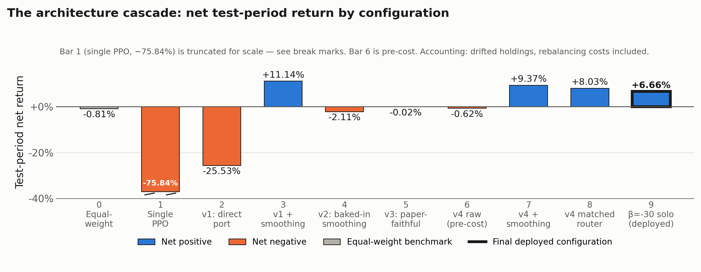
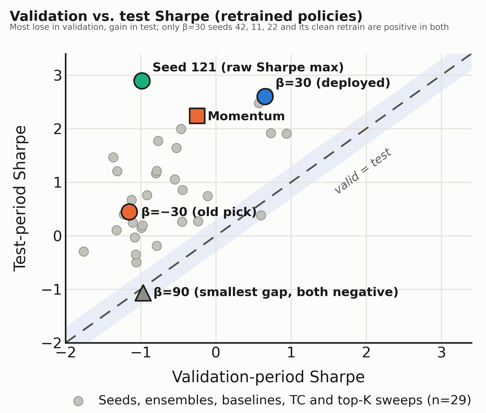

# 포트폴리오 강화학습에서의 실패 진단 — 쉬운 설명판

*안내: 이 문서는 `DRAFT_KR.md`(정식 국문 논문 초고, 학회 투고·졸업논문 제출용)와 같은 내용·같은 숫자·같은 결론을 담고 있습니다. 다만 전문용어와 수식을 최대한 풀어서, 교수님 설명이나 발표 준비용으로 쓰기 편하게 다시 썼습니다. 정식 제출에는 반드시 `DRAFT.md`(영문)/`DRAFT_KR.md`(국문)를 사용하세요.*

> **재학습 반영 현황(2026-10-08).** 크립토 AI를 고친 회계(3.3절)를 반영한 보상으로 처음부터 다시 학습했고, 4~6장의 크립토 수치는 모두 재학습 결과입니다(`paper/RETRAIN_1006.md`). 남은 건 그림 1·2 다시 그리기, 6.3절 클린 재학습 모델의 검증구간 수치 채우기, 6.4절 앙상블을 시드 16개로 다시 계산하기(선택)입니다.

---

## 먼저, 자주 나오는 용어 한 번에 정리

아래 용어들은 본문에서 계속 등장합니다. 여기서 한 번만 풀어두고, 본문에서는 쉬운 표현이나 기호를 그대로 씁니다.

- **등가중 벤치마크**: 모든 종목에 그냥 똑같은 비중으로 나눠 담는, 가장 단순한 투자 방식. 우리 전략이 이걸 이겨야 의미가 있다는 비교 기준선.
- **샤프비율(Sharpe)**: 위험(변동성) 대비 수익을 나타내는 숫자. 높을수록 좋음. 예: 1.0이면 위험 1단위당 수익 1단위.
- **MDD(최대낙폭)**: 고점 대비 최대로 얼마나 까먹었는지. 0에 가까울수록(작을수록) 좋음.
- **검증구간 / 테스트구간**: 전략을 고를 때 들여다보는 구간이 검증구간, 그 선택이 끝난 뒤 진짜 실력을 딱 한 번 확인하는 구간이 테스트구간. 이 논문 전체의 핵심 잣대는 "**검증구간과 테스트구간 성적이 얼마나 차이 나는가**"입니다 — 차이가 크면 "그냥 테스트 구간에 운 좋게 맞아떨어진 것"이라는 뜻입니다.
- **β(베타, 위험선호도 값)**: 각 전략에 미리 부여한 "얼마나 공격적으로 투자할지" 설정값. 음수면 보수적, 양수면 공격적. 서로 다른 β값으로 여러 전략을 동시에 학습시킵니다.
- **α(알파, 관성 강도)**: 실제 매매를 실행할 때 "이전 비중을 얼마나 그대로 유지할지" 정하는 값. 0에 가까울수록 이전 비중을 많이 유지(강한 관성=매매를 적게 함).
- **top-K(상위 K개 선택)**: 전체 종목 중 상위 K개만 골라서 그 안에서만 비중을 나누는 방식. 예: K=10이면 10개 종목만 보유.
- **Q-teacher(정답표 교사)**: 원래 방법(EarnHFT)에서, 미리 계산해둔 "이 상황엔 이게 정답"이라는 표를 학습 과정에 직접 주입해서 여러 전략이 실제로 서로 달라지게 만드는 장치. 계산량이 매우 커서 종목이 하나일 때만 현실적으로 쓸 수 있습니다.
- **보정된 샤프비율(DSR)**: 여러 번 시도해보고 그중 제일 좋은 걸 고르면 원래보다 운이 좋아 보이는 착시가 생기는데, 그 착시를 통계적으로 보정해주는 지표.
- **원인 뒤섞임(confound)**: 두 가지 원인이 동시에 바뀌어서 어느 쪽이 진짜 원인인지 구분이 안 되는 상황.
- **관리자 모듈(라우터)**: 여러 전략 중 지금 상황에 맞는 걸 골라주는 상위 모듈.
- **선택 규칙**: 여러 후보 중 배포할 전략은 "검증구간 샤프가 가장 높은 것"으로 고릅니다. 검증-테스트 차이는 고르는 데 쓰지 않고, 고른 뒤에 점검하는 용도로만 씁니다(차이를 계산하려면 테스트 성적이 필요하기 때문).
- **회계 수정**: 초기 버전의 백테스트는 가격이 움직여 비중이 틀어지는 것을 무시하고, 상장 전 종목도 들고 있을 수 있게 계산했습니다. 이 오류를 고친 뒤 모든 크립토 수치를 다시 계산했습니다(3.3절). 일부 실험은 수정된 환경에서 다시 학습했고, 나머지는 평가만 다시 했습니다(8장 한계 11).

---

## 한 문단 요약 (원래 초록을 쉽게 풀면)

EarnHFT라는, 종목 하나만 갖고 초 단위로 사고파는 상황에 맞춰 만들어진 계층적 AI 트레이딩 방법이 있습니다. 이 방법을 여러 종목에 동시에 비중을 나누는 "포트폴리오" 상황에 옮기면 어떻게 되는지는 지금까지 자세히 기록된 적이 없습니다. 이 논문은 새 알고리즘을 제안하는 게 아니라, 이 방법을 옮겼을 때 실제로 어떤 문제가 순서대로 나타나는지 정리하고, 테스트 성적만 봐서는 안 보이는 문제를 드러내는 보고 방식을 정리한 사례 연구입니다. 한국 주식(KOSPI 781종목)과 암호화폐(바이낸스 44종목) 두 시장에서 실험했습니다.

암호화폐에서 단순한 단일 전략 AI는 모든 종목에 고르게 나눠 담는 것(등가중)보다 훨씬 못했습니다(−79.68% vs −0.81%). 처음엔 KOSPI에서도 같은 실패가 보였는데, 나중에 점검해보니 데이터 처리 결함 때문이었습니다. 결함을 고치자 단일 전략 AI가 10번 중 9번 등가중을 이겼지만, 학습 기간의 평균 비중을 그냥 고정해서 들고 있어도 거의 같은 성적이 나왔습니다(7장). 모든 수치는 "가격이 움직인 뒤 실제로 들고 있는 비중" 기준으로 매매량과 수수료를 계산했고, 크립토 AI는 이 회계를 반영한 보상으로 학습했습니다(3.3절).

EarnHFT의 3단계 구조를 "Q-teacher" 단계만 빼고 옮기면, 수수료 떼기 전 약한 신호(+3.54%, 등가중 +2.71%)가 30분마다 리밸런싱하는 비용에 압도됩니다(수수료 뗀 후 −32.88%). 실행 단계에서만 관성 필터를 걸면 +3.76%까지 회복하지만, 같은 관성을 학습 과정에 넣으면 수수료 전 수익이 −2.84%로 떨어집니다. 선별 절차를 더 충실하게 다시 만들어도 등가중을 못 이깁니다(−5.23%). 행동 범위를 구조적으로 좁히면(top-K 선택 + 위험노출 조절 장치) 위험 대비 성적이 크게 좋아지지만(+5.97%, 샤프 1.231, MDD −6.50%), 그 위에 얹은 관리자 모듈은 사실 항상 같은 전략 하나만 고르는 상수함수로 붕괴해 있었습니다.

네 전략 중 검증구간 샤프가 가장 높은 β=30(검증 0.653, 테스트 2.602, 테스트 MDD −4.38%)을 관리자 없이 관성 필터와 함께 배포 후보로 골랐습니다. 흥미로운 점은, 회계 오류가 있던 보상으로 학습했을 때는 바로 이 β=30이 "테스트에서만 좋은 과최적화 전략"으로 보였고 β=−30이 선택됐다는 것입니다 — 어느 전략이 과최적화로 보이는지가 보상 회계 오류에 따라 뒤집혔습니다. β=30은 비교한 10개 전략 중 검증·테스트 두 구간 모두 플러스인 유일한 전략이지만, 검증-테스트 차이가 1.950으로 작지 않고, 시드 16개로 학습하면 테스트에서는 12개가 등가중을 넘지만 검증구간에서 플러스는 3개뿐이며, 검증 샤프가 가장 높은 시드는 배포 시드가 아닙니다. 여러 시드를 섞은 앙상블은 검증구간에서 손실이고, 통계 보정(DSR 0.707)과 순열검정(p=0.50)도 유의수준에 못 미칩니다. 게다가 같은 노출로 비교해 보니, 이 전략의 작은 낙폭은 거의 전부 위험자산에 조금만 넣은 덕분이고(테스트 평균 10.4%), 테스트 성적의 대부분도 같은 노출 경로를 따르는 등가중으로 재현됩니다(샤프 1.998 대 2.602). 이 실패 목록과, 테스트 성적과 함께 검증구간 성적과 시드별 분포를 보고하고 보상 회계까지 점검해야 하는 이유가, 종목 하나짜리 AI 트레이딩 방법을 포트폴리오로 옮기려는 사람들에게 쓸모가 있을 것입니다.

---

## 1. 왜 이 연구를 시작했나

### 1.1 임베딩 기반 단일 전략 AI는 왜 실패하는가

강화학습(AI가 시행착오로 스스로 전략을 배우는 방법)은 수익률·리스크 모델을 사람이 직접 설계할 필요 없이 데이터만으로 포트폴리오 배분을 배우는 방법으로 꾸준히 제안되어 왔습니다. 그런데 실제로는, 전체 종목을 한 번에 다루는 단순한 단일 전략 AI 에이전트는 생각보다 약한 출발점입니다.

처음엔 서로 아무 관련 없는 두 시장에서 이 실패를 확인했습니다. 한국 주식(781종목)에서는, 5개 그룹으로 묶은 특징값과 현재 비중을 보고 판단하는 AI가 2024–2025년 테스트 구간에서 +0.28%(샤프 0.100)를 기록해 같은 구간 등가중(+34.33%, 샤프 1.043)에 크게 뒤처졌습니다. 암호화폐(바이낸스 44종목)에서는 같은 방식의 구조(종목별 특징값 + 비중 배분 AI)가 2026년 상반기 테스트 구간에서 −79.68%(샤프 −4.440)를 기록했습니다 — 같은 구간 등가중은 −0.81%(샤프 0.255)였습니다. 자산군도, 상태 설계도, 행동공간 크기도, 학습 기간도 다른 두 실험이 같은 방향으로 실패했다는 점이 단일 전략을 계속 다듬는 대신 계층적 구조로 다시 설계하게 만든 계기였습니다.

그런데 나중에 점검해보니 한국 주식 쪽 실패는 데이터 처리 과정의 결함 때문이었습니다. 특징값(임베딩)을 뽑을 때 정규화(RevIN)가 빠져 있었고 입력 순서도 학습 때와 달랐으며, 종목을 그룹으로 묶은 기간과 특징 추출 모델을 학습한 기간이 테스트 구간과 겹쳐 있었습니다. 같은 코드·같은 시드에서 특징 추출 모델만 바꿔도 결과가 +0.28%에서 +137.22%로 뒤집혔습니다. 이 결함들을 고치고 특징 추출 모델 2종 × 시드 5개로 다시 학습했더니, 단일 전략 AI가 10번 중 9번 등가중의 샤프를 넘었습니다(평균 샤프 약 1.08 vs 등가중 0.943). 다만 학습 기간의 평균 그룹 비중을 테스트 내내 그냥 고정해서 들고 있어도 거의 같은 성적이 나왔습니다(샤프 1.108/1.099 vs AI 1.134/1.168). AI가 시장을 읽은 게 아니라 특정 그룹에 쏠려 있었던 것뿐이라는 뜻입니다. 그래서 이 논문의 출발점이 된 "단일 전략 AI의 실패"는 이제 암호화폐 결과와 아래의 미국 주식 통제 실험에만 근거합니다.

이 실패를 보인 구조에는 공통점이 있습니다: 사전에 학습해둔 "특징 요약값(임베딩)"을 상태로 쓰고, 전체 종목에 걸쳐 촘촘하게(빽빽하게) 비중을 나누는 방식을 씁니다. 7장에서 보고하는 미국 대형주 44종목 확인 — 처음에는 임베딩 없이 원래 가격 그대로를 상태로 사용 — 에서는 이 실패가 재현되지 않았습니다: 단일 전략 AI가 2024–2025년 테스트 구간에서 등가중과 사실상 동률이었습니다(+45.58%/샤프 1.482 대 등가중 +45.00%/샤프 1.454). 이 확인은 시장뿐 아니라 상태 표현 방식도 함께 바꾼 것이라 시장 하나의 효과라고 단정할 수 없었습니다 — 그래서 같은 미국 대형주·같은 구간에 이번엔 임베딩(크립토와 같은 계열의 특징값)을 입혀서 다시 확인했습니다(7장). 결과: 성과가 등가중 대비 "동률"에서 "명확히 저조"로 바뀌었습니다(테스트 샤프 1.482→1.251, 등가중 1.458). 이때 매매 빈도가 스텝당 1.22%에서 9.2~9.5%로 약 8배 늘었는데, 이는 뒤에서 설명할 "매매가 너무 잦아서 수익을 다 까먹는다"는 패턴과 같은 메커니즘입니다. 즉 **임베딩 기반 촘촘한 행동 방식 자체가 실패를 유발하는 실제 원인**이지만, 크립토(샤프 −4.440)만큼 파국적이지는 않습니다 — 시장이나 시장 국면이 그 실패의 심각도를 조절하는 것으로 보입니다.

### 1.2 EarnHFT를 여러 종목 포트폴리오로 옮길 때 나타나는 문제들

단일 전략 실패의 원인을 근거 없이 추측하는 대신, EarnHFT 원 논문 자체의 결과에서 직접적인 선례를 찾을 수 있습니다. EarnHFT는 자기 세팅(종목 하나·고빈도)에서 정확히 같은 종류의 단일 전략(PPO, DQN)과 비교하는데, 이 단일 전략들은 4개 크립토 데이터셋 전부에서 EarnHFT의 계층적 구조에 뒤처집니다 — 심지어 종종 마이너스 수익을 냅니다(예: ETH에서 단일 PPO −22.61% 대 EarnHFT +4.52%). EarnHFT 저자들은 이 실패를 단일 전략이 "아무것도 안 하는 정책으로 수렴"하고 "시장 추세 변화에 약하기" 때문이라고 설명하는데, 이는 저희가 암호화폐에서 확인한 실패와 같은 종류의 현상입니다. 이 선례 — 추상적인 이론이 아니라 EarnHFT가 자기 세팅에서 이미 이 실패를 계층적 구조로 해결했다는 실증 결과 — 가 EarnHFT의 3단계 구조를 옮겨보기로 한 근거입니다.

EarnHFT는 종목 하나·고빈도·이산(사고/무포지션/팔기) 트레이딩을 3단계로 다룹니다: ① 여러 위험선호도(β)로 편향된 다수의 전략을 미리 계산해둔 정답표(Q-teacher)로 학습하는 단계, ② 소수의 다양한 전략만 남기는 선별 단계, ③ 시장 상황에 따라 이들 사이를 전환하는 관리자(라우터) 단계. 이 구조를 EarnHFT가 원래 설계되지 않은 상황 — 44개 종목을 동시에 보유하는 연속 비중 포트폴리오 — 으로 옮기면 무슨 일이 일어나는지가 이 논문의 핵심입니다. 특히, 종목 하나·이산 행동을 전제로 하여 여러 종목엔 일반화하기 어려운 ①단계(Q-teacher)는 옮기지 않았습니다.

이 조사 과정에서 각각 고유한 원인 진단과 시도된 해법을 가진 실패의 연쇄가 드러났고, 이것이 이 논문의 실증적 핵심입니다.

- **직접 이식(v1)**: Q-teacher 없이 ②③단계만 재현하면 수수료를 뗀 뒤 −32.88% 손실입니다. 수수료 떼기 *전* 수익은 +3.54%로 등가중(+2.71%)을 겨우 넘는 약한 신호이고, 30분마다 리밸런싱하며 생기는 스텝당 평균 4.65%의 매매(누적 수수료 35.17%)가 이를 압도합니다.
- **실행 단계 해법은 통하지만, 학습 단계 해법은 신호를 망칩니다**: 실행 단계에서만 관성 필터(α=0.01)를 걸면 재학습 없이 +3.76%(샤프 0.403)를 회복합니다 — 등가중보다 낫지만 MDD는 −39.25%로 거의 그대로입니다. 같은 관성을 학습 환경에 넣으면(α=0.03) 수수료 전 수익이 +3.54%에서 −2.84%로 떨어지고 순수익은 −8.02%가 됩니다(같은 α=0.03을 실행 시점에만 걸면 −0.62%). "어떤 행동이 어떤 보상을 냈는지" 연결이 약해진 탓으로 추정하지만 직접 측정하지는 않았습니다.
- **더 충실하게 다시 만들어도 등가중을 못 이깁니다(v3)**: 현금 항목과 엄격한 학습/검증 분리를 넣어도 −5.23%(샤프 0.102)로 등가중(−0.81%)보다 나쁩니다. 회계 수정 전 원래 실행에서는 전략들이 거의 똑같이 균등가중으로 수렴해 있었고, 이를 Q-teacher 부재로 해석하지만 검증하지는 못했습니다.
- **행동공간을 구조적으로 바꾸기(v4)**: top-K(10개) 종목 선택과 위험노출 조절 장치(게이트)를 결합하고 관성 필터를 걸면, **관리자가 남아있는 상태에서** +5.97%, 샤프 1.231, MDD −6.50% — v1+관성보다 수익과 위험 대비 성적 모두 낫습니다.
- **관리자 모듈이 상수함수로 붕괴합니다**: 입력 불일치를 고친 "맞춘" 관리자는 더 좋아 보입니다(+8.73%, 샤프 2.602, MDD −4.38%). 그런데 관리자 없이 β=30 전략만 돌려도 똑같은 수치가 나옵니다. 관리자는 항상 같은 전략 하나만 고르고 있었습니다.
- **어느 전략이 "과최적화"로 보이는지가 보상 회계에 따라 뒤집힙니다**: 네 전략을 검증·테스트 양쪽에서 비교하면 검증 샤프 최고는 β=30(검증 0.653, 테스트 2.602)이고, 두 구간 모두 플러스인 유일한 전략입니다. 그런데 회계 오류가 있던 보상으로 학습했을 때는 같은 β=30이 검증 0.189 → 테스트 3.033으로 뛰는 "테스트에서만 좋은 전략"으로 보였고, 이 논문의 초기 버전은 그래서 β=−30을 배포했습니다. 재학습 후 그 β=−30은 검증구간에서 손실(−7.39%)입니다. 테스트 성적과 함께 검증 성적을 보고해야 하지만, 검증-테스트 차이 하나로 과최적화를 판정하면 안 된다는 교훈입니다.

### 1.3 살아남은 전략에 대한 검증

최종 배포 후보 — 관리자 없이 관성 필터만 건 β=30 전략 하나 — 는 살아남은 것 중 가장 단순한 구성입니다. 이 전략을 다음 검증에 걸었습니다:

- **시드 16개 재현성**: 테스트에서는 16개 중 12개가 등가중보다 높은 샤프를 내지만, 검증에서 플러스인 시드는 배포 시드 포함 3개뿐이고, 검증 샤프가 가장 높은 시드는 배포 시드가 아닙니다.
- **보정된 샤프비율(DSR)**: 0.707(시드 16개 기준)으로 교과서적 유의수준(0.95)에 못 미칩니다.
- **데이터 유출 없는 재학습**: 검증구간을 학습에서 빼도 테스트 +5.40%, 샤프 1.907로 성적이 크게 유지됩니다.
- **여러 시드 섞기(앙상블)**: 테스트 샤프 1.054지만 검증구간에서 마이너스입니다.
- **단순·AI 전략 비교**: 모멘텀은 테스트 수익률이 훨씬 높지만(+97.41% vs +8.73%) 검증구간에서 손실이고 차이(2.490)가 단순 전략 중 가장 큽니다. 배포 후보의 차이(1.950)도 작지 않습니다. EIIE·LSRE-CAAN은 여전히 등가중과 비슷합니다.
- **수수료·순열검정·노출 맞춤**: 수수료를 2배로 올려도 결론은 그대로지만, 검증-테스트 차이는 순열검정에서 우연과 구별되지 않고, 작은 낙폭과 테스트 성적의 대부분은 같은 노출 경로의 등가중으로 재현됩니다.

### 1.4 이 논문이 기여하는 것

1. **단일 전략 AI 실패의 원인을 인과적으로 밝힙니다**: 암호화폐에서 임베딩 기반 단일 전략 AI가 등가중에 크게 뒤처짐을 확인한 뒤(처음엔 한국 주식에서도 같은 실패로 보였지만, 결함을 고친 재실험에서 재현되지 않았습니다 — 7장), 세 번째 시장(미국 대형주)에서 시장은 고정하고 상태 표현 방식만(원래 가격 대 사전학습 임베딩) 바꾸는 통제 실험을 수행해, 이 실패가 특정 시장의 우연이 아니라 임베딩 기반 촘촘한 행동 방식 자체(아키텍처) 때문임을 직접 확인합니다(매매빈도 약 8배 증가 동반) — 시장이나 시장 국면은 그 붕괴의 심각도만 조절하는 것으로 보입니다.
2. **문서화된 실패 연쇄**: 종목 하나짜리 계층적 AI(EarnHFT)를 여러 종목 연속 포트폴리오로 옮길 때 — 수수료로 인한 신호 소거, 학습 시점 관성의 함정, Q-teacher 부재로 인한 다양성 격차, 희소 행동공간을 통한 구조적 해법, 그리고 소리 없이 상수함수로 퇴화하는 관리자 모듈. "여러 전략 + 관리자 + 총 노출 조절"이라는 구조 자체는 선행연구(MoEDRLPM, DeepTrader)에 이미 있으므로, 기여는 구조가 아니라 이 연쇄의 기록입니다.
3. **강건성 진단 방법론**: 테스트 성적과 함께 검증구간 성적과 시드별 분포를 보고하고, 이것이 DSR과 서로 보완한다는 걸 보입니다. 이 방식은 관리자 붕괴와 시드 간 들쭉날쭉함을 드러냈습니다. 하지만 검증-테스트 차이로 개별 전략의 과최적화를 판정했던 결과는 보상 회계 오류를 고치고 재학습하자 뒤집혔습니다 — 차이는 두 구간의 시장 국면 차이에 크게 좌우되므로 단독 판정 기준으로 쓰기 어렵고, 진단 전에 보상 회계부터 점검해야 한다는 것도 이 기여의 일부입니다.
4. **단순한 배포 전략과 그 한계에 대한 정직한 보고**(β=30 하나, 관리자 없음, 실행 시점 관성): 10개 전략 중 두 구간 모두 플러스 샤프를 낸 유일한 전략이고(검증 0.653, 테스트 2.602), 테스트 MDD −4.38%로 등가중(−40.46%)보다 89% 낮습니다. 다만 차이가 1.950으로 크고, 시드 16개 중 3개만 두 구간 모두 플러스입니다. 또 이 낙폭 개선은 거의 전부 위험자산에 조금만 넣은 덕분입니다(테스트 평균 노출 10.4%) — 같은 노출 경로로 등가중을 들어도 테스트 MDD −4.60%, 샤프 1.998이 나오고, 전략 고유의 종목 선택이 더하는 몫은 샤프 +0.60 정도입니다(6.11절). 그래서 이 전략의 가치는 "위험 관리"보다 "노출 타이밍"으로 설명하는 게 정확합니다. 지금 실계좌에서 돌고 있는 건 회계 오류가 있던 보상으로 학습한 β=−30이고, 재학습 후 같은 구성은 검증구간에서 손실이라 교체가 필요합니다.

### 1.5 논문 구성

2장은 관련 연구, 3장은 데이터, 4장은 v1–v4 실패 연쇄, 5장은 통합 결과표, 6장은 강건성 검증(낮은 낙폭이 어디서 오는지 확인하는 6.11절 포함), 7장은 세 시장 비교, 8장은 한계, 9장은 결론입니다.

---

## 2. 관련 연구

### 2.1 트레이딩을 위한 계층적 AI

EarnHFT(Qin 외, 2024, AAAI)는 이 논문이 기반으로 삼고 또한 갈라져 나온 원형입니다. 초 단위·종목 하나·이산 행동 고빈도 트레이딩을 3단계로 다룹니다: 여러 위험선호도(β)에 대해 미리 계산해둔 정답(Q-teacher)으로 다수 전략을 학습하는 단계, 이 중 대표 전략만 남기는 선별 단계, 시장 국면이 바뀌면 전략을 전환하는 관리자(라우터) 단계. Q-teacher가 있기 때문에 전략 풀은 태생적으로 다양합니다 — 각 전략이 스스로 다양성을 찾는 게 아니라, 외부에서 주어진 서로 다른 정답을 향해 학습됩니다.

이 구조는 계산이 가능한 이산 행동(사기/무포지션/팔기)을 가진 종목 하나에 특화돼 있어서, 여러 종목에 연속적으로 비중을 나누는 포트폴리오로 그대로 일반화되지 않습니다. 이건 "계산할 시간/자원이 부족해서"가 아니라 **차원의 저주**라는, 자원을 아무리 늘려도 못 피하는 구조적 한계입니다. 종목 하나·선택지 3개(사기/무포지션/팔기)일 때는 "이 중 뭐가 최선인가"를 세 숫자만 비교하면 바로 정확히 풀립니다. 반면 44종목에 비중을 나누는 문제는 선택지 자체가 연속적인 43차원 공간 전체이고, 여기에 수수료(매매 비율에 비례, 꺾이는 함수)까지 끼어 있어서 "이 중 뭐가 최선인가"를 정확히 푸는 효율적인 방법 자체가 없습니다(종목당 5단계로만 성기게 나눠서 무식하게 다 대입해봐도 5⁴⁴ ≈ 5.7×10³⁰개 조합이 나옵니다). 그렇다고 신경망으로 "대충 근사"해서 풀면 — 그건 결국 AI가 스스로 좋은 행동을 학습하게 만드는 것과 같아져서, Q-teacher가 원래 주려던 "미리 계산해둔 확실한 정답"이라는 장점 자체가 사라져버립니다. 즉 이 한계는 자원 문제가 아니라, 종목 하나·이산 선택지에서만 통하는 "정확한 계산"이 여러 종목·연속 선택지로는 원리적으로 안 옮겨진다는 구조적 문제입니다. 4장은 Q-teacher를 뺀 채(위험선호도 조건부 데이터 샘플링만 사용) 나머지 단계를 이 상황으로 옮겼을 때 정확히 무슨 일이 일어나는지 상세히 기록합니다 — 이 특정 실패(교사 없는 다양성 붕괴와 그에 이은 관리자의 상수함수 붕괴)는 포트폴리오 규모의 계층적 AI에서 이전에 문서화된 적이 없다고 봅니다.

더 일반적으로, EarnHFT의 3단계 구조는 "고정된 하위 전략들 사이를 상위 정책이 전환한다"는 더 넓은 이론 계열(옵션 프레임워크, 봉건적 RL 등)의 한 사례입니다. 이 이론들은 대개 하위 전략의 다양성이 저절로 생긴다고 전제하는데, 4장의 실패 목록은 정확히 그 전제(EarnHFT에서는 Q-teacher가 담당)가 없을 때 이 일반적인 틀이 무너지는 구체적 사례를 보여줍니다.

### 2.2 다양성을 되살리는 데 쓴 두 가지 재료

직접 이식이 실패한 뒤, 전략 다양성을 복원하려고 최근 두 논문에서 재료를 가져왔습니다. **FreQuant**(Jeon 외, 2024, KDD)는 주파수 도메인 정보를 쓰는 포트폴리오 프레임워크인데, 여기서 채택한 부분은 딱 하나 — 확신도 점수 기준 top-K 종목 선택 방식 — 이고, 이걸 행동공간을 희소화하는 용도로만 씁니다(주파수 인코더 자체는 재구현하지 않았습니다). **DeepClair**(Choi 외, 2024, CIKM)는 사전학습된 시장 예측기를 포트폴리오 파이프라인에 결합하는데, 채택한 부분은 "어떤 종목을 보유할지"와 "총 얼마나 위험을 감수할지"를 분리하는 전용 위험노출 조절 장치뿐입니다. 두 채택 모두 부분적입니다 — 각 논문에서 구조적 메커니즘 하나만 가져와 EarnHFT 골격에 접목했을 뿐, 어느 쪽도 전체를 재현하지 않았습니다.

관성 필터(4.2절)는 다른 문헌 계열 — 로봇 제어에서 행동을 매끄럽게 만드는 CAPS(Mysore 외, 2021) — 와 관련되지만, 채택이 아니라 대조 관계입니다. CAPS는 매끄러움을 정책의 손실함수에 직접 넣어서 로봇 제어에서 전력소비를 크게 줄이는 데 성공했다고 보고합니다. 이 논문의 두 번째 실험(관성을 학습 환경 자체에 내장)은 사실 CAPS와 같은 발상을 독립적으로 재발견한 건데, CAPS의 성공과 정반대로 이 상황에서는 신호를 파괴했습니다. 최종 채택한 해법(관성은 실행 시점에만, 학습은 자유롭게)은 그래서 CAPS와 정반대 지점에 있습니다. 로봇 제어의 보상은 매 순간 촘촘하고 지속적인데, 이 상황의 보상은 수수료라는 드물고 지연된 페널티가 지배한다는 게 차이일 수 있다고 추측하지만, 확인하지는 않았습니다.

### 2.3 예전부터 있던 단순 전략들

강건성 검증(6장)에서 등가중과 별도로 네 가지 단순 전략과 비교합니다: 매수후보유, 모멘텀(최근 오른 종목 따라 사기), 평균-분산 최적화(수익과 위험을 함께 고려한 전통적 최적화, 여기선 표본 공분산 대신 안정적인 축소추정 공분산 사용), 리스크 패리티(위험을 고르게 나누기, 역변동성 배분). 별도로, top-K 희소선택(4.4절)은 전통적인 "보유 종목 수 제한" 최적화 문제를 AI가 학습한 확신도 점수로 근사한 것으로 볼 수 있는데, 6.8절의 검증은 이 확신도가 실제로는 미래 수익률 순위를 거의 예측하지 못한다는 걸 보여줘서, 전통적 정식화가 전제하는 "진짜 신호 기반 선택"이 이 근사에서는 성립하지 않을 수 있음을 시사합니다.

### 2.4 사용한 AI 알고리즘 자체는 새롭지 않습니다

모든 전략·관리자는 새로운 알고리즘이 아니라 기존에 널리 쓰이는 방법(PPO, DQN)으로 학습됩니다. EarnHFT 원 논문은 두 단계 모두 DDQN(과대추정 편향을 교정한 DQN 개선판)을 쓰는데, 이 논문은 구현을 단순화하려고 표준 DQN으로 대체했습니다 — 이 단순화가 관리자 붕괴 진단에 영향을 줬을 가능성은 8장에서 별도로 다룹니다. 이 논문의 기여는 AI 알고리즘 자체가 아니라 그 위에 세운 구조와 그걸 평가하는 진단 방법론에 있습니다.

### 2.5 백테스트 과최적화를 잡아내는 방법

4.5~4.6절 및 6장과 가장 가까운 선행 연구는 Gort 외(2022)로, 정확히 우리가 마주친 문제 — 백테스트 성적이 진짜 재현 가능한 실력을 반영하지 않는 AI 트레이딩 — 를 연구하며, 과최적화 탐지를 정식 통계 검정으로 만들 것을 제안합니다. 검증-테스트 차이 진단(4.6절)은 이 아이디어의 더 단순한 정성적 버전으로 시작했다가, 6.10절에서 정식 통계 검정(순열검정)으로 재확인합니다 — 방향은 일치하지만 교과서적 유의수준에는 못 미칩니다.

계량 금융에서 가져온 두 도구가 "하나의 좋은 백테스트를 얼마나 믿어야 하나"를 정식화합니다: **Probability of Backtest Overfitting**(Bailey 외, 2016)과 **보정된 샤프비율(DSR, Bailey & López de Prado, 2014)**입니다. 이 논문은 여러 시드 실험에 후자를 적용합니다 — 독립적으로 학습된 여러 후보 중 최선을 고르는 문제라, DSR의 다중비교 보정이 이 구조에 직접 들어맞기 때문입니다. 실증적으로도 확인한 결과, DSR과 검증-테스트 일관성 검사는 서로 다른 종류의 착시를 교정합니다 — 둘은 서로를 대체하지 않고 보완합니다.

### 2.6 관련 프레임워크와 비교

아래 표는 이 논문이 위에서 논의한 프레임워크들과 비교해 어디에 있는지 정리한 것입니다. 특히 짚어둘 점 둘: 첫째, DeepClair는 스스로 수수료 반영을 향후 과제로 남겼는데, 이 논문의 핵심 발견(4.1절)이 바로 수수료가 지배적인 실패 요인이라는 것이고, 배포 전략이 수수료 0.5~2배 범위에서 강건한 것(6.9절)은 처음부터 수수료를 진지하게 다룬 결과입니다. 둘째, 아래 네 프레임워크 중 어느 것도 이 논문이 쓰는 의미의 검증-테스트 일관성 검사를 보고하지 않습니다.

| 프레임워크 | 여러 종목·연속 비중? | 관리자(라우터) 있음? | 희소/구조화된 행동공간? | 수수료 반영? | 여러 시드 강건성 보고? | 검증-테스트 일관성 검사? |
|---|---|---|---|---|---|---|
| EarnHFT (2024) | 아니오(종목 하나, 이산) | 예 | 해당없음 | 예 | 미보고 | 부분적 |
| FreQuant (2024) | 예 | 아니오 | 예(확신도 기반 top-K) | 예 | 미보고 | 아니오 |
| DeepClair (2024) | 예 | 아니오 | 예(롱/숏 선택) | **아니오**(향후 과제로 명시) | 예(10시드, 평균만) | 아니오 |
| DeepTrader (2021)‡ | 예(롱/숏) | 아니오(자산·시장 2-유닛 분리) | 예(자산 점수 + 롱/숏 비율) | 본문 미대조 | 본문 미대조 | 본문 미대조 |
| MoEDRLPM (2025)‡ | 예 | 예(여러 전문가 + 라우터) | 부분적(시장 위험 기반 투자 비율) | 본문 미대조 | 초록에 없음 | 초록에 없음 |
| EIIE / LSRE-CAAN(본 논문 재구현) | 예 | 아니오 | 아니오(촘촘한 방식) | 예 | 아니오(시드 1개씩) | 본 논문 기준으로 평가됨 |
| **본 논문(배포)** | 예 | **검증으로 제거함 — 기여 0으로 확인** | 예(top-K + 위험게이트) | 예(0.5~2배 스윕) | 예(16시드) | 예(격차 + DSR + 순열검정) |

‡ DeepTrader·MoEDRLPM은 본문 전체가 아니라 초록과 서지 정보만으로 채웠습니다. "본문 미대조"는 그 항목이 없다는 뜻이 아니라 확인하지 못했다는 뜻입니다. 특히 "여러 전략 + 관리자 + 총 노출 조절"이라는 구조는 MoEDRLPM·DeepTrader에 이미 있으므로, 이 논문의 기여는 구조 자체가 아니라 그 구조를 옮길 때 나타난 실패의 기록입니다.

---

## 3. 데이터와 문제 설정

### 3.1 두 시장, 같은 설계 패턴

이 논문은 같은 설계 패턴(임베딩으로 채우는 상태, 비중 배분 행동공간, PPO로 학습)을 공유하지만 세부사항은 모든 면에서 다른, 서로 독립적으로 구축된 두 문제를 다룹니다:

| | KOSPI 주식 | 암호화폐(바이낸스) |
|---|---|---|
| 대상 종목 | KOSPI 781종목 | USDT 현물 44종목 |
| 봉 주기 | 일봉 | 5분봉 |
| 원래 데이터 | OHLCV + 기술지표 20개 | 5분 그리드로 계산한 동일 지표 20개 |
| 예측 타겟 | 1일/5일 앞 수익률 | 30분(6봉) 앞 수익률 |
| 상태 정리 방식 | DTW로 묶은 클러스터 5개 | 종목별(클러스터링 없음) |
| 행동공간 크기 | 5차원(클러스터 비중) | 최대 45차원(종목별 비중+현금) |
| 학습/테스트 구간 | 2021–2023 / 2024–2025 | 2025년 / 2026년 상반기 |

두 데이터셋은 RL 부분이 설계되기도 전에 서로 다른 회사·다른 파이프라인·다른 설계 방식으로 독립적으로 만들어졌습니다. 처음에는 이 독립성 때문에 두 시장에서 함께 보인 단일 전략 실패가 의미 있다고 봤습니다. 하지만 KOSPI 쪽 실패는 나중에 데이터 처리 결함 때문으로 드러났습니다(1.1절, 7장). 그래서 두 트랙은 "같은 실패의 두 사례"가 아니라 같은 설계 패턴을 서로 다른 시장에 적용한 두 사례로 읽어야 합니다.

한 가지 더 근본적인 차이가 있습니다: EarnHFT 원 논문은 초 단위로 판단하는데, 이 논문의 두 트랙은 그보다 몇 자릿수 느립니다 — 크립토의 30분 리밸런싱도 이미 "고빈도"라 부르기엔 한참 느리고, KOSPI의 일봉 주기는 그보다 더 느립니다. KOSPI에서는 특히 중요한 문제입니다: 하루에 한 번만 리밸런싱하면, EarnHFT의 계층 구조가 애초에 해결하려던 "수수료가 복리로 쌓이는 문제" 자체가 발생할 여지가 거의 없습니다. 이게 7장의 KOSPI 결과를 어떻게 읽어야(또는 읽지 말아야) 하는지에 직결됩니다.

### 3.2 공통으로 쓴 임베딩 백본

두 트랙 모두 같은 계열의 종목별(또는 클러스터별) 특징 요약값(임베딩) 백본을 씁니다. 8개 후보 백본(StockMixer, PatchTST, iTransformer, Chronos 제로샷, Chronos-LoRA, MTGNN, Mamba/BiGRU, Chronos+MTGNN 결합)을 방향 정확도와 수익률 예측 순위상관 기준으로 비교한 뒤 정했습니다. 1차 비교에서는 제로샷 Chronos(아마존이 미리 학습해둔 범용 시계열 모델, 추가 학습 없이 그대로 사용)가 방향 정확도에서 가장 우수했고, 확장 비교에서는 MTGNN(원래 여러 변수를 동시에 예측하려고 만든 그래프 학습 모델)이 1위였습니다(방향 정확도 0.5145). 다만 모든 후보의 방향 정확도가 0.496–0.515로 "그냥 오른 날 비율"(0.505)과 거의 같고, 같은 설정을 다시 돌렸을 때의 편차가 후보 간 차이와 비슷해서, 이 순위는 강한 우열이 아니라 약한 신호로 읽어야 합니다.

최종 배포한 백본은 Chronos(종가 흐름으로부터 종목별 시간 표현을 뽑음, 가중치 고정)와 MTGNN을 단순화한 그래프 인코더(한 종목의 기술지표 20개를 점으로 두고 지표 사이 관계를 학습)를 이어붙인 뒤 작은 신경망으로 합친 것입니다. 이 그래프는 지표 사이 관계만 다루고 종목 사이 관계는 다루지 않습니다. 이 결합 모델의 단독 예측 성능(방향 0.5056)은 MTGNN 단독보다 오히려 낮았습니다. 리밸런싱 스텝마다 종목별 64차원 임베딩을 만들고, 이걸 현재 포트폴리오 비중과 이어붙인 것이 AI가 보는 전체 상태입니다.

이 백본은 크립토 트랙의 모든 AI 실험(4–6장)에서 고정돼 있으므로, 4장의 구조 간 비교 결과는 백본 차이로 설명되지 않습니다. 다만 백본 선택이 성과와 무관하다는 뜻은 아닙니다. 한국 주식 트랙의 원래 파이프라인에서는 같은 코드·시드에서 백본만 바꿔도 단일 전략 AI의 테스트 수익이 +137.22%와 +0.28%로 갈렸습니다. 이 파이프라인에는 임베딩 정규화 누락 등의 결함이 있었고, 결함을 고친 재실험에서는 두 백본이 비슷한 결과를 냈습니다(시드 5개 평균 샤프 1.09 대 1.07, 7장). 자세한 백본 비교 수치는 별도 기술 보고서에 있습니다.

### 3.3 공통 환경 설정

각 스텝에서 AI는 종목별 임베딩과 직전 보유 비중을 이어붙인 것을 관측하고, 목표 비중(밀집한 방식이면 소프트맥스, 희소한 방식이면 top-K+게이트)을 출력합니다. 매매 비율에 비례해 수수료를 뗍니다(비율 τ=0.001, 바이낸스 표준 테이커 수수료와 일치, 오더북 슬리피지·시장충격은 포함 안 함). 스텝 보상은 이 수수료를 뗀 실현 수익률입니다.

여기서 중요한 회계 규칙 두 가지가 있습니다.

- **매매량은 "가격이 움직인 뒤 실제로 들고 있는 비중" 기준으로 셉니다.** 직전에 목표로 정한 비중도 한 스텝 동안 가격이 움직이면 틀어집니다. 그래서 등가중처럼 목표 비중이 안 바뀌는 전략도, 틀어진 비중을 되돌리는 재조정 비용을 냅니다(EIIE 논문과 같은 방식).
- **그 시점에 거래할 수 없는 종목(상장 전·상폐 후)은 비중을 0으로 둡니다.** 빠진 몫은 나머지 종목으로 다시 나누거나(전액투자 방식), 현금으로 둡니다(top-K 방식).

이 논문의 초기 버전은 직전 *목표* 비중을 그대로 보유 비중으로 넘겨서 재조정 비용을 빠뜨렸고, 상장 전 종목을 수익률 0인 자산처럼 들고 있을 수 있게 했습니다. 4–6장의 크립토 수치는 이 오류를 고친 환경에서 다시 계산한 것입니다. 크립토 AI는 이 고친 회계를 반영한 보상으로 다시 학습했습니다. 다만 6장 일부 실험은 재학습 전 전략 기준입니다(8장 한계 11).

모든 전략은 PPO(학습률 3×10⁻⁴, 10만 스텝)로, 관리자(DQN)는 별도 하이퍼파라미터(학습률 10⁻³, 2만 스텝)로 학습하며, 이 예산은 v1–v4 전체에서 고정해 비교가 불균등한 연산량으로 왜곡되지 않게 했습니다.

---

## 4. 방법론: 어떻게 흘러왔는가 (v1 → v4)

아래 각 절은 앞서 1.2절에서 요약한 흐름의 한 단계씩입니다. 환경이나 학습 방식을 바꾼 부분을 먼저 설명하고, 결과와 진단을 뒤이어 설명합니다. 이 장의 수치는 특별히 표시하지 않는 한 3.3절의 수정된 회계로 다시 계산한 값입니다.

### 4.1 v1 — Q-teacher 없이 EarnHFT를 그대로 이식

2025년 학습 구간의 시장 흐름을 다섯 국면(하락/조정/횡보/반등/상승)으로 나눈 뒤(평균 약 3일 길이, 123개 구간 — 반등·상승 쪽에 치우친 분포), 위험선호도 β ∈ {−90, −30, 30, 90}마다 하나씩 네 개 전략을 학습합니다. Q-teacher가 없으니 β는 학습 데이터를 뽑는 우선순위에만 반영되고(그 부호에 유리했던 국면 쪽으로 편향), PPO의 목적함수 자체는 안 바뀝니다. 그다음 관리자(DQN)가 국면이 바뀔 때마다 네 전략 중 하나를 고르도록 학습합니다.

결과: 테스트 구간에서 수수료를 떼고 자본의 32.88%를 잃습니다(샤프 −1.071, MDD −50.68%). 같은 매매를 수수료 없이 계산하면 +3.54%로, 수수료 전 +2.71%(수수료 후 −0.81%)인 등가중을 겨우 넘습니다. 스텝당 평균 매매 비율이 포트폴리오 가치의 4.65%이고, 이게 복리로 쌓여 구간 전체 35.17%의 수수료 손실이 됩니다. 즉 신호는 약하게나마 플러스지만, 30분마다 리밸런싱하는 수수료가 그보다 훨씬 큽니다. 회계 오류가 있던 보상으로 학습했을 때는 수수료 전 신호가 +11.98%로 훨씬 강해 보였는데, 그 상당 부분이 회계 오류와 함께 사라진 셈입니다.

### 4.2 실행 시점 관성 vs 학습 시점 관성

수수료에 압도된 전략을 고치는 가장 직접적인 방법은 매매 빈도를 줄이는 겁니다. 두 가지를 시험했습니다.

첫 번째는 재학습 없이 실행 시점에만 적용합니다: 매 스텝의 목표 비중을 이전 비중과 일정 비율로 섞습니다(새 판단 반영 비율 α를 1.0부터 0.01까지 7단계로 스윕). 테스트 성적이 가장 좋은 α=0.01은 같은 전략을 −32.88%에서 수수료 뗀 후 +3.76%(샤프 0.403, MDD −39.25%)로 끌어올립니다. 다만 이 α는 테스트 결과를 보고 고른 것이라 "탐색 중 관측한 값"입니다(이후 v3·v4에서는 검증 구간에서 고르는데, 같은 0.01이 뽑힙니다). 수수료 뗀 후 수익은 α를 줄일수록 꾸준히 좋아지지만(−32.88% → … → +3.76%), 수수료 전 수익은 +1.53%~+4.97%로 크게 안 변합니다 — 관성이 약한 신호를 수수료로부터 지켜주는 역할이라는 뜻입니다. 다만 MDD는 −39.25%로 등가중과 거의 같아서, 관성만으로 위험 프로필이 바뀌지는 않습니다. 같은 시기에 실행 시점 보정 8종도 시험했지만(최고 +28.43%), 테스트 결과를 보고 고른 것이라 쓰지 않았습니다.

두 번째 방법은 같은 관성(α=0.03)을 학습 환경 자체에 넣습니다 — AI가 자기 행동이 완충될 걸 알고 미리 저매매 전략을 배우게 하자는 발상입니다(로봇 제어의 CAPS와 같은 발상). 결과는 실행 시점 관성보다 확연히 나쁩니다: 순수익 −8.02%(샤프 0.006, MDD −40.85%)로, 같은 α=0.03을 실행 시점에만 건 v1의 −0.62%에 못 미칩니다. 더 시사적으로는 수수료 전 수익이 +3.54%에서 −2.84%로 마이너스가 됩니다(실행 시점 α=0.03은 +2.27%). "환경이 행동을 흐릿하게 만들면 어떤 행동이 도움이 됐는지 연결이 약해진다"는 **가설**로 해석하지만, 직접 측정하지는 않았습니다. 여기서 정한 원칙은 논문 끝까지 유지됩니다: **학습은 완전히 자유롭게(α=1) 시키고, 관성은 실행 시점에만 건다.**

### 4.3 v3 — 더 충실하게 다시 만들어도 다양성 엔진이 없다

v1의 단순화(현금 없음, 정답표 대신 우선순위 샘플링, 테스트 구간으로 튜닝된 전략 선택)가 그 자체로 부족한 성적의 원인이었을 가능성을 배제하려고, 선별 절차를 더 충실하게 다시 만듭니다. 45번째 행동으로 현금을 추가하고, 2025년을 9개월 학습 + 3개월 검증으로 엄격히 나눕니다. 20개 후보 전략(4개 β × 5개 체크포인트) 각각을 검증 구간에서 국면별로 평가해 국면마다 최고 후보를 남기고, 관리자와 최종 관성 비율도 테스트 구간이 아니라 이 검증 구간에서 고릅니다.

이 버전도 등가중을 넘지 못합니다: 수수료 뗀 후 −5.23%(샤프 0.102, MDD −39.51%)로 등가중(−0.81%, 샤프 0.255)보다 나쁩니다(검증에서 고른 α=0.01). 선별 단계는 국면마다 다른 β를 골랐습니다(하락 β=90, 조정 β=30, 횡보·반등 β=−30, 상승 β=−90). 회계 수정 전 원래 실행에서 뜯어보면 현금 비중이 테스트 구간 내내 2.2%(정확히 균등값 1/45)로 고정돼 있고, 20개 후보의 국면별 검증 점수는 서로 1%포인트도 안 차이 나는 — 즉 서로 다른 β로 학습했는데도 사실상 똑같은 클론처럼 행동합니다. 이를 EarnHFT Q-teacher의 역할과 연결해 해석합니다: 위험선호도가 오직 학습 데이터의 샘플링 방식으로만 표현되고 목적함수 자체는 안 바뀌었을 때, 45차원 연속 행동공간에서 서로 다른 행동이 만들어지지 않았습니다 — β에 따라 다른 목표를 목적함수에 직접 주입하는 교사 신호가 없으면, 경사하강법이 균등가중이라는 국소최적점에서 벗어날 이유가 없습니다.

이 해석을 그냥 사후 해석으로 남기지 않으려고 최소한으로 직접 검증했습니다. 현금 환경은 그대로 두고, β 부호에 따라 현금 비중을 다르게 유도하는 보조 보상 하나만 목적함수에 직접 추가했습니다. 보조 보상이 없는 기본 풀, 약한 보조 보상(λ=0.01) 풀, 15배 강한(λ=0.15) 풀을 수정된 환경에서 각각 처음부터 학습했습니다. β 순서와 현금비중 순서의 순위상관은 기본 풀 −0.400, λ=0.01 −0.800, λ=0.15 −0.600입니다. 회계 수정 전에는 +0.400 → −0.400 → −0.800으로 보조 보상이 셀수록 꾸준히 좋아져서 "신호 강도에 비례해 반응한다"는 증거로 썼는데, 다시 학습해보니 보조 보상이 없어도 이미 의도한 방향(−0.400)이고, 강도를 올려도 꾸준히 좋아지지 않습니다. β가 4개뿐이라 이 값은 두 β의 순서만 바뀌어도 크게 움직이니, 이 정도 차이는 우연 범위입니다. 효과 크기도 작습니다 — 가장 강하게 줘도 β별 평균 현금 비중이 0.89%~4.26%로 모두 균등값(2.2%) 근처입니다. 그래서 "v3가 붕괴한 건 Q-teacher 같은 목적함수 신호가 없어서"라는 해석은 이 실험으로 뒷받침되지 않고, 검증 안 된 가설로 남습니다. 성과 쪽 패턴은 수정 전과 같습니다 — 강한 풀을 관성 필터로 평가하면 검증구간에서는 네 전략 다 등가중보다 나쁘고(샤프 −1.10~−1.29 대 −0.459), 테스트구간에서 가장 화려한 원시 수익률(β=−30, +8.61%)을 낸 후보가 검증-테스트 차이는 가장 큽니다(1.706) — 4.6절과 같은 과최적화 패턴입니다.

### 4.4 v4 — 행동공간 구조를 바꿔서 다양성을 되살림

Q-teacher를 다시 만드는 대신(앞서 설명한 차원의 저주 때문에 44종목 규모에서는 원리적으로 못 함 — 정확히 풀 효율적 방법이 없고, 대충 근사하면 그냥 AI를 직접 학습시키는 것과 같아져 버림), 2.2절에서 설명한 두 메커니즘으로 행동공간의 형태 자체를 바꿉니다. 처음 44개 값은 종목별 확신도, 마지막 하나는 위험게이트입니다. 확신도 기준 top-10 종목을 먼저 고르고 그 안에서만 비중을 나누며(FreQuant 응용), 그 결과 만들어진 하위 포트폴리오를 위험게이트(0~1 사이 값)로 스케일링합니다(DeepClair 응용). 나머지는 암묵적으로 현금입니다. 국면 구분과 β 조건부 샘플링은 v1과 동일하게 유지해, v1 대비 유일하게 바뀐 변수가 행동공간의 형태뿐이도록 했습니다.

세 가지 다양성 진단(위험게이트의 시간에 따른 변동폭, β별 평균 위험게이트값, top-10에 등장한 서로 다른 종목 수)은 재학습한 풀에서도 v3의 붕괴가 재발하지 않았음을 보여줍니다. 관리자+풀의 위험게이트 변동폭은 0.084(v3는 사실상 0)이고, 각 전략을 테스트 구간 전체에서 단독으로 돌린 평균 위험게이트값은 β=−90 0.256, β=−30 0.265, β=30 0.093, β=90 0.446이며, 44개 중 36개 종목이 top-10에 한 번 이상 들어왔습니다. 위험게이트값이 β 순서대로 커지지는 않습니다 — 가장 보수적인 건 β=30, 가장 공격적인 건 β=90입니다. 네 전략의 검증·테스트 성적이 크게 다르다는 점(4.6절)도 행동이 서로 다르다는 증거입니다.

성적은 이렇습니다. 관성 필터 없는 원시 관리자+풀은 수수료 전 수익이 −0.81%로 사실상 0이고, 스텝당 매매 2.97%로 수수료 뗀 후 −24.79%입니다. α=0.01 관성 필터를 걸면 +5.97%, 샤프 1.231, MDD −6.50% — v1+관성(+3.76%, 샤프 0.403, MDD −39.25%)보다 수익과 위험 대비 성적 모두 낫습니다(이 α도 테스트에서 고른 값). v1과 달리 v4에서는 수수료 전 수익 자체가 α를 줄일수록 대체로 커집니다(α=1의 −0.81%에서 α=0.01의 +6.65%까지, 꾸준하지는 않음). 즉 관성이 기존 신호를 지키기만 하는 게 아니라, 실제로 어떤 매매가 일어나는지 자체를 바꿔서 원래 없던 플러스 신호를 만듭니다. 왜 그런지는 아직 설명하지 못하는 열린 질문입니다. "초반에 잡은 포지션을 그냥 들고 있는" 아티팩트가 아니라는 것도 따로 확인했습니다: 매매 비율이 테스트 구간 앞 10%(스텝당 0.129%)와 뒤 10%(0.122%)에서 비슷하고 매매가 0인 스텝이 없으며, 앞·뒤 1/4 구간에서 고른 종목은 16개와 29개로 겹치는 정도(자카드)가 0.25입니다. 다만 수익은 전반부에 크게 몰려 있습니다(전반부 +5.36%, 후반부 +0.57%).

### 4.5 "맞춘" 관리자와 그 붕괴

4.4절의 관리자는 여러 입력 중 하나로 "현재 국면 구간이 얼마나 진행됐는지"를 봅니다. 이건 학습 때는 잘 정의되지만 실거래에는 구간 경계가 없어서, 배포 시스템은 그냥 상수 0.5로 근사합니다. 이 학습/실행 불일치를 없애려고, 전략 풀은 그대로 두고 이 값을 학습 때도 0.5로 고정한 채 관리자만 다시 학습했습니다("맞춘" 관리자). 결과는 더 좋아 보입니다: 순수익 +5.97% → +8.73%, 샤프 1.231 → 2.602, MDD −6.50% → −4.38%. 검증 구간에서 α를 골라도 같은 0.01이 뽑힙니다.

그런데 관리자 없이 β=30 전략만 단독으로 돌리면 "맞춘" 관리자의 테스트 수치가 그대로 나옵니다(둘 다 +8.73%, 샤프 2.602, MDD −4.38%). 관리자는 상황에 맞춰 고르는 법을 배운 게 아니라, 모든 입력을 무시하고 상수 하나로 붕괴한 것이었습니다. 회계 오류가 있던 보상으로 학습했을 때도 같은 β=30으로 붕괴했었습니다(테스트 195/195, 검증 92/92 구간). 재학습한 풀 위에서 관리자를 DDQN으로 바꿔 학습하면 같은 붕괴가 가장 나쁜 전략인 β=90으로 나타났습니다(테스트 −17.17%) — 붕괴 자체는 견고하지만, 어느 전략으로 붕괴하는지는 학습 과정에 따라 달라집니다.

### 4.6 어느 전략이 진짜인가

이 발견은 질문을 바꿉니다: 관리자로부터 결과적으로 물려받은 β=30 전략은 검증구간에서도 좋을까요, 아니면 이 테스트 구간에서만 좋아 보이는 걸까요? 네 전략 전부를 관리자 없이 단독으로(α=0.01), 검증구간(2025년 4분기)과 테스트구간(2026년 상반기) 양쪽에서 실행했습니다:

| β | 검증 샤프 | 테스트 샤프 | 검증 수익률 | 테스트 수익률 | 테스트 MDD |
|---|---|---|---|---|---|
| −90 | −0.111 | 0.743 | −2.70% | +5.51% | −10.80% |
| −30 | −1.155 | 0.448 | −7.39% | +3.09% | −14.06% |
| **30** | **0.653** | **2.602** | **+2.98%** | **+8.73%** | **−4.38%** |
| 90 | −0.971 | −1.065 | −13.41% | −17.17% | −30.41% |
| 등가중 | −0.459 | 0.255 | −32.56% | −0.81% | −40.46% |

**선택 규칙.** 배포할 전략은 **검증구간 샤프가 가장 높은 전략**으로 고릅니다. 테스트 정보를 쓰지 않는 규칙이고, β=30(검증 0.653, 차점 β=−90의 −0.111)을 고릅니다. β=30은 네 전략 중 두 구간 모두 플러스인 유일한 전략이고, 붕괴한 관리자가 고른 전략과 같습니다. 그래서 최종 배포 후보는 관리자 없이 β=30 단독 + α=0.01 관성 필터입니다 — 붕괴한 관리자가 사실상 하던 일을, 불필요한 관리자 층 없이 그대로 하는 구성입니다.

**재학습 전과 달라진 점.** 회계 오류가 있던 보상으로 학습한 풀에서는 같은 표가 정반대였습니다: β=30은 검증 0.189 → 테스트 3.033으로 뛰는 "테스트에서만 좋은 전략"이었고, 검증 최고는 β=−30(0.914, 테스트 1.310)이었습니다. 이 논문의 초기 버전은 그래서 β=30을 과최적화로 판정하고 β=−30을 배포했습니다. 고친 보상으로 재학습하면 β=30이 검증에서도 최고가 되고, β=−30은 검증구간에서 손실(−7.39%)입니다. 즉 **어느 전략이 과최적화로 보이는지가 보상 회계 오류에 따라 뒤집혔습니다.**

**검증-테스트 차이.** 차이는 고르는 데 쓰지 않고 사후 점검으로만 봅니다: β=−90 0.854, β=−30 1.603, **β=30 1.950**, β=90 0.094. 고른 β=30의 차이가 가장 큽니다. 검증구간은 등가중이 −32.56%인 급락장이고 테스트구간은 보합장이라, 네 전략 중 셋이 검증보다 테스트에서 샤프가 0.85~1.95 높아지는 국면 차이가 있습니다. 차이 크기는 이 국면 차이에 크게 좌우됩니다. 차이가 가장 작은 β=90은 두 구간 다 손실입니다. 그래서 이 데이터에서는 차이 크기만으로 과최적화를 판정할 수 없고, 플러스 성과·시드 분포와 함께 봐야 합니다. 이 선택도 검증 구간 하나와 시드 하나에 근거하며, 6.1절은 같은 구성의 시드 16개 중 13개가 검증구간에서 마이너스 샤프라는 걸 보여줍니다.

---

## 5. 결과

표 1은 4장에서 나온 모든 구성을 같은 테스트 구간(2026년 상반기, 9,319스텝)에서, 등가중 벤치마크(매 스텝 재조정 비용 포함: −0.81%, 샤프 0.255, MDD −40.46%) 대비로 정리한 것입니다. 모든 행은 고친 회계를 반영한 보상으로 학습하고 같은 회계로 평가했습니다.

| # | 구성 | 다양성 메커니즘 | 관리자 | 관성 필터 | 순수익 | 샤프 | MDD |
|---|---|---|---|---|---|---|---|
| 0 | 등가중 벤치마크 | — | — | — | −0.81% | 0.255 | −40.46% |
| 1 | 단일 전략(계층 없음) | — | — | — | **−79.68%** | −4.440 | −82.48% |
| 2 | v1: 직접 이식 | 우선순위 샘플링만 | 있음 | — | −32.88% | −1.071 | −50.68% |
| 3 | v1 + 실행시점 관성 | 우선순위 샘플링만 | 있음 | α=0.01 | +3.76% | 0.403 | −39.25% |
| 4 | v2: 학습에 관성 내장 | 우선순위 샘플링만 | 있음 | 내장 | −8.02% | 0.006 | −40.85% |
| 5 | v3: 현금 + 검증기반 선별 | 우선순위 샘플링만 | 있음(검증 선별) | α=0.01(검증 선택) | −5.23% | 0.102 | −39.51% |
| 6 | v4 원본(관성 없음) | **top-K+게이트** | 있음 | — | −0.81%(수수료 전)† | −6.524† | −25.21%† |
| 7 | v4 + 관성(원본 관리자) | top-K+게이트 | 있음 | α=0.01 | +5.97% | 1.231 | −6.50% |
| 8 | v4 맞춘 관리자 | top-K+게이트 | **상수함수로 붕괴** | α=0.01 | +8.73% | 2.602 | −4.38% |
| 9 | **β=30 단독(배포 후보)** | top-K+게이트 | **없음** | α=0.01 | **+8.73%** | **2.602** | **−4.38%** |

† 6행의 "순수익"만 수수료 전 수치입니다(수수료 후 −24.79%). 샤프·MDD는 수수료 후 기준입니다.
3·7행의 α는 테스트 구간에서 고른 값이라 독립적인 성적으로 읽으면 안 됩니다. 8·9행은 검증 구간으로 골라도 같은 값입니다.

이 표를 관통하는 두 패턴: 첫째, 큰 개선(2→3, 6→7)은 관성 추가 덕분이고, 3→7의 위험 대비 개선은 행동공간 구조 변경 덕분이며, 관리자 덕분인 적은 없습니다 — 8행과 9행이 소수점까지 같으니 관리자의 순수 기여는 0입니다. 둘째, 단일 전략과 v1은 고친 보상으로 학습해도 크게 실패하고, 수수료를 다루는 장치(관성, 희소 행동공간)가 성과 대부분을 만듭니다.

*그림 1은 재학습 전 수치로 그려져 있어 다시 만들어야 합니다.*

표 2는 배포 후보를 예전 단순 전략·최신 AI 전략·강건성 변형들과 나란히 놓고, 검증구간/테스트구간 샤프 차이를 함께 보여줍니다:

| 전략 | 테스트 수익률 | 테스트 샤프 | 검증 수익률 | 검증 샤프 | 검증-테스트 차이 |
|---|---|---|---|---|---|
| 등가중 벤치마크(재조정 비용 포함)* | −0.57% | 0.263 | −32.38% | −0.451 | 0.714 |
| 매수후보유 | +19.44% | 0.854 | −27.98% | −0.443 | 1.296 |
| 모멘텀(top-10) | **+97.41%** | 2.240 | −18.21% | −0.251 | **2.490(단순 전략 중 최대)** |
| 평균-분산 최적화 | −6.96% | −0.032 | −39.16% | −1.078 | 1.046 |
| 리스크 패리티 | −15.11% | −0.497 | −38.84% | −1.060 | 0.563 |
| **β=30 RL, 배포 시드(42)** | +8.73% | **2.602** | +2.98% | 0.653 | 1.950 |
| β=30, 추가 시드 15개(평균) | +6.15% | 0.972 | −7.79% | −0.738 | — |
| β=30, 6시드 앙상블 | +6.21% | 1.054 | −5.45% | −0.548 | 1.602 |
| β=30, 유출없는 클린 재학습 | +5.40% | 1.907 | (기입 예정)§ | (기입 예정)§ | — |
| EIIE(최신 AI 전략, 2017)† | −3.51% | 0.148 | −33.56% | −0.991 | 1.139 |
| LSRE-CAAN(최신 AI 전략, 2023)† | −2.37% | 0.193 | −33.31% | −0.975 | 1.168 |

\* 단순 전략들은 별도 시뮬레이터로 계산해서, 이 표의 등가중이 표 1의 등가중(−0.81%)과 조금 다릅니다. 둘 다 재조정 비용을 포함합니다. 단순 전략은 학습이 없어서 재학습 영향을 받지 않습니다.
§ 클린 재학습 모델의 검증구간 수치는 결과 파일에 저장되지 않아 실행 출력에서 옮겨야 합니다(6.3절).
† EIIE·LSRE-CAAN은 다른 데이터로더로 평가 구간을 구성해서, 같은 노트북에서 다시 계산한 등가중(테스트 −1.92%/샤프 0.214, 검증 −35.97%/샤프 −1.000)과 비교해야 합니다. 그렇게 보면 두 AI 전략 모두 등가중과 거의 같습니다.

원시 수익률로는 모멘텀이 크게 이깁니다. 하지만 모멘텀은 검증구간에서 손실이고 차이(2.490)가 단순 전략 중 가장 큽니다. 배포 후보 β=30은 10개 전략 중 *양쪽* 구간에서 플러스 샤프를 낸 유일한 전략이고 테스트 샤프도 가장 높습니다. 하지만 차이(1.950)는 리스크 패리티(0.563)·등가중(0.714)·매수후보유(1.296)보다 크고, 추가 시드 평균·앙상블 행은 검증구간에서 마이너스입니다 — "두 구간 모두 플러스"는 구성 전체가 아니라 일부 시드에서만 보입니다(6.1절).

---

## 6. 강건성 분석

검증구간 샤프(4.6절)를 근거로 β=30을 고른 뒤, 이 선택 자체를 "따로 검증해야 할 주장"으로 보고 여러 검증에 다시 걸었습니다. 이 장의 크립토 수치는 모두 재학습 결과입니다. 6.5절 단순 전략은 학습이 없어서 영향이 없습니다.

### 6.1 여러 시드로 재현되는가

배포 구성(β=30, top-K+게이트, α=0.01 관성, 관리자 없음)을 시드(무작위 시작값)만 5개 바꿔(11, 22, 33, 44, 55) 다시 학습했습니다:

| 시드 | 검증 수익률 | 검증 샤프 | 테스트 수익률 | 테스트 샤프 |
|---|---|---|---|---|
| **42(배포)** | +2.98% | 0.653 | +8.73% | **2.602** |
| 11 | +3.66% | 0.601 | +2.09% | 0.383 |
| 22 | +1.90% | **0.732** | +6.52% | 1.916 |
| 33 | −12.15% | −1.313 | +7.21% | 1.205 |
| 44 | −17.10% | −0.788 | −3.16% | −0.187 |
| 55 | −11.64% | −1.365 | +14.63% | 1.465 |
| 등가중 | −32.56% | −0.459 | −0.81% | 0.255 |

- **테스트구간에서는 방향이 대체로 재현됩니다**: 6개 중 5개가 등가중(샤프 0.255)보다 높고, 시드 44만 마이너스입니다.
- **검증구간에서는 절반만 재현됩니다**: 검증 샤프가 플러스인 건 시드 42, 11, 22 셋입니다.
- **크기는 재현되지 않습니다**: 새 5개 시드의 테스트 샤프는 평균 0.956(표준편차 0.848), 검증 샤프는 평균 −0.427(표준편차 1.024)입니다.
- **검증 샤프가 가장 높은 시드는 42가 아니라 22입니다**(0.732 대 0.653). 시드 42는 테스트 샤프가 가장 높은 시드입니다. 시드까지 검증으로 골랐다면 22가 뽑혔을 겁니다.

시드 10개(66, 77, 88, 99, 110, 121, 132, 143, 154, 165)를 더 돌려 16개로 늘리면 이 패턴이 더 뚜렷해집니다:

| 시드 | 검증 수익률 | 검증 샤프 | 테스트 수익률 | 테스트 샤프 |
|---|---|---|---|---|
| 66 | −12.67% | −1.067 | −4.30% | −0.349 |
| 77 | −10.41% | −1.108 | +1.41% | 0.247 |
| 88 | −18.30% | −1.761 | −5.01% | −0.292 |
| 99 | −4.53% | −0.464 | +9.41% | 1.997 |
| 110 | −1.21% | −0.238 | +1.11% | 0.271 |
| 121 | −8.15% | −0.986 | **+36.49%** | **2.893** |
| 132 | −7.26% | −0.771 | +7.10% | 1.773 |
| 143 | −7.83% | −1.225 | +3.01% | 0.399 |
| 154 | −3.65% | −0.526 | +11.20% | 1.642 |
| 165 | −7.42% | −0.788 | +4.57% | 1.212 |

- **새로 더한 10개는 검증 샤프가 전부 마이너스입니다.**
- 16개 전체로 보면 테스트 샤프는 13개가 플러스, 12개가 등가중보다 높고(평균 1.073), 검증 샤프는 3개(42, 11, 22)만 플러스입니다(평균 −0.651). 검증 수익률은 16개 모두 등가중(−32.56%)보다 손실이 작습니다.
- **테스트 샤프가 가장 높은 시드도 배포 시드가 아니라 시드 121입니다**(2.893, +36.49%). 시드 42는 16개 중 테스트·검증 모두 2위입니다.
- 시드별 검증 샤프와 테스트 샤프의 상관은 0.36으로, 검증 성적은 테스트 성적을 약하게만 예측합니다.

이 결과를 이렇게 읽습니다: 검증구간(급락장)과 테스트구간(보합장)의 국면 차이가 커서, 이 구성의 전략들은 대체로 "급락장에선 손실, 보합장에선 이익"을 내고 그 정도가 시드마다 크게 다릅니다. 시드 하나가 두 구간에서 일관됐다는 것만으로는 강건성의 증거가 되기 어렵습니다.

### 6.2 보정된 샤프비율(DSR)

DSR을 시드 실험에 적용해, 각 시드를 "여러 번 시도한 것 중 하나"로 취급했습니다. 재학습 후에는 배포 시드(42)가 6개 중 테스트 샤프도 가장 높습니다:

| 후보 | 테스트 샤프 | DSR(6개 중) |
|---|---|---|
| 시드 42(배포, 원시 최댓값) | 2.602 | 0.826 |
| 시드 11 | 0.383 | 0.248 |

배포 시드의 DSR 0.826은 교과서적 유의수준(0.95)에 못 미칩니다. 시드를 16개로 늘리면 "시도 횟수"가 늘어 기준선이 높아지고 DSR은 더 낮아집니다: 시드 42는 0.707, 원래 샤프가 가장 높은 시드 121은 0.775로 둘 다 0.95에 못 미칩니다. 시드 121의 DSR이 더 높은 건 DSR의 보정 기준선이 "몇 번 시도했는가"로 정해져 모든 후보에 똑같이 적용되기 때문입니다 — DSR은 그 후보가 최댓값이었는지를 보지 않습니다.

DSR과 검증-테스트 차이는 서로 다른 질문에 답합니다: DSR은 "한 테스트 구간 *안에서* 여러 시도 중 최선을 고른 게 보정 후에도 살아남는가"를, 검증-테스트 차이는 "*평가 구간 자체가* 바뀌어도 성적이 유지되는가"를 묻습니다. 그래서 둘 다 보고합니다.

### 6.3 데이터 유출 없는 재검증

α와 β를 고른 검증 구간(2025년 4분기)이 학습 구간(2025년 전체)과 겹쳐 있어서, "검증"이 완전히 안 본 데이터가 아니라는 우려가 있습니다. 그래서 β=30(시드 42)을 **오직** 2025년 1–9월로만 다시 학습하고, 진짜로 안 본 10–12월에서 α를 고른 뒤, 그 구성을 2026년 상반기 테스트 구간에 딱 한 번 실행했습니다:

| | 테스트 수익률 | 테스트 샤프 | 테스트 MDD | 스텝당 매매 |
|---|---|---|---|---|
| 등가중 | −0.81% | 0.255 | −40.46% | 0.37% |
| 배포(2025년 전체로 학습) | +8.73% | 2.602 | −4.38% | 0.044% |
| **클린 재학습(9개월 학습, 안 본 3개월에서 α 선택)** | **+5.40%** | **1.907** | **−4.05%** | 0.027% |

안 본 검증구간에서도 배포와 같은 α=0.01이 뽑히고, 테스트 성적은 배포 모델보다 낮지만 크게 유지됩니다(샤프 1.907, MDD −4.05%). 즉 검증 구간을 학습에 넣은 것이 β=30의 테스트 성적을 만들어낸 건 아닙니다. 샤프 차이(2.602 대 1.907)에는 학습 데이터가 3개월 적은 효과와 6.1절에서 본 학습의 우연이 섞여 있어서, 이 실험 하나로는 둘을 나눌 수 없습니다. 클린 모델의 검증구간 성적은 결과 파일에 저장되지 않아 아직 적지 못했습니다.

배포 전략을 클린 재학습 모델로 바꾸지는 않습니다 — 테스트 결과를 보고 바꾸면 테스트 기반 선택을 다시 끌어들이는 셈이기 때문입니다.

### 6.4 여러 전략을 섞으면? (부정적 결과)

6.1절의 시드 간 들쭉날쭉함을 줄이는 자연스러운 방법은, 시드 하나만 쓰는 대신 여러 시드의 비중을 매 스텝 평균내는 것입니다. 6개 시드로 추가 학습 없이 시험했습니다:

| 구성 | 검증 샤프 | 테스트 샤프 | 검증-테스트 차이 |
|---|---|---|---|
| 시드 11 | 0.601 | 0.383 | 0.218 |
| 시드 44 | −0.788 | −0.187 | 0.601(두 구간 다 마이너스) |
| 시드 22 | 0.732 | 1.916 | 1.184 |
| 앙상블(6개 전부) | −0.548 | 1.054 | 1.602 |
| **시드 42(배포)** | **0.653** | **2.602** | **1.950** |
| 앙상블(시드 11 뺀 5개) | −0.797 | 1.165 | 1.961 |
| 시드 33 | −1.313 | 1.205 | 2.518 |
| 시드 55 | −1.365 | 1.465 | 2.830 |

두 앙상블 모두 테스트 샤프는 플러스지만 검증 샤프는 마이너스입니다. 검증구간에서 손실인 시드가 절반이라, 비중을 평균내면 그 행동이 섞여 검증 성적이 마이너스가 되는 것으로 보입니다. 시드마다 top-K 종목 선택이 달라서 평균내면 집중된 포지션이 희석된다는 설명이 그럴듯하지만, 확인하지는 않았습니다. 결론은 재학습 전과 같습니다: **비중을 평균내는 시드 앙상블은 두 구간 일관성을 개선하지 못합니다.** 이 앙상블은 처음 6개 시드로만 계산했습니다. 새로 더한 10개가 모두 검증에서 마이너스라 16개로 늘려도 나아지기는 어려워 보이지만, 직접 계산하지는 않았습니다.

### 6.5 예전부터 있던 단순 전략들과 비교

학습이 전혀 없는 네 가지 전략과 비교했습니다: 매수후보유(처음에 사서 그대로, 시작 시점에 거래 가능한 종목만), 모멘텀(최근 7일 수익률 상위 10종목으로 매일 리밸런싱), 평균-분산 최적화(축소추정 공분산, 주 1회, 최소분산, 공매도 없음), 리스크 패리티(최근 90일 변동성의 역수로 주 1회). 리밸런싱 사이에는 그냥 들고 있고, 비중은 가격에 따라 틀어집니다.

결과(표 2): 모멘텀은 연구 전체에서 가장 높은 원시 테스트 수익률(+97.41%)을 내지만 검증구간에서는 손실(−18.21%)이고, 단순 전략 중 검증-테스트 차이가 가장 큽니다(2.490). 평균-분산 최적화는 두 구간 모두 등가중보다 나쁩니다(테스트 −6.96%, 검증 −39.16%) — 암호화폐 종목들이 서로 너무 강하게 같이 움직여서, 공분산 기반 최적화가 활용할 구조가 거의 없기 때문으로 봅니다. 리스크 패리티도 같은 방향으로 실패합니다(테스트 −15.11%, 검증 −38.84%). 비교한 여섯 전략(등가중, 매수후보유, 모멘텀, 평균-분산, 리스크 패리티, 배포 AI) 중 배포 전략만 두 구간 모두 플러스 샤프입니다.

"차이가 작으면 좋은 전략"이라는 생각에 대한 반례는 이 표가 아니라 4.6절의 β=90(차이 0.094, 두 구간 다 손실)에서 나옵니다 — 차이는 플러스 성과와 함께일 때만 의미가 있습니다.

### 6.6 최신 AI 전략과 비교: EIIE, LSRE-CAAN

AI 전략이 단순 전략을 이기는 게 그냥 "어떤 신경망이든 쓰면 생기는 효과"인지 확인하려고, 대표적인 포트폴리오 AI 구조 두 개를 재구현했습니다. **EIIE**(2017)는 종목마다 같은 CNN으로 점수를 매기고 직전 비중을 기억해 비중을 내는 구조이고, **LSRE-CAAN**(2023)은 어텐션으로 가격 흐름을 요약한 뒤 종목 사이 관계를 보고 점수를 매기는 더 최신 구조입니다. 둘 다 원 논문의 학습법 대신 이 논문의 PPO 파이프라인으로, 임베딩 없이 원래 가격 그대로를 입력으로, 배포 구성과 같은 수수료·학습량으로 학습했습니다.

- EIIE: 테스트 샤프 0.148(−3.51%)로 같은 노트북에서 다시 계산한 등가중(0.214)과 비슷하고, 검증에서도 등가중과 거의 같습니다(−0.991 vs −1.000).
- LSRE-CAAN: 테스트 샤프 0.193(−2.37%), 검증 −0.975로 같은 노트북의 등가중(0.214, −1.000)과 사실상 같습니다.

세 가지 서로 다른 구조(v3, EIIE, LSRE-CAAN)에서 모두 등가중 근처에 머무는 결과가 재현됐습니다. 이 문제의 어려움이 특정 신경망 구조 탓이 아니라, 외부에서 다양성을 만들어주는 신호 없이 포트폴리오 비중 AI를 처음부터 학습시키는 것 자체의 일반적인 성질로 보인다는 뜻입니다. 배포 후보 β=30은 두 전략을 테스트 샤프로 크게 앞서고(2.602 vs 0.148/0.193), 추가 시드 15개 평균(0.972)과 비교해도 앞서지만 시드 44·66·88처럼 마이너스인 시드도 있습니다.

### 6.7 보조 증거: 종목 하나로 Q-teacher를 되살리면 다양성도 되살아난다

4.3절은 v3의 다양성 붕괴를 Q-teacher가 없기 때문이라고 봤는데, 44종목 규모에서는 Q-teacher를 직접 다시 넣기 어렵습니다(2.1절의 차원의 저주). 간접 확인으로, 이 프로젝트에서 따로 진행한 비트코인 한 종목짜리 브랜치 — 사기/무포지션/팔기 이산 행동에 Q-teacher까지 포함해 EarnHFT를 원래 범위에 가깝게 재현한 것 — 의 결과를 언급합니다. Q-teacher 계산이 *쉬운* 이 상황의 초기 버전(나중에 자산 계산 버그가 발견된 버전)에서는 β별 평균 포지션이 0.39에서 0.79까지 갈렸습니다 — 4.3절에서 붕괴했던 것과 같은 척도의 다양성입니다. 다만 버그를 고친 최종 버전에서는 다섯 β의 평균 포지션이 0.42~0.66으로 분리 폭이 줄었고, β 순서대로 정렬되지도 않습니다(β=−10이 0.651로 β=30의 0.485보다 높음). 그래서 이 브랜치는 "Q-teacher가 β별로 다른 행동을 만든다"는 약한 정성적 증거일 뿐이고, 4.3절 진단의 강한 확인으로 읽으면 안 됩니다. 이 브랜치의 수익률 자체는 무관한 이유(초기 회계 버그, 잘못 맞춘 규칙 기반 관리자)로 저조하고 44종목 결과와 비교할 수도 없어서, 다양성 결과만 보고합니다.

### 6.8 top-K를 바꾸면 어떻게 되나

4.4절의 top-K는 K=10으로 고정한 채 v1–v4 비교를 진행했습니다(학습량을 균등하게 유지하려는 방침의 일부). 스윕 없이 정했다는 점이 원래 한계였어서, 나중에 배포 구성(β=30, α=0.01, 관리자 없음)을 고정한 채 K ∈ {5, 7, 15}로 다시 학습하고(K=10은 4.4절 모델 재사용) 같은 검증/테스트 진단을 적용했습니다.

| K | 검증 샤프 | 테스트 샤프 | 검증-테스트 차이 | 검증 수익률 | 테스트 수익률 | 테스트 MDD |
|---|---|---|---|---|---|---|
| 5 | −1.322 | 0.106 | 1.427 | −10.38% | +0.19% | −14.57% |
| 7 | −1.122 | 0.672 | 1.795 | −8.95% | +3.85% | −9.05% |
| **10(배포)** | **0.653** | **2.602** | 1.950 | **+2.98%** | **+8.73%** | **−4.38%** |
| 15 | −0.916 | 0.760 | 1.676 | −15.78% | +5.49% | −11.69% |

K=10이 검증·테스트 모두에서 가장 좋고, 검증 샤프가 플러스인 것도 K=10뿐입니다. 그래서 4.6절과 같은 규칙(검증 샤프 최고)으로 K를 골라도 K=10이 뽑힙니다. 재학습 전(β=−30)에는 검증 샤프가 가장 높은 게 K=5라서 K=10이 이 실험으로 정당화되지 않았는데, 재학습 후에는 그 문제가 사라졌습니다. 다만 이웃한 K들이 전부 검증에서 손실이고 K=10만 튀는 모양이라, 이게 K라는 설정의 성질인지 6.1절에서 본 것 같은 학습의 우연인지는 이 실험(K마다 시드 하나)으로 구별할 수 없습니다. 그래서 K=10은 여전히 "실험 전에 정해둔 값"으로 읽어야 합니다. 실험 범위({5,7,10,15})도 원래 계획했던 범위({5,10,15,20})와 정확히 같지는 않습니다.

이 실험은 부수적으로 부정적 결과 하나를 함께 보여줬습니다. top-K를 고를 때 쓰는 종목별 확신도와 그 종목의 실제 수익률 사이의 순위상관을 테스트 구간에서 재보면, 평균이 0.0014~0.0046(사실상 0)이고, 순위상관이 플러스인 스텝 비율도 50.5~51.3%(동전 던지기 수준)입니다. β=30과 β=−90은 통계적으로는 유의하지만 크기가 아주 작고, β=−30·β=90은 유의하지도 않습니다. 즉 **확신도가 다음 구간 종목 순위를 실제로 맞힌다는 증거는 거의 없습니다** — K를 바꿀 때 성과가 달라지는 건 정교한 종목 선별보다는 보유 종목 수 자체가 분산·집중도를 바꾸기 때문일 가능성이 큽니다. 이는 4.4절의 열린 질문과 이어집니다: 종목 선택 신호가 거의 0인데도 관성을 건 배포 전략의 수수료 전 수익은 플러스이고, 그 이유는 아직 설명하지 못합니다(6.11절이 일부 답을 줍니다).

### 6.9 수수료 가정을 바꾸면 어떻게 되나

τ=0.001(10bp)은 바이낸스 표준 수수료지만, VIP 등급이나 BNB 할인을 쓰면 실제 비용은 더 낮을 수 있습니다(8장 한계 7). 배포 구성(β=30, α=0.01)을 고정하고 재학습 없이 수수료만 바꿔 다시 계산했습니다:

| 수수료 | 검증 샤프 | 검증 수익률 | 테스트 샤프 | 테스트 수익률 | 테스트 MDD |
|---|---|---|---|---|---|
| 5bp | 0.693 | +3.21% | 2.665 | +8.95% | −4.35% |
| 10bp(배포) | 0.653 | +2.98% | 2.602 | +8.73% | −4.38% |
| 15bp | 0.613 | +2.76% | 2.540 | +8.51% | −4.41% |
| 20bp | 0.573 | +2.54% | 2.477 | +8.28% | −4.44% |

수수료를 0.5배~2배로 흔들어도 두 구간 모두 등가중(테스트 샤프 0.255, 검증 샤프 −0.459)보다 높습니다 — 2배 수수료에서도 테스트 샤프가 2.477입니다. 배포 전략의 매매 비율이 스텝당 0.04%(테스트)~0.10%(검증)로 아주 낮아서, 수수료 전 수익(테스트 +9.18%)에서 빠지는 비용이 20bp에서도 0.9%에 그치기 때문입니다. 다만 이건 배포 시드 하나에 대한 것이고, 6.1절의 시드 간 들쭉날쭉함을 줄여주지는 않습니다.

### 6.10 검증-테스트 차이를 정식 통계 검정으로

지금까지의 검증-테스트 차이 진단은 "차이가 크다/작다"를 눈으로 비교한 것이었습니다. 이를 **블록 순열검정**으로 정식화했습니다: 하루(48스텝) 단위 블록으로 단기 패턴은 유지한 채, "검증·테스트 구간 이름표를 서로 바꿔도 상관없다"는 가정 아래 지금만큼 큰 차이가 우연히 나올 확률(p값)을 계산합니다(2,000번 섞음). 각 구간 샤프의 95% 신뢰구간(블록 부트스트랩)도 함께 봅니다. 네 β 전략 전부에 적용했습니다:

| β | 검증 샤프 [95% 구간] | 테스트 샤프 [95% 구간] | 차이(테스트−검증) | p값 |
|---|---|---|---|---|
| −90 | −0.111 [−3.15, 3.03] | 0.743 [−1.94, 3.12] | +0.854 | 0.695 |
| −30 | −1.155 [−4.66, 1.86] | 0.448 [−2.19, 2.83] | +1.603 | 0.481 |
| 30(배포) | 0.653 [−2.80, 4.27] | 2.602 [−0.95, 5.43] | +1.950 | 0.498 |
| 90 | −0.971 [−4.08, 2.35] | −1.065 [−3.74, 1.27] | −0.094 | 0.963 |

네 전략 모두 교과서적 유의수준(p<0.05)에 한참 못 미칩니다. 재학습 전에는 차이가 가장 큰 β=30의 p값이 가장 작아서(0.353) 눈으로 본 판단과 방향이라도 맞았는데, 재학습 후에는 그런 순서도 안 나옵니다. 더 근본적으로, 신뢰구간이 배포 후보의 테스트 샤프(2.602)까지 포함해 전부 0을 포함합니다 — 반년(하루 블록 약 194개)과 한 분기 데이터로는 샤프 차이는커녕 샤프 자체도 0과 통계적으로 구별되지 않습니다. 이는 "검증-테스트 차이로 과최적화를 판정하기 어렵다"는 4.6절의 결론을 뒷받침합니다. 배포 근거는 이 검정의 유의성에 기대지 않습니다(8장 한계 6).

### 6.11 같은 노출로 비교하면: 낮은 최대낙폭은 어디서 오는가

배포 전략은 위험게이트와 관성 때문에 평균적으로 자산의 일부만 위험자산에 넣습니다(실제 평균 노출: 검증 20.9%, 테스트 10.4%). 등가중(100% 투자) 대비 낙폭이 작은 게 이 낮은 노출 때문인지 확인하려고, 같은 환경·회계로 두 벤치마크를 더 계산했습니다: 전략의 평균 노출만큼만 등가중에 넣는 "고정 노출", 매 스텝 전략과 같은 노출로 등가중을 드는 "전략 노출 경로".

| | 검증 수익률 | 검증 샤프 | 검증 MDD | 테스트 수익률 | 테스트 샤프 | 테스트 MDD |
|---|---|---|---|---|---|---|
| β=30 배포 전략 | +2.98% | 0.653 | −8.62% | +8.73% | 2.602 | −4.38% |
| 등가중 100% | −32.56% | −0.459 | −43.82% | −0.81% | 0.255 | −40.46% |
| 등가중 × 고정 노출 | −4.41% | −0.483 | −9.97% | +0.54% | 0.203 | −5.06% |
| 등가중 × 전략 노출 경로 | +0.32% | 0.230 | −15.74% | +6.48% | 1.998 | −4.60% |

세 가지가 드러납니다.

1. **낙폭 개선은 거의 전부 노출을 줄인 덕분입니다.** 테스트에서 전략의 평균 노출(10.4%)만큼만 등가중을 들어도 MDD가 −5.06%이고, 전략 노출 경로를 따르면 −4.60%로 전략의 −4.38%와 거의 같습니다. 1.4절의 "89% 감소"는 등가중 100% 대비 수치이고, 같은 노출 대비로는 개선이 거의 없습니다.
2. **테스트 성적의 대부분은 노출 타이밍에서 옵니다.** 전략 노출 경로를 따른 등가중은 테스트 샤프 1.998(+6.48%)로, 고정 노출(0.203)보다 훨씬 높고 전략(2.602, +8.73%)에 가깝습니다. 전략 고유의 종목 선택이 더하는 몫은 샤프 +0.60, 수익률 +2.25%p 정도입니다. 6.8절의 "종목 선택 신호가 거의 0"이라는 발견과도 맞아떨어집니다.
3. **검증구간에서는 종목 선택의 몫이 더 큽니다.** 같은 노출 경로의 등가중은 검증 샤프 0.230, MDD −15.74%인데 전략은 0.653, −8.62%입니다. 다만 배포 모델은 검증 구간을 학습에 포함했으므로(6.3절), 이 효과를 안 본 데이터에서의 증거로 읽으면 안 됩니다.

정리하면 이 전략은 평균 노출 10~20%의 아주 보수적인 전략이고, 성적은 주로 "언제 얼마나 시장에 들어가 있느냐"에서 나옵니다.

**그림 2.** *재학습 전 수치로 그려져 있어 다시 만들어야 합니다.* 6장에서 검증·테스트 샤프가 둘 다 있는 모든 구성을 대각선(y=x, 음영은 차이 0.3 미만) 위에 찍은 그림입니다. top-K 실험(6.8절, 그림을 만든 뒤 다시 계산해서 반영 안 됨)과 다른 시장인 7장 KOSPI 후보는 뺐습니다. 다시 그리면 배포 후보 β=30은 대각선에서 1.950 떨어지고, 16개 시드 중 13개와 앙상블은 "검증 마이너스, 테스트 플러스" 영역에 모이며, 대각선에 가장 가까운 건 두 구간 다 손실인 β=90(0.094)이 됩니다 — 대각선에 가깝다는 것만으로는 성공 기준이 안 됩니다.

---

## 7. 세 시장 비교

(이 장의 수치도 모두 회계 수정 후 환경에서 계산했습니다. KOSPI 단일 전략 AI는 수정된 환경에서 다시 학습했고, 나머지 실험들은 수정 전에 학습한 AI를 수정된 환경에서 다시 평가했습니다 — 8장 한계 11. KOSPI·미국 대형주에는 상장 전·상폐 후 종목이 없어서 "비중 틀어짐" 수정만 적용됩니다.)

### 7.1 한국 주식 재실험: 단일 전략 실패는 데이터 처리 결함이었다

1.1절에서 시장 간 관찰로 시작했습니다: 서로 다른 데이터·설계를 가진 두 실험(한국 주식, 암호화폐)에서 단일 전략 AI가 각자의 등가중을 못 이긴 것처럼 보였습니다. 그런데 한국 주식 쪽 결과(+0.28% 대 등가중 +34.33%)는 점검 과정에서 믿을 수 없는 것으로 드러났습니다.

- 같은 코드·시드에서 백본만 Chronos+iTransformer로 바꾸면 +137.22%(샤프 2.473)가 나왔습니다.
- 특징 추출 단계에 정규화(RevIN) 누락과 학습·추출 간 입력 순서 불일치가 있었습니다.
- 종목을 그룹으로 묶은 기간(2022–2024)과 백본 학습 기간(~2024년 6월)이 테스트 구간(2024–2025)과 겹쳐 있었습니다.

이 넷을 고친 파이프라인(그룹 묶기 2021–2023, 백본 학습 ~2023년 6월, 정규화 적용, 입력 순서 일치)에서 백본 2종 × 시드 5개로 단일 전략 AI를 다시 학습했습니다. 결과는 원래 관찰과 반대입니다. **10번 중 9번 등가중의 테스트 샤프를 넘었고**(Chronos+iTransformer 평균 +44.2%/샤프 1.09, 5번 중 4번; Chronos+MTGNN 평균 +41.7%/샤프 1.07, 5번 중 5번; 등가중 +31.0%/샤프 0.943), 수익률은 10번 모두 등가중보다 높았습니다. 다만 최대낙폭은 10번 중 7번이 등가중(−16.1%)보다 나빴습니다.

이 우위가 어디서 오는지도 확인했습니다(시드 42, 두 백본).

- 학습 구간의 평균 그룹 비중을 테스트 내내 **그냥 고정해서 들고 있어도** AI와 거의 같은 성적이 나왔습니다(샤프 1.108 대 AI 1.134, MTGNN 백본은 1.099 대 1.168).
- MTGNN 백본 AI는 테스트 내내 한 그룹에 약 96%를 넣었고(비중이 거의 안 움직임), 그 그룹 하나만 들고 있는 포트폴리오(샤프 1.185)가 AI 10번 평균보다 높았습니다.
- 두 백본의 검증 방향 정확도(0.495/0.515)는 "그냥 많이 나온 방향 찍기"(0.533)에도 못 미쳤습니다.

즉 결함을 고친 KOSPI 단일 전략 AI는 등가중을 이기지만, 시점마다 시장을 읽어서가 아니라 학습 구간에서 정해진 **고정된 그룹 쏠림**으로 이깁니다. 그래서 이 논문의 출발 주장 — **임베딩 기반 상태와 촘촘한 행동공간을 쓰는 단일 전략 AI는 연속 포트폴리오 배분의 믿을 만한 출발점이 아니다** — 은 이제 크립토 관찰과 아래 미국 대형주 통제 실험에만 기댑니다. 한국 주식 결과는 이 주장을 뒷받침하지도 반박하지도 않습니다(등가중은 이기지만 임베딩이 하는 일이 거의 없음).

### 7.2 세 번째 시장이 이 주장을 다듬는다

미국 대형주 44종목(11개 섹터, 2015–2025)에서 같은 질문("단일 전략 AI가 등가중을 이기는가?")을 확인했습니다. 다만 임베딩 백본을 새로 만드는 대신(그 자체로 몇 달 규모의 별도 작업) 원래 가격 윈도우 그대로를 상태로 씁니다 — 즉 시장뿐 아니라 상태 표현도 함께 바뀐 확인입니다. 결과: 단일 전략 AI가 등가중과 **사실상 동률**입니다(+45.58%/샤프 1.482 대 등가중 +45.00%/샤프 1.454) — 크립토의 극적 실패가 재현되지 않습니다. 이 프로젝트 데이터 안에서 보이는 패턴: "실패 재현"(크립토 원본)은 임베딩 기반이고, "실패 미재현"(크립토 EIIE, 미국 대형주)은 둘 다 원래 가격 윈도우 기반입니다.

### 7.3 원인을 직접 통제한 후속 확인

시장과 아키텍처가 위 관찰에서 뒤섞여 있었으므로(어느 쪽이 원인인지 구분 안 됨), 같은 미국 대형주·같은 테스트 구간에 이번엔 임베딩(Chronos 제로샷, 크립토와 같은 계열)만 입혀서 단일 전략 AI를 재학습했습니다. 시장은 고정하고 아키텍처만 바꾼 겁니다. 결과, 성과가 "동률"에서 "명확히 저조"로 바뀌었습니다(테스트 샤프 1.482→1.251, 등가중 1.458; 각자 노트북의 등가중과 비교하면 +0.028 대 −0.207). 매매 빈도는 스텝당 1.22%에서 9.2~9.5%로 약 8배 늘었는데, 이는 v1의 "매매가 잦아서 수익을 다 까먹는다"는 발견과 같은 메커니즘입니다(회계 수정 전에는 0.38%에서 24배로 집계됐는데, 재조정 비용이 0으로 잡히던 오류 때문에 원래 가격 버전의 매매량이 과소 측정됐었습니다).

**아키텍처는 실패를 유발하는 실제 원인입니다** — 다만 크립토(샤프 −4.440)만큼 파국적이지는 않습니다. 아키텍처가 실패의 *방향*(왜 발생하는가)을 설명하고, 시장이나 국면이 그 실패의 *정도*(얼마나 심각한가)를 조절하는 것으로 해석합니다. 다만 이 통제 실험은 조건당 학습을 한 번만 해서, 관측된 차이 일부가 실행 간 노이즈일 가능성을 완전히 배제하진 못했습니다(매매 빈도 8배 증가는 크고 질적인 변화라 노이즈일 가능성이 낮지만, 더 작은 샤프 변화는 노이즈 가능성을 배제하기 어렵습니다).

### 7.4 KOSPI: 최종 레시피로 간극을 좁혀본 결과

먼저 짚어야 할 것: EarnHFT의 핵심 동기(초 단위 리밸런싱에서 복리로 쌓이는 수수료)는 크립토 v1 실험이 정확히 재현하고 해결합니다. 그런데 KOSPI는 일봉으로 리밸런싱해서, EarnHFT가 풀려는 문제 자체가 발생할 여지가 거의 없습니다. 그래서 아래 KOSPI 시험은 "EarnHFT의 고빈도 메커니즘이 느린 시장에서도 통하는가"가 아니라, "크립토에서 쓴 처방(전략 다양성+실행 시점 관성)이 다른 리밸런싱 주기에도 옮겨지는가"를 묻는 것으로 읽어야 합니다. 이 시험은 7.1절 재실험 *이전*에 수행돼서, 결함이 있던 원래 임베딩과 그룹 배정을 그대로 씁니다(수정된 회계로 다시 평가했지만, 고친 임베딩으로 재학습하지는 않았습니다).

4장 전체(top-K+게이트와 관리자 실험까지)를 KOSPI에 재구현하는 건 큰 작업이라 시도하지 않았습니다. 대신 이미 검증이 끝난 최종 레시피(Q-teacher 없는 β조건부 전략 풀 + 실행 시점 관성, 관리자 없음)만 KOSPI의 5그룹 환경에 이식하고, 2023년을 학습에서 빼서 진짜 안 본 검증 구간으로 썼습니다.

결과는 부분적으로만 재현되고 전체적으로는 부정적입니다. 다양성은 크립토 v3의 전면 붕괴와 다릅니다 — β=30은 나머지와 뚜렷이 다른 배분을 보이지만(비중 상관 0.22–0.51), 극단 쌍(β=±90)은 상관 0.955로 사실상 같은 전략입니다. 완전한 붕괴도 완전한 다양성도 아닌 중간 패턴입니다. 관성의 방향도 다릅니다 — β=−30만 크립토처럼 강한 관성이 최선이었고, 나머지 세 β는 오히려 약한 관성이 최선이었습니다(KOSPI는 이미 일봉 주기라 관성으로 흡수할 고빈도 잡음이 애초에 적기 때문일 수 있습니다). 결정적으로, 검증구간 샤프만으로 고른 최종 후보(β=90, α=0.3)는 검증에서는 등가중을 이겼지만(샤프 1.477 대 1.302) 테스트에서는 참패합니다(샤프 0.137 대 1.038) — 크립토의 β=30과 형태는 같고 방향은 반대인(여기선 검증이 좋고 테스트가 나쁨) 이유로 기각됩니다.

이건 이중적 의미가 있습니다. 첫째, 검증-테스트 일관성 진단이 새 시장에서도 의도대로 작동합니다 — 검증 수치만 봤다면 배포했을 후보를 같은 절차가 걸러냈습니다. 둘째, 크립토의 개별 메커니즘은 KOSPI로 그대로 옮겨오지 않습니다 — 등가중은 물론 결함을 고친 단일 전략 AI(평균 샤프 약 1.08)도 이 후보를 크게 이겼습니다. 다만 그 단일 전략의 우위는 고정 그룹 쏠림으로 재현되므로, **KOSPI에서 시점별 판단으로 등가중을 이긴 AI 구성은 아직 없습니다**. 또 이 후보는 결함 있던 임베딩 위에서 학습됐으니, 참패의 일부가 임베딩 결함 때문일 가능성도 배제할 수 없습니다. 구조적 해법(top-K+게이트)을 이식하지 않은 축소판이므로, 4장 전체가 KOSPI에서 재현되지 않는다고 결론 내릴 수도 없습니다.

### 7.5 미국 대형주: 같은 최종 레시피, 세 번째 결과

같은 원래 가격 윈도우 환경 위에 KOSPI와 같은 축소 레시피를 이식했습니다(두 보조 시장을 서로 비교 가능하게 하려는 것이지, top-K+게이트가 여기서 적용 불가능해서는 아닙니다 — 미국 대형주는 크립토처럼 44종목입니다). 다양성은 네 전략 간 비중 상관이 0.86–0.98로, KOSPI보다 크립토 v3의 전면 붕괴에 훨씬 가깝습니다. 관성은 또 다른 패턴입니다 — 네 β **전부**에서 검증 최선의 α가 1.0(관성 없음)입니다. 크립토("관성이 항상 이긴다")나 KOSPI(혼재)와도 다른데, 일봉 주기라 흡수할 고빈도 비용이 애초에 없기 때문일 수 있습니다(가설, 미검증). 검증으로 고른 최종 후보(β=−90, α=1.0)는 검증에서 등가중을 근소하게 이겼지만(샤프 1.539 대 1.506) 테스트에서는 등가중(1.454)·단일 전략(1.482)과 **사실상 구분되지 않습니다**(1.465). 검증-테스트 차이 자체는 작습니다(0.074) — 이 진단만 보면 "일관됨"입니다. 하지만 이건 "일관되게 등가중과 비슷하다"는 뜻이지 "일관되게 이긴다"는 뜻이 아닙니다.

이 지점이 KOSPI와 정확히 대칭입니다: KOSPI 후보는 큰 차이로 기각됐고, 미국 대형주 후보는 차이 기준은 통과하지만 이길 이유가 없는 결과를 "일관되게" 냅니다. 두 실패 모두 성공 기준이 두 조건의 결합(**작은 차이와 플러스 성과, 둘 다**)이라는 걸 보여줍니다. 4.6절의 β=90(차이 0.109로 크립토에서 가장 작지만 두 구간 다 손실)도 같은 지점을 재확인합니다.

### 7.6 세 시장 종합

| 시장 | 상태 표현 | 단일전략 vs 등가중 | 최종 레시피 vs 등가중 | 검증-테스트 차이 |
|---|---|---|---|---|
| 크립토(배포) | 임베딩 | 큰 폭 실패(샤프 −4.440 대 0.255) | **우위(+8.73% vs −0.81%, 샤프 2.602 대 0.255)** — 단 두 구간 모두 플러스는 시드 6개 중 3개에서만(6.1절) | 큼(1.950) |
| KOSPI | 임베딩 | 원래는 큰 폭 실패(0.100 대 1.043). 결함 수정 후 10번 중 9번 상회(평균 1.08 대 0.943) — 단 고정 그룹 쏠림으로 재현됨 | 검증만 승리, 테스트 참패 | **큼(1.340)** |
| 미국 대형주 | 원래 가격 | 실패 없음(동률, 1.482 대 1.454) | 검증·테스트 둘 다 등가중과 비슷 | 작음(0.074, 그러나 무의미) |
| 미국 대형주(원인 통제) | **임베딩**(시장 고정) | 중간 정도 저조(1.251 대 1.458) | (미시험) | — |

네 번째 행이 핵심입니다: 시장을 고정하고 상태 표현만 바꾸자 성과가 "동률"에서 "명확히 저조"로 바뀌었습니다 — 아키텍처가 실패 원인이라는 걸 직접 확인합니다. 다만 저하 폭이 크립토만큼 크지 않아, 시장/국면이 실패의 심각도를 별도로 조절한다는 것도 시사합니다.

세 시장은 서로 다른 세 가지 유형을 보여줍니다: 크립토는 두 구간 모두 플러스 초과성과를 낸 유일한 사례(다만 재학습 후 차이가 1.950으로 작지 않고 시드 6개 중 3개에서만 재현), KOSPI는 차이 진단이 걸러낸 기각, 미국 대형주는 차이는 작지만 애초에 초과성과가 없는 "일관된 무의미". 세 시장 중 둘에서 최종 레시피가 등가중을 못 이겼다는 건, 배포 전략이 시장에 무관하게 일반화된다고 주장할 근거가 없다는 뜻입니다 — 이 논문은 그런 주장을 하지 않습니다. 대신 같은 진단 절차를 다른 두 시장에 적용했을 때 두 경우 모두 방어 가능한(비록 부정적인) 판정을 냈다는 것, 그리고 단일 전략 실패가 아키텍처에 의해 유발되고 시장/국면에 의해 심각도가 조절된다는 것을 보고합니다.

### 7.7 같은 자산군, 다른 시간축: 여러 해에 걸친 검증

위 세 시장 비교는 전부 "시장을 바꿨을 때"를 물었습니다. 크립토 자체에서 "시간축을 바꿨을 때"도 같은 질문을 던지고 싶었지만, 44종목 대부분이 상장된 지 오래되지 않아 여러 해 검증이 불가능하다고 처음엔 결론 냈습니다. 이 절은 그 결론을 부분적으로 뒤집은 후속 실험입니다.

CoinMarketCap의 2021년 1월 스냅샷(시총 상위 20)에서 스테이블코인·래핑 자산을 뺀 "진짜" 자산 17개를 추렸고, 그중 13개(BTC·ETH·XRP·LTC·BCH·ADA·BNB·LINK·XLM·TRX·DOT·THETA·XTZ)가 지금도 거래소에서 활성 상태임을 확인해 축소 유니버스로 구성했습니다(4개는 거래 중단돼 제외 — 이게 이 실험이 못 없앤 생존편향입니다). 학습 2021–2023(3년) / 검증 2024(1년, 완전히 안 봄) / 테스트 2025–2026(약 1.5년)으로 나누고, 같은 최종 레시피(β조건부 전략 풀 + 실행 시점 관성, 관리자 없음)를 이식했습니다. 13종목이라 top-K+게이트는 생략했습니다.

**1차 결과 — 극단적 국면 전환.** 검증구간(2024)은 등가중만으로 +90.7%(샤프 1.307)가 나온 극단적 강세장이었습니다. 28개 조합(4β×7α) 중 검증 샤프가 가장 높은 조합(β=−30, α=0.01, 검증 샤프 1.449)을 골라 테스트구간(등가중이 −61.0%까지 급락한 구간)에 한 번 실행한 결과, 순수익 −52.10%(샤프 −0.417)입니다. 등가중(−60.98%, 샤프 −0.497)보다는 낫고 MDD도 조금 낮지만(−64.94% 대 −68.57%, 44종목 실험의 82% 감소에 한참 못 미치는 3.6%p 차이), 검증-테스트 차이는 1.866으로 배포 전략(재학습 전 β=−30의 0.396보다 훨씬 크고, 재학습 후 배포 후보 β=30의 1.950과는 비슷합니다. 네 β 전부 단독으로 돌려도 차이 1.759~1.952로 예외 없이 실패합니다.

**2차 검증 — 우연이 아님을 확인.** "2024 강세장→2025 급락"이라는 유난히 가혹한 조합의 우연인지 확인하려고, 재학습 없이 2024–2026을 6개월 블록 5개로 나눠 이웃한 블록 쌍마다 같은 절차(검증에서 고르고 → 테스트 한 번)를 반복했습니다. 4개 중 3개는 차이가 0.3을 넘었습니다(0.784 / 2.526 / 0.220 / 2.184, 평균 1.429). 0.3 미만인 유일한 구간(2025 상반기→하반기, 0.220)은 양쪽 샤프가 0.01~0.23으로 애초에 성과랄 게 없었습니다 — β=90처럼 "작은 차이, 성과 없음"입니다. **5개의 독립 관측 중 "작은 차이 + 플러스 성과"를 함께 보인 건 하나도 없습니다.**

**3차 검증 — 다양성 붕괴 때문이 아님을 확인.** v3 선례가 있으니 "또 다양성이 안 생겨서"일 가능성을 먼저 배제해야 합니다. 테스트구간에서 네 β의 비중 상관은 평균 0.380(범위 0.302~0.565)으로, v3의 전면 붕괴(≈1)와는 거리가 멀고 KOSPI 축소판(0.22~0.51)과 비슷하게 분리돼 있습니다(회계 수정 전에는 평균 −0.153이었는데, 수정 후에는 가격 변동이 반영된 실제 보유 비중을 기록해서 같은 시장 움직임에 모든 β의 비중이 함께 흔들려 상관이 기계적으로 올라갑니다). β별 주력 종목도 확연히 다릅니다(β=−90은 ADA·DOT·ETH, β=−30은 BCH·BNB·BTC 위주 등). **즉 이번엔 다양성이 정상이었는데도 전부 실패했습니다** — "다양성을 고치면 된다"는 처방이 안 통하는, 더 근본적인 실패입니다.

**해석.** 검증-테스트 일관성 진단은 이번에도 5개 관측 전부에서 "일관된 후보가 없다"는 걸 드러냈습니다 — 이 절차가 고른 후보를 그대로 믿으면 안 된다는 경고로는 작동했습니다. 6.1절의 시드 결과(재학습 후 6개 중 3개, 재학습 전 16개 중 3개만 검증 플러스)와 함께 보면, 검증 구간 하나로 고른 후보의 일관성은 그 구간·시드에 특정될 가능성이 큽니다. 이 결과가 44종목·18개월 배포 전략이 이 규모로 무너진다는 직접 증거는 아니지만(다른 유니버스, 다른 모델), "검증-테스트 차이가 작다"는 사실이 진짜 다년 강건성을 보장한다고 믿기엔, 시간축을 실제로 늘려본 이 데이터가 정반대 방향을 가리킵니다. 배포 전략의 방어적 성격(1.4절 기여 4)을 장기간 검증된 강건함의 근거로 읽으면 안 되는 이유가 여기 있습니다.

---

## 8. 한계

1. **핵심 구조적 해법은 한 시장(크립토)에서만 검증됐고, 최종 레시피는 세 시장 중 하나에서만 등가중을 이겼습니다.** 구조 해법(4.4절)과 관리자 붕괴(4.5절)는 44종목 촘촘한 행동공간에 특정된 개입이라 KOSPI(5차원)에는 애초에 적용할 수 없었고, 미국 대형주(크립토와 같은 44종목)에는 아직 이식하지 않았습니다. KOSPI는 일봉 주기라 EarnHFT가 풀려던 고빈도 수수료 문제 자체가 없다는 유보도 있습니다. 원인 통제 실험(7.3절)도 조건당 학습을 한 번만 해서, 관측된 차이 일부가 실행 간 노이즈일 가능성이 남습니다. 아키텍처와 시장/국면이 각각 얼마나 기여하는지는 아직 정량화하지 못했습니다.
2. **PPO/DQN 하이퍼파라미터는 스윕 없이 고정돼 있고, top-K 스윕도 부분적입니다.** 하이퍼파라미터는 한 번 정해서 v1–v4 전체에 고정했습니다(비교가 불균등한 튜닝으로 왜곡되지 않게 하려고). K=10은 인접값({5,7,15})만 사후 스윕했고, 검증 샤프가 가장 높은 것도 K=10이었습니다 — 다만 K마다 시드 하나라 K=10만 튀는 게 설정의 성질인지 우연인지 구별할 수 없으므로, K=10은 실험 전에 정한 값으로 읽어야 합니다. 더 넓은 범위(K=20 등)는 미검증입니다. 같은 실험에서 확신도가 실제 수익률 순위를 거의 못 맞힌다는 부정적 결과도 나왔습니다(6.8절).
3. **관리자 학습은 같은 시드에서도 결과가 달라지며, 원 논문의 DDQN 대신 표준 DQN을 썼습니다.** 같은 조건으로 반복 학습해도 GPU 연산의 비결정성 때문에 순수익이 ±8%포인트 정도 흔들립니다. 재학습한 풀 위에서 관리자를 DDQN(과대추정 편향 교정판)으로 다시 학습해 DQN 관리자와 비교하면, 둘 다 전략 하나만 고르는 상수함수로 붕괴합니다(검증 92/92, 테스트 195/195 구간). 다만 DQN은 β=30, DDQN은 가장 나쁜 β=90을 고릅니다(DDQN 테스트 −17.17%; 재학습 전 풀에서는 DDQN이 β=−30을 골랐음). 그래서 붕괴 자체는 알고리즘 탓이 아니고 관리자가 보는 정보에 신호가 거의 없기 때문으로 보이며, 어느 전략으로 붕괴하는지는 학습 과정에 따라 달라집니다 — 4.5절의 관리자가 β=30을 고른 것도 시장을 읽은 결과가 아니라 우연에 가깝습니다.
4. **v4 전략 풀의 전반부 편중 수익 문제는 완전히 해결되지 않았습니다.** 재학습한 풀에서 전반부 +5.36% vs 후반부 +0.57%로 오히려 더 쏠렸습니다(재학습 전에는 +5.55% vs +3.62%). 정적 포지션 아티팩트는 아니지만 완전한 설명은 없습니다.
5. **44종목 원 유니버스로는 여러 해 검증이 불가능했지만, 축소 유니버스로 실제로 해봤고 — 실패했습니다.** 44종목 중 2022년 이전 가격 기록이 있는 건 23개뿐이고 2021년 이전은 하나도 없습니다. 7.7절에서 13종목 축소 유니버스로 진짜 다년 검증을 했더니, 5개의 독립 관측 어느 것에서도 "작은 차이 + 플러스 성과"를 함께 얻지 못했습니다(차이 0.22~2.53, 평균 1.43). 다양성 붕괴 때문이 아니라는 것도 확인했습니다. 44종목·18개월 전략이 같은 규모로 무너진다는 직접 증거는 아니지만, "차이가 작으면 강건하다"는 기준이 진짜 다년 강건성까지 보장한다고 확신할 근거는 없습니다.
6. **어떤 구성도 통계적 유의성에 도달하지 못했습니다.** DSR(6.2절)과 순열검정(6.10절) 모두 교과서적 유의수준에 못 미칩니다. "시험한 것 중 가장 일관된 구성"과 "통계적으로 유의성이 입증된 결과"를 혼동하면 안 됩니다. 재학습 후 배포 시드의 DSR은 0.826(시드 6개)·0.707(시드 16개)이고, 순열검정에서도 네 전략 모두 유의하지 않습니다.
7. **수수료 모델은 슬리피지나 시장충격이 없는 단순 비례 수수료입니다.** 현재 계좌 규모에는 적절하지만, 훨씬 큰 자본에서는 재검토가 필요합니다. 0.5~2배 민감도 스윕에서는 결론이 안 바뀌었습니다(2배 수수료에서도 테스트 샤프 2.477로 기준 수수료의 2.602와 거의 같음).
8. **EIIE·LSRE-CAAN 베이스라인은 신경망 구조만 재구현했을 뿐 원래 학습 절차는 재구현하지 않았습니다.** 두 원 논문의 학습 방법 대신 이 논문의 PPO 파이프라인을 썼으므로, "우리 학습 체계 하의 각 아키텍처"로 읽어야지 원 논문의 완전한 재현으로 읽어선 안 됩니다.
9. **이건 새 알고리즘이 아니라 실증적 사례연구와 진단 방법론입니다.** 모든 구성요소는 기존에 발표된 방법을 응용한 것입니다. 기여는 문서화된 실패 연쇄와 그걸 확인하는 검증 방법론에 있습니다.
10. **실거래 배포 증거는 예비적입니다.** 최종 전략은 현재 실계좌에서 가동 중이지만, 실거래 기록은 2026-07-29부터만 쌓여서 백테스트 결과를 독립적으로 검증하기엔 아직 짧습니다. 실거래 배포는 추가 증거가 아니라 현재 운영 상태로 보고합니다. 또한 실계좌에서 돌고 있는 건 회계 오류가 있던 보상으로 학습한 β=−30이라, 재학습 후 배포 후보(β=30)와 다르고 재학습 후 같은 구성은 검증구간에서 손실입니다 — 교체가 필요합니다. 교체 후보 β=30은 평균 위험자산 노출이 10~20%인 아주 보수적인 전략이라는 점(6.11절)도 고려해야 합니다.
11. **크립토 AI는 고친 보상으로 다시 학습했지만, 그림과 일부 부수 수치는 아직 갱신하지 못했습니다.** 3.3절 회계 오류를 고친 뒤 4~6장의 크립토 AI·관리자·비교 전략·강건성 실험, 4.3절 목적함수 주입 실험을 처음부터 다시 학습하고 평가했습니다(`crypto/notebooks/retrain1006/`, `paper/RETRAIN_1006.md`). 그림 1·2는 재학습 전 수치라 다시 그려야 하고, 6.3절 클린 재학습 모델의 검증구간 수치는 아직 적지 못했으며, 6.4절 앙상블은 처음 6개 시드로만 계산했습니다. 7장 실험은 고친 환경으로 재평가만 했습니다(KOSPI 단일 전략만 재학습).

---

## 9. 결론

이 논문은 종목 하나·고빈도 트레이딩용으로 설계된 계층적 AI(EarnHFT)를 여러 종목 연속 포트폴리오로 옮겼을 때 무슨 일이 일어나는지 추적했습니다. 시작이 된 동기 — 임베딩 기반 단일 전략 AI가 등가중을 못 이긴다는 것 — 는 암호화폐에서 유지됐습니다(고친 보상으로 재학습해도 −79.68%). 처음 같은 실패로 보였던 한국 주식 결과는 데이터 처리 결함을 고친 재실험에서 뒤집혔고, 원래 가격 그대로를 상태로 쓴 미국 대형주에서도 실패는 재현되지 않았습니다. 시장을 고정하고 같은 데이터에 임베딩만 입힌 후속 확인은 성과를 "동률"에서 "명확히 저조"로 되돌려, 아키텍처가 실패의 실제 원인이라는 해석과 일치했습니다.

이후 암호화폐 조사는 테스트 성적만으로는 안 보였을 실패들을 드러냈습니다: 실행 시점에서만 다룰 수 있는 수수료 손실; Q-teacher 없는 재구현이 등가중을 못 넘는 문제; 행동공간 구조 변경으로 위험 대비 성적을 크게 개선했지만 그 위의 관리자가 상수함수로 퇴화한 것. 살아남은 전략 — 관리자 없이 관성 필터를 건 β=30 하나 — 은 가장 단순한 구성이고, 10개 전략 중 두 구간 모두 플러스 샤프를 낸 유일한 전략입니다. 하지만 다른 시드로 학습하면 16개 중 13개가 검증구간에서 마이너스 샤프이고, 작은 낙폭과 테스트 성적의 대부분은 같은 노출 경로의 등가중으로 재현됩니다 — 이 전략의 실체는 정교한 종목 선택보다 보수적인 노출 타이밍에 가깝습니다.

이 과정에서 세 가지 교훈을 얻습니다. 첫째, 문제 구조가 크게 바뀌는 상황에 방법을 옮길 때는, 원래 방법의 핵심 메커니즘(EarnHFT의 경우 다양성)을 지탱하는 구성요소가 뭔지 먼저 짚어볼 가치가 있습니다 — 다만 이 논문에서 그 식별은 가설 수준입니다. 둘째, 테스트 성적만으로는 전략 품질의 증거가 부족합니다 — 검증구간 성적과 시드별 분포가 관리자 붕괴와 시드 간 들쭉날쭉함을 드러냈습니다. 셋째, 과최적화를 진단하기 전에 학습 보상의 회계부터 점검해야 합니다 — 재조정 비용이 빠진 보상으로 학습했을 때는 β=30이 "테스트에서만 좋은 전략", β=−30이 일관된 전략으로 판정됐는데, 회계를 고쳐 재학습하자 정반대가 됐습니다. 검증-테스트 차이는 시장 국면 차이에 크게 좌우되므로 단독 판정 기준으로 쓰기 어렵습니다.

지금 실계좌에서는 재학습 전 전략(β=−30)이 돌고 있어서 교체가 필요합니다. 노출 타이밍과 종목 선택의 몫을 시드 16개 전체에서 나눠 보는 게 가장 직접적인 다음 단계이고, 더 긴 실거래 기록, KOSPI 전체 연쇄 재구현, 아키텍처와 시장/국면의 기여도 정량화가 그 뒤를 잇습니다. Q-teacher 없이 전략 다양성을 되살리는 새 알고리즘을 제안하는 것은 방법론 중심 메인 학회 기준을 채우려면 필요하고, 이 논문은 그 후속 작업의 토대로 자리매김합니다.

